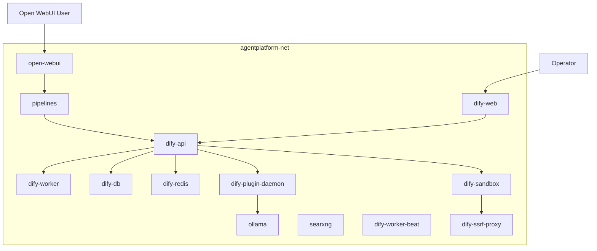
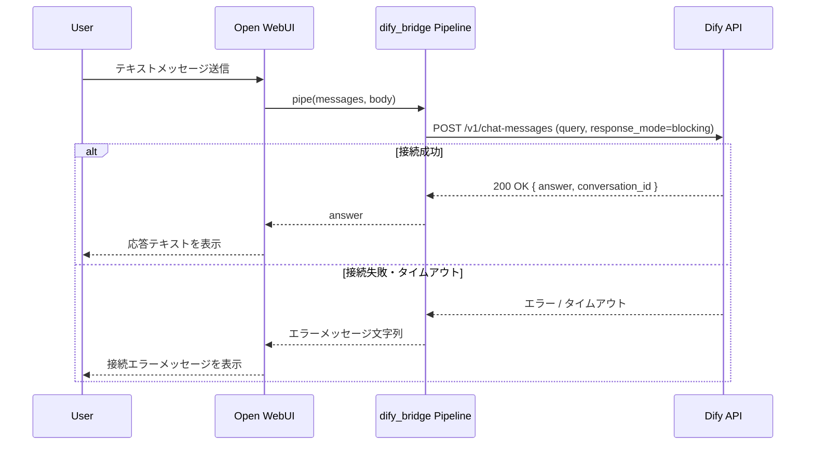
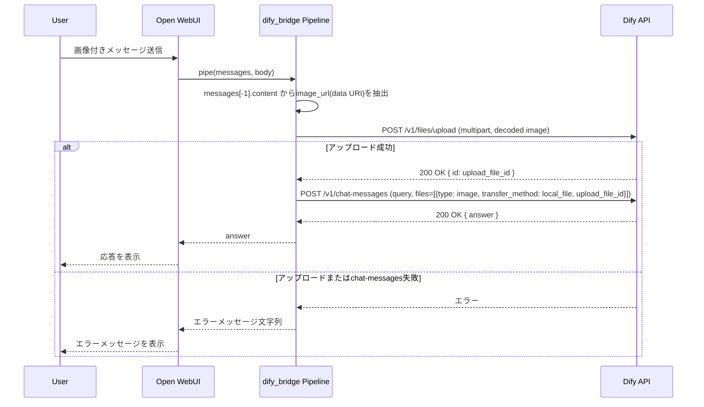

# Design Document

## Overview

本機能は、`infrastructure` Specが構築したDocker環境（Open WebUI / Ollama / SearXNG、`agentplatform-net`）に、Difyワークフローエンジンと、Open WebUI ↔ Dify間のメッセージ中継を行うPipelineを追加する。これにより、Open WebUIのチャットUIから送信されたテキスト・画像メッセージがDifyワークフローへ転送され、応答がチャット画面に表示される経路が確立し、後続の機能Spec（web-search、image-generation、reverse-image-search、instagram-search、multimodal-rag）がDifyワークフローとして機能を実装できるようになる。

**Purpose**: Open WebUIとDifyワークフローエンジンの間に、テキスト・画像メッセージの中継経路と、DifyからOllamaモデルへの接続設定を確立し、後続の機能Specが共通の基盤として利用できる状態を提供する。

**Users**: 個人開発者（環境構築・Dify管理画面でのモデル接続設定）、エンドユーザー（Open WebUIチャットでのテキスト・画像メッセージ送受信）。

**Impact**: `docker/docker-compose.yml`にDifyサービス群とOpen WebUI Pipelinesランタイムを追加し、新規ディレクトリ`pipelines/`・`workflows/`を作成する。既存の`open-webui`・`ollama`・`searxng`サービス定義およびネットワーク・ボリューム構成は変更しない。

### Goals
- Difyサービス群を`agentplatform-net`上に追加し、既存サービスとコンテナ名で相互通信できる状態にする
- Open WebUI ↔ Dify間のテキスト・画像メッセージ中継Pipeline（`pipelines/dify_bridge.py`）を実装する
- Dify接続情報（URL・APIキー）を環境変数化し、`.env.example`に反映する
- DifyのモデルプロバイダーとしてOllamaを接続する手順を確立する
- 中継経路のEnd-to-End動作を確認できる検証用Difyワークフローを提供する

### Non-Goals
- 個別機能Spec（web-search等）のDifyワークフロー実装
- ComfyUI・imgpush等の追加サービス導入
- base64画像のURL変換（imgpush連携）
- Dify Web UIの外部公開・TLS終端（nginx/certbot等）、マルチユーザー運用

## Boundary Commitments

### This Spec Owns
- `docker-compose.yml`へのDifyサービス群（API・Worker・DB・Redis・ベクトルストア・Sandbox・SSRF Proxy・Plugin Daemon・Web）の追加と`agentplatform-net`への接続、データ永続化
- Open WebUI Pipelinesランタイム（`pipelines`コンテナ）の追加
- `pipelines/dify_bridge.py`（Open WebUI ↔ Dify中継Pipeline）: テキスト・画像メッセージの転送契約、エラー応答契約
- Dify接続用環境変数（`DIFY_API_BASE_URL`等）の定義と`.env.example`への追加
- E2E疎通確認用の検証用Difyワークフロー（`workflows/echo_workflow.yml`）とそのインポート・実行手順
- Dify管理画面でのOllamaモデルプロバイダー接続手順、Pipelines接続手順のドキュメント化（`docs/`）

### Out of Boundary
- 各機能Spec固有のDifyワークフロー（`workflows/web_search.yml`等）の作成・設計
- ComfyUI・imgpush等、本Spec以外のサービスのDocker Compose追加
- base64画像のURL変換処理・`image_uploader.py`（`reverse-image-search` Specで詳細化）
- Dify Web UIの外部公開・TLS終端（nginx/certbot）、マルチユーザー認証
- `infrastructure` Specが定義したネットワーク名・ボリューム構成・既存サービス定義の変更

### Allowed Dependencies
- `infrastructure` Specが提供する`agentplatform-net`ネットワークおよび`.env`管理パターン（`docker/.env`, `docker/.env.example`）
- `ollama`サービス（DifyのモデルプロバイダーAPIとして利用、既存定義は変更しない）
- Dify公式コンテナイメージ（`langgenius/dify-api`等、v1.11以降の安定タグ）
- Open WebUI Pipelinesランタイム（`ghcr.io/open-webui/pipelines`）

### Revalidation Triggers
- `pipelines/dify_bridge.py`が公開するモデルID・Valves（環境変数）名・エラー応答形式を変更した場合 → 後続の機能Spec（Difyワークフローを追加する各Spec）に影響するため、`web-search`等の関連Specで再確認が必要
- `workflows/echo_workflow.yml`のDify DSLフォーマットやAPIキー発行手順を変更した場合 → 各機能Specがワークフローをインポートする際の前提が変わるため再確認が必要
- Difyへの画像受け渡し方式（アップロード→`chat-messages`参照）を変更した場合 → `reverse-image-search`等、画像を扱う後続Specが再確認が必要
- `agentplatform-net`上のDifyサービスのコンテナ名・公開ポートを変更した場合 → Dify-Ollama接続設定や各種接続URLの再確認が必要

## Architecture

### Architecture Pattern & Boundary Map



**Architecture Integration**:
- 選定パターン: 既存`infrastructure`の「単一`docker-compose.yml`への直接サービス追加・`agentplatform-net`上での名前解決」パターンを継続する
- 責務境界: Difyサービス群はワークフロー実行エンジンとしての責務のみを持ち、Open WebUIとの中継ロジックは`pipelines`コンテナ上の`dify_bridge.py`に閉じる
- 既存パターンの継承: `127.0.0.1:${PORT}`形式のホスト公開、`.env`による機密情報管理、コンテナ名による名前解決
- 新規コンポーネントの理由:
  - `pipelines`: Open WebUIのPipelinesフレームワークを実行するための専用ランタイム（Open WebUI本体には組み込めない）
  - Difyサービス群: ワークフローオーケストレーションを担う本Specの中核
- Steering準拠: `tech.md`の「Open WebUI → Pipeline → Dify Workflow → 各バックエンド」構成、`structure.md`の`docker ← pipelines ← workflows`依存方向を維持

### Technology Stack

| Layer | Choice / Version | Role in Feature | Notes |
|-------|------------------|-----------------|-------|
| Workflow Engine | Dify CE v1.11以降（`langgenius/dify-api`, `dify-web`, `dify-worker`, `dify-plugin-daemon`等） | チャット/ワークフローAPIの提供、Ollamaをモデルプロバイダーとして利用 | nginx/certbotは省略し、`api`/`web`を直接ポート公開 |
| Workflow Datastore | PostgreSQL（`pgvector/pgvector`イメージ） + Redis | Difyのアプリ・会話・ベクトルデータの永続化、Celeryブローカー | ベクトルストアは`pgvector`拡張で代替し追加コンテナを抑制 |
| Sandbox / Egress | `langgenius/dify-sandbox` + `ssrf_proxy`（squid） | ワークフローのCode Node実行と送信先制御 | squid設定は最小構成をvendor |
| Pipeline Runtime | `ghcr.io/open-webui/pipelines:main` | `dify_bridge.py`を実行し、Open WebUIへOpenAI互換APIを提供 | `/app/pipelines`にホストの`pipelines/`をマウント |
| Pipeline実装 | Python 3.x（Pipelines Manifold） | Open WebUI ↔ Dify間のテキスト・画像メッセージ中継 | PEP8・型ヒント必須（`tech.md`準拠） |
| 接続先 | Ollama（既存`infrastructure`）, agentplatform-net | DifyのLLMモデルプロバイダー | コンテナ名`ollama:11434`で接続 |

## File Structure Plan

### Directory Structure
```
docker/
├── docker-compose.yml              # 変更: Difyサービス群とpipelinesサービスをagentplatform-netに追加
├── .env.example                    # 変更: Dify/Pipelines関連の環境変数を追加
└── dify/
    ├── README.md                   # 新規: vendor元（Dify公式リポジトリ）とバージョンを記録
    └── ssrf_proxy/
        ├── squid.conf.template     # 新規: dify-sandboxの送信制御用squid設定（公式リポジトリからvendor）
        └── docker-entrypoint.sh    # 新規: squid.conf.templateを展開する起動スクリプト（vendor）

pipelines/
└── dify_bridge.py                  # 新規: Open WebUI ↔ Dify中継Pipeline（manifold）

workflows/
└── echo_workflow.yml               # 新規: E2E疎通確認用Dify検証ワークフロー（DSLエクスポート）

docs/
└── dify-integration-setup.md       # 新規: Dify初期化・Ollamaプロバイダー設定・Pipelines接続・検証ワークフロー導入の手順
```

### Modified Files
- `docker/docker-compose.yml` — Difyサービス群（`dify-api`, `dify-worker`, `dify-worker-beat`, `dify-web`, `dify-db`, `dify-redis`, `dify-sandbox`, `dify-ssrf-proxy`, `dify-plugin-daemon`）と`pipelines`サービスを追加し、すべて`agentplatform-net`に接続する。既存サービス（`open-webui`, `ollama`, `searxng`）の定義は変更しない
- `docker/.env.example` — `DIFY_*`（`SECRET_KEY`, `DB_*`, `REDIS_*`, ベクトルストア設定, `DIFY_WEB_PORT`, `DIFY_API_PORT`）、`PIPELINES_PORT`、`DIFY_API_BASE_URL`、`DIFY_APP_API_KEY`（検証用ワークフロー用）の項目を追加

## System Flows

### テキストメッセージ中継フロー (2.1-2.4)



### 画像メッセージ中継フロー (5.1-5.3)



**フロー上の決定事項**:
- `response_mode`は`blocking`を採用する。ストリーミング表示はOpen WebUI Pipelinesの`pipe()`がGenerator/Iteratorを返すことで対応可能だが、本Specでは要件2.3（処理中表示）を満たすために中間メッセージのみを返す簡易実装とし、ストリーミング応答は将来の拡張として`research.md`に記録する
- 画像メッセージのテキストが空の場合、`query`には固定の説明文（例: 画像が送信されたことを示す文言）を設定し、Dify側の`query`必須制約を満たす

## Requirements Traceability

| Requirement | Summary | Components | Interfaces | Flows |
|-------------|---------|------------|------------|-------|
| 1.1 | Compose起動でDifyサービス群が起動する | Dify Service Stack | docker-compose service定義 | - |
| 1.2 | Difyサービス群がagentplatform-net上で名前解決できる | Dify Service Stack | Docker network設定 | - |
| 1.3 | Difyの設定・データが再起動後も保持される | Dify Service Stack | Docker volume定義 | - |
| 2.1 | テキストメッセージをDifyへ転送する | DifyBridge Pipeline | `pipe()` → `POST /v1/chat-messages` | テキストメッセージ中継フロー |
| 2.2 | Dify応答をOpen WebUIに表示する | DifyBridge Pipeline | `pipe()`戻り値 | テキストメッセージ中継フロー |
| 2.3 | 処理中であることが分かる状態を提供する | DifyBridge Pipeline | `pipe()`応答 | テキストメッセージ中継フロー |
| 2.4 | Dify接続失敗時にエラーメッセージを表示する | DifyBridge Pipeline | エラー応答契約 | テキストメッセージ中継フロー |
| 3.1 | Dify接続先URL・APIキーを環境変数から読み込む | DifyBridge Pipeline, Dify Service Stack | `Valves`環境変数 | - |
| 3.2 | 環境変数一覧を値なしテンプレートで提供する | Dify Service Stack | `docker/.env.example` | - |
| 3.3 | 機密情報を含む設定ファイルをVCS対象外にする | Dify Service Stack | `.gitignore`（既存`infrastructure`定義を継続利用） | - |
| 4.1 | OllamaをDifyのモデルプロバイダーとして接続する手順を提供する | Setup Documentation | `docs/dify-integration-setup.md` | - |
| 4.2 | Ollama接続完了後、モデルがワークフローで選択可能になる | Dify Service Stack（Plugin Daemon経由） | Dify管理画面（Operator操作） | - |
| 4.3 | ワークフローからOllama接続済みモデルを呼び出し応答を利用できる | Dify Service Stack | Dify Workflow Engine ↔ Ollama API | - |
| 5.1 | 画像データをDifyのマルチモーダル入力形式に変換して転送する | DifyBridge Pipeline | `POST /v1/files/upload` → `chat-messages.files` | 画像メッセージ中継フロー |
| 5.2 | テキストのみの場合は画像変換を行わない | DifyBridge Pipeline | `pipe()`内の分岐 | 画像メッセージ中継フロー |
| 5.3 | 画像リクエスト失敗時にエラーメッセージを表示する | DifyBridge Pipeline | エラー応答契約 | 画像メッセージ中継フロー |
| 6.1 | 受信メッセージをそのまま返す検証用ワークフローを提供する | Echo Verification Workflow | `workflows/echo_workflow.yml` | - |
| 6.2 | Pipelineをチャットで選択可能なモデルとして認識する | DifyBridge Pipeline, Pipelines Runtime | Open WebUI接続設定（Operator操作） | - |
| 6.3 | 検証用ワークフローでテキスト応答を確認できる | DifyBridge Pipeline, Echo Verification Workflow | テキストメッセージ中継フロー | テキストメッセージ中継フロー |
| 6.4 | 検証用ワークフローで画像中継を確認できる | DifyBridge Pipeline, Echo Verification Workflow | 画像メッセージ中継フロー | 画像メッセージ中継フロー |

## Components and Interfaces

| Component | Domain/Layer | Intent | Req Coverage | Key Dependencies (P0/P1) | Contracts |
|-----------|--------------|--------|---------------|--------------------------|-----------|
| Dify Service Stack | Infrastructure | Difyワークフローエンジン群をagentplatform-netに追加し永続化する | 1.1, 1.2, 1.3, 3.1, 4.2, 4.3 | dify-db (P0), dify-redis (P0), ollama (P1) | State |
| Pipelines Runtime | Infrastructure | `dify_bridge.py`を実行するOpenAI互換APIコンテナ | 6.2 | dify-api (P0), open-webui (P0) | API |
| DifyBridge Pipeline | Application | Open WebUI ↔ Dify間のテキスト・画像メッセージ中継、エラー応答 | 2.1-2.4, 3.1, 5.1-5.3, 6.2-6.4 | Dify Chat/Files API (P0) | Service |
| Echo Verification Workflow | Workflow | 受信内容をそのまま返すDify検証用ワークフロー | 6.1, 6.3, 6.4 | Dify Workflow Engine (P0) | API |
| Setup Documentation | Documentation | Dify初期化・Ollama接続・Pipelines接続・検証手順 | 3.2, 3.3, 4.1, 6.1, 6.2 | - | - |

### Infrastructure

#### Dify Service Stack

| Field | Detail |
|-------|--------|
| Intent | Difyのワークフロー実行に必要なサービス群を`agentplatform-net`上に追加し、設定・データを永続化する |
| Requirements | 1.1, 1.2, 1.3, 3.1, 4.2, 4.3 |

**Responsibilities & Constraints**
- `dify-api`, `dify-worker`, `dify-worker-beat`, `dify-web`, `dify-db`（pgvector拡張PostgreSQL）, `dify-redis`, `dify-sandbox`, `dify-ssrf-proxy`, `dify-plugin-daemon`を`docker-compose.yml`に追加する
- すべてのサービスを既存`agentplatform-net`に接続し、`ollama`とコンテナ名で通信可能にする
- `dify-db`, `dify-redis`, Difyアプリ設定（ストレージ）はDockerボリュームで永続化する
- nginx/certbotは追加せず、`dify-web`（管理画面）・`dify-api`（外部API）は既存パターンに合わせて`127.0.0.1:${PORT}`でホスト公開する

**Dependencies**
- Inbound: Pipelines Runtime — `dify-api`への中継リクエスト (P0)
- Inbound: Operator — `dify-web`管理画面へのアクセス (P1)
- Outbound: `ollama` — モデルプロバイダーAPI (P1)
- External: `langgenius/dify-*`コンテナイメージ（v1.11以降の安定タグ） (P0)

**Contracts**: Service [ ] / API [ ] / Event [ ] / Batch [ ] / State [x]

##### State Management
- State model: Difyのアプリ定義・会話履歴・ベクトルデータは`dify-db`（PostgreSQL + pgvector）、キャッシュ・Celeryキューは`dify-redis`が保持する
- Persistence & consistency: 各サービスのデータディレクトリをDockerボリュームにマウントし、`docker compose down`後も保持する
- Concurrency strategy: `dify-worker`/`dify-worker-beat`がCeleryによる非同期タスクを処理する（Dify既定の挙動を変更しない）

**Implementation Notes**
- Integration: `docker/.env.example`に`DIFY_SECRET_KEY`, `DIFY_DB_*`, `DIFY_REDIS_*`, `DIFY_WEB_PORT`, `DIFY_API_PORT`等を追加する
- Validation: `docker compose up`後、`dify-api`のヘルスチェック完了と`dify-web`管理画面への到達を確認する（Requirement 1.1）
- Risks: Difyのバージョンアップに伴う公式Compose構成の変更。実装時に使用したタグを`docker/dify/README.md`に記録する

#### Pipelines Runtime

| Field | Detail |
|-------|--------|
| Intent | Open WebUI Pipelinesフレームワーク（`dify_bridge.py`）を実行し、OpenAI互換APIとしてOpen WebUIに公開する |
| Requirements | 6.2 |

**Responsibilities & Constraints**
- `ghcr.io/open-webui/pipelines:main`イメージを使用し、ホストの`pipelines/`ディレクトリを`/app/pipelines`にマウントする
- `agentplatform-net`上で`open-webui`・`dify-api`の双方と通信可能にする
- Open WebUI管理画面の接続設定（Operator操作）から、本コンテナをOpenAI互換APIエンドポイントとして登録する

**Dependencies**
- Inbound: Open WebUI — チャットメッセージのリクエスト (P0)
- Outbound: `dify-api` — ワークフロー呼び出し (P0)

**Contracts**: Service [ ] / API [x] / Event [ ] / Batch [ ] / State [ ]

##### API Contract
| Method | Endpoint | Request | Response | Errors |
|--------|----------|---------|----------|--------|
| POST | /v1/chat/completions（Open WebUI → Pipelines、Pipelinesフレームワーク標準） | OpenAI Chat Completions形式（`messages`） | OpenAI Chat Completions形式（`choices[0].message.content`） | 接続エラー時もHTTP 200 + エラー文字列（Requirement 2.4, 5.3） |

**Implementation Notes**
- Integration: `docker/.env.example`に`PIPELINES_PORT`を追加し、Open WebUI管理画面での接続設定手順を`docs/dify-integration-setup.md`に記載する
- Validation: Open WebUIのモデル選択リストに`dify_bridge`が表示されることを確認する（Requirement 6.2）

### Application

#### DifyBridge Pipeline (`pipelines/dify_bridge.py`)

| Field | Detail |
|-------|--------|
| Intent | Open WebUIから受信したテキスト・画像メッセージをDify Chat APIへ中継し、応答またはエラーメッセージを返す |
| Requirements | 2.1, 2.2, 2.3, 2.4, 3.1, 5.1, 5.2, 5.3, 6.2, 6.3, 6.4 |

**Responsibilities & Constraints**
- Open WebUI Pipelinesの`Pipe`クラスとして実装し、`Valves`で`DIFY_API_BASE_URL`・`DIFY_APP_API_KEY`・タイムアウト秒数を環境変数から受け取る（Requirement 3.1）
- `pipe()`内でメッセージ本文を判定し、テキストのみの場合は`POST /v1/chat-messages`、画像を含む場合は`POST /v1/files/upload`実行後に`upload_file_id`を付与して`POST /v1/chat-messages`を呼び出す
- Dify API呼び出しの例外（タイムアウト・接続エラー・HTTPエラー）を捕捉し、ユーザーに分かるエラーメッセージ文字列を返す（例外を再raiseしない）
- ユーザーごとに一意な識別子（Open WebUIのユーザーID）をDify APIの`user`パラメータに設定し、Dify側の会話スコープを分離する

**Dependencies**
- Outbound: Dify Chat API (`POST /v1/chat-messages`) — テキスト・画像メッセージの処理結果取得 (P0)
- Outbound: Dify Files API (`POST /v1/files/upload`) — 画像メッセージのアップロード (P0)

**Contracts**: Service [x] / API [ ] / Event [ ] / Batch [ ] / State [ ]

##### Service Interface
```python
class Valves(BaseModel):
    DIFY_API_BASE_URL: str  # 例: http://dify-api:5001/v1
    DIFY_APP_API_KEY: str   # 検証用ワークフローのAPIキー（Requirement 6.1で発行）
    REQUEST_TIMEOUT_SECONDS: int  # デフォルト値を持つ

class Pipe:
    valves: Valves

    def pipe(
        self,
        user_message: str,
        model_id: str,
        messages: list[dict],
        body: dict,
    ) -> str:
        """Open WebUIからのメッセージをDifyへ中継し、応答テキストまたは
        ユーザー向けエラーメッセージを返す。例外を呼び出し元に伝播しない。"""
```
- Preconditions: `messages`の最後の要素がOpen WebUIのチャットメッセージ形式（`content`が文字列、またはテキスト・画像を含むリスト）であること
- Postconditions: 戻り値は常に文字列（Dify応答テキスト、またはエラーメッセージ）であり、Open WebUIのチャット画面にそのまま表示可能であること
- Invariants: 画像が含まれない場合、Dify Files APIは呼び出されない（Requirement 5.2）

**Implementation Notes**
- Integration: 画像抽出ロジックは`messages[-1]["content"]`がリストの場合に`type == "image_url"`の要素から`data:image/...;base64,...`形式のURLを取得し、base64部分をデコードして`/v1/files/upload`へ送信する
- Validation: Requirement 6.3（テキスト）・6.4（画像）の検証用ワークフローを通じて、中継経路全体をEnd-to-Endで確認する
- Risks: Dify APIの`query`必須制約に対応するため、画像のみのメッセージでは固定のプレースホルダーテキストを`query`に設定する（research.mdの設計判断を参照）

### Workflow

#### Echo Verification Workflow (`workflows/echo_workflow.yml`)

| Field | Detail |
|-------|--------|
| Intent | Open WebUI → Pipeline → Dify の中継経路をEnd-to-Endで確認するための、入力をそのまま返す最小構成のDifyワークフロー |
| Requirements | 6.1, 6.3, 6.4 |

**Responsibilities & Constraints**
- 受信した`query`（テキスト）および添付ファイル（画像）の有無を含む応答メッセージをそのまま返す
- Difyのワークフロー機能としてDSL（YAML）形式でエクスポートし、`workflows/`配下に格納する。Operatorが`docs/dify-integration-setup.md`の手順に従いDify管理画面からインポートし、アプリ用APIキーを発行する

**Dependencies**
- Inbound: DifyBridge Pipeline — `chat-messages`呼び出し (P0)
- Outbound: なし（外部呼び出しを行わない最小構成）

**Contracts**: Service [ ] / API [x] / Event [ ] / Batch [ ] / State [ ]

##### API Contract
| Method | Endpoint | Request | Response | Errors |
|--------|----------|---------|----------|--------|
| POST | /v1/chat-messages（Dify標準） | `{query, files?, response_mode, user}` | `{answer}`（受信内容を要約したテキスト、画像受信時はその旨を含む） | Dify標準のエラーレスポンス |

**Implementation Notes**
- Integration: 本ワークフローのAPIキーは`DIFY_APP_API_KEY`としてPipelines Runtimeの環境変数に設定する
- Validation: Requirement 6.3/6.4のEnd-to-End確認の対象そのものである

## Error Handling

### Error Strategy
DifyBridge Pipelineは、Dify API呼び出しに関するすべてのエラー（接続不可・タイムアウト・HTTPエラー応答・ファイルアップロード失敗）を捕捉し、例外を伝播させずにユーザー向けの説明文字列を`pipe()`の戻り値として返す。これにより、Open WebUI側は常に正常なチャット応答として処理し、チャット画面にエラー内容を表示できる。

### Error Categories and Responses
- **接続エラー・タイムアウト（Requirement 2.4）**: Dify APIへの接続確立またはレスポンス待機が失敗した場合、「Dify環境への接続に失敗しました」等、原因を示すメッセージを返す
- **画像処理エラー（Requirement 5.3）**: `/v1/files/upload`の失敗、またはアップロード成功後の`chat-messages`失敗時、「画像の送信に失敗しました」等のメッセージを返す。アップロード自体に失敗した場合は`chat-messages`を実行しない
- **Dify側のワークフローエラー（4xx/5xxレスポンス）**: レスポンスボディのエラー内容を要約してユーザーに表示する

### Monitoring
Pipelinesコンテナの標準出力ログに、Dify API呼び出しのリクエストID・HTTPステータス・エラー内容を記録する（個人利用環境のため、外部監視基盤との連携は対象外）。

## Testing Strategy

### Unit Tests
- `DifyBridge.pipe()`がテキストのみの`messages`を受け取った場合、`/v1/files/upload`を呼び出さず`/v1/chat-messages`のみを呼び出すこと（Requirement 5.2）
- `DifyBridge.pipe()`が画像付き`messages`（`content`がリストで`image_url`を含む）を受け取った場合、base64データを正しく抽出し`/v1/files/upload`を呼び出すこと（Requirement 5.1）
- Dify APIが接続エラー・タイムアウトを返した場合、`pipe()`が例外を発生させずエラーメッセージ文字列を返すこと（Requirement 2.4）
- Dify Files APIがエラーを返した場合、`chat-messages`が呼び出されずエラーメッセージ文字列が返ること（Requirement 5.3）

### Integration Tests
- `docker compose up`実行後、`dify-api`・`dify-web`・`dify-db`・`dify-redis`・`dify-sandbox`・`dify-plugin-daemon`・`pipelines`コンテナが`agentplatform-net`上で起動し、ヘルスチェックに合格すること（Requirement 1.1, 1.2, 1.3）
- 検証用ワークフロー（`echo_workflow.yml`）をDifyにインポートしAPIキーを発行した状態で、`DifyBridge.pipe()`からテキストメッセージを送信し、Dify APIが`answer`を返すこと（Requirement 6.3）

### E2E Tests
- Open WebUIのチャットでPipelineモデル（`dify_bridge`）を選択し、テキストメッセージを送信すると、検証用ワークフールを経由した応答がチャット画面に表示されること（Requirement 6.2, 6.3）
- Open WebUIのチャットで画像を含むメッセージを送信すると、画像が中継されたことを確認できる応答がチャット画面に表示されること（Requirement 6.4）
- Dify管理画面でOllamaモデルプロバイダーを設定した状態で、検証用ワークフロー（またはDifyのデバッグ実行）からOllama接続済みモデルを呼び出し、応答が得られること（Requirement 4.2, 4.3）

## Security Considerations
- `DIFY_SECRET_KEY`・DB認証情報・`DIFY_APP_API_KEY`等の機密情報は`docker/.env`に保持し、`.env.example`には値を含まないテンプレートのみを記載する（Requirement 3.2, 3.3、`infrastructure`の`.gitignore`設定を継続利用）
- `dify-web`・`dify-api`は`infrastructure`の既存サービスと同様に`127.0.0.1`バインドとし、ホスト外部への公開を行わない
