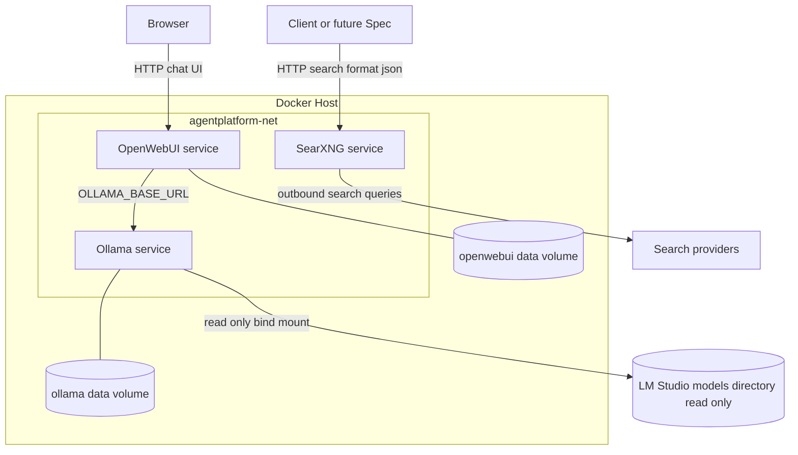
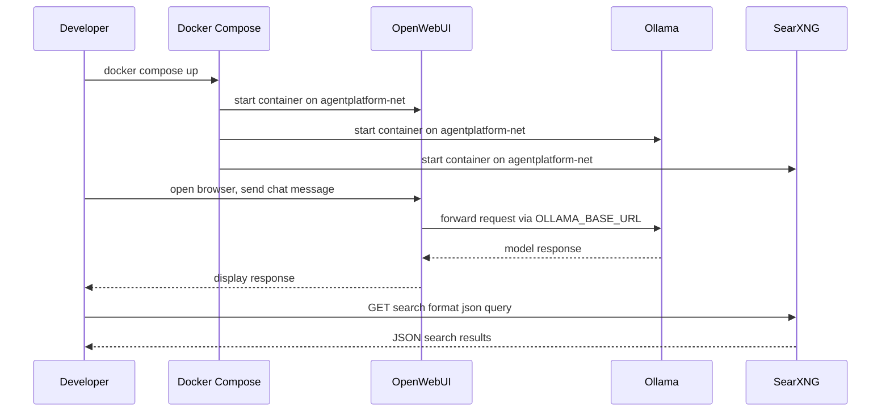

# Design Document

## Overview

本機能は、ローカル完結のマルチモーダルAIエージェント基盤の最初のレイヤーとして、Open WebUI・Ollama・SearXNGをDocker Compose上に構築する。`docker compose up` のみで3サービスが共通のDockerネットワーク・ボリューム構成上に起動し、Open WebUIからのチャットおよびSearXNGの `/search?format=json` 応答という疎通確認（Phase1完了基準）を満たす。

**Purpose**: 個人開発者に対し、後続Spec（dify-integration、web-search等）が積み上げていくための「動作確認可能なDocker基盤」を提供する。
**Users**: 個人開発者（リポジトリ運用者）が `docker compose up` で起動し、ブラウザからOpen WebUIにアクセスして動作確認を行う。
**Impact**: 現状 `.kiro/` と `docs/` のみのリポジトリに、`docker/` ディレクトリと関連設定一式（Compose定義・SearXNG設定・環境変数テンプレート・Git除外設定）を新規追加する。既存ファイルへの破壊的変更はない。

### Goals
- `docker compose up` でOpen WebUI・Ollama・SearXNGの3コンテナが同一Dockerネットワーク上で起動し、コンテナ名で相互に名前解決できる
- Open WebUIにブラウザでアクセスし、Ollama接続済みモデルとチャットできる
- SearXNGの `/search?format=json` がJSON形式で応答する
- APIキー等の機密情報を `.env`（Git管理外）に分離し、`.env.example` をテンプレートとして提供する
- 後続Specがサービス・ボリュームを追記できる構成にする
- LM Studioが管理するGGUFモデル資産をOllamaサービスから読み取り専用で参照できる構成にする

### Non-Goals
- Dify、ComfyUI、imgpush等、後続フェーズで追加されるサービスの定義（各Specで対応）
- Ollamaへのモデルのダウンロード・選定・チューニング（運用時に手動実施）
- バックアップ・更新スクリプト（`scripts/`配下、将来検討）
- LLM要約付きのWeb検索機能（`web-search` Specで対応）。本Specが提供するのはSearXNGのJSON API疎通のみ
- 個々のモデルのModelfile作成・`ollama create`の実行・チャットテンプレートの設定（モデルごとの運用作業）

## Boundary Commitments

### This Spec Owns
- `docker/docker-compose.yml`（全サービス統合定義）・`docker/docker-compose.override.yml`（開発用オーバーライド）の作成と、Open WebUI・Ollama・SearXNGのサービス定義
- 3サービスが接続する共有Dockerネットワーク（`agentplatform-net`）の定義・命名
- Open WebUI・Ollama・SearXNG用の永続化ボリューム定義
- SearXNGの `settings.yml`（JSON出力有効化、`server.limiter` 設定を含む）
- `docker/.env.example` の作成、および `.env` をGit管理対象から除外する `.gitignore` 設定
- Phase1完了基準の疎通確認手順（Open WebUIチャット、SearXNG `/search?format=json`）とそれを検証するスモークテスト
- LM Studioのモデルディレクトリ（ホスト側パスは `.env` で指定）をOllamaサービスに読み取り専用でマウントする構成、およびOllama管理データ（manifests/blobs）を独立ボリュームに保持する構成

### Out of Boundary
- Dify・ComfyUI・imgpush等のサービス定義（`dify-integration` 等の後続Specが追加）
- Ollamaのモデル選定・pull・チューニング（運用手順として案内するのみ）
- `pipelines/`・`workflows/`配下のアプリケーションロジック
- LLM要約付きWeb検索ワークフロー（`web-search` Spec）
- `scripts/` 配下の運用スクリプト（バックアップ・更新等）
- 個々のモデルのModelfile作成・`ollama create`実行・チャットテンプレートの設定（手順をドキュメント化するが実行は運用作業）

### Allowed Dependencies
- 外部依存: Open WebUI公式イメージ（`ghcr.io/open-webui/open-webui`）、Ollama公式イメージ（`ollama/ollama`）、SearXNG公式イメージ（`searxng/searxng`）
- ランタイム前提: Docker Compose（Windows 11 + WSL2）、任意でNVIDIA Container Toolkit（GPU利用時）
- ホスト依存: LM Studioのモデルディレクトリ（ホスト側パス、利用者の環境に依存し`.env`で指定）。本Specはこのディレクトリを読み取り専用で参照するのみで、ディレクトリ構造やLM Studio自体の管理には関与しない
- 本Specより前段の依存スペックは存在しない（roadmap上の最初のSpec）

### Revalidation Triggers
- 共有ネットワーク名（`agentplatform-net`）の変更 — 後続Specが同名ネットワークへの接続を前提とするため、変更時は依存する全Specを確認する
- `docker-compose.yml` のトップレベル構造（サービス追記パターン、ボリューム命名規則）の変更
- SearXNGの `/search?format=json` のレスポンス形式・エンドポイントパスの変更 — `web-search` Specが直接依存する
- Open WebUI ↔ Ollama間の接続方式（環境変数名・URL形式）の変更
- LM Studioモデルディレクトリのマウントパス・マウント先（`/lmstudio-models`）の変更 — モデル取り込み手順（`ollama create`のFROMパス）に影響する

## Architecture

### Architecture Pattern & Boundary Map



**Architecture Integration**:
- 選択パターン: 単一の `docker-compose.yml` に全サービスを集約し、`docker-compose.override.yml` で開発環境向け差分（GPU割り当て等）を上書きする構成（research.md「単一docker-compose.yml + override」を採用）
- ドメイン境界: Open WebUI（フロントエンド）、Ollama（LLM推論）、SearXNG（メタ検索）はそれぞれ独立コンテナとし、`agentplatform-net` というブリッジネットワーク上でコンテナ名により疎通する
- 既存パターンの遵守: `.kiro/steering/structure.md` の「`docker/`はインフラ定義のみ」「環境変数はSCREAMING_SNAKE_CASE」「機密情報は`.env`管理」方針に従う
- 新規コンポーネントの理由: 本Specがリポジトリ初の実装ディレクトリ追加であり、`docker/` 配下に3サービス分の定義を新設する以外の選択肢はない
- Steering準拠: `.kiro/steering/tech.md` の「全コンポーネントを同一Dockerネットワーク上のコンテナとして構築」「コンテナ名で名前解決」「`.env`での機密情報管理」方針に準拠

### Technology Stack

| Layer | Choice / Version | Role in Feature | Notes |
|-------|------------------|-----------------|-------|
| フロントエンド | Open WebUI（`ghcr.io/open-webui/open-webui:main`） | チャットUI、Ollama接続先選択 | `OLLAMA_BASE_URL`でOllamaコンテナに接続 |
| LLMランタイム | Ollama（`ollama/ollama:latest`） | OpenAI互換APIによるローカルLLM推論、LM Studioモデル資産の参照 | `OLLAMA_HOST=0.0.0.0`で他コンテナからの接続を許可。LM Studioモデルディレクトリを`/lmstudio-models`に読み取り専用マウント |
| メタ検索 | SearXNG（`searxng/searxng:latest`） | `/search?format=json` によるJSON検索API | `settings.yml`で`search.formats`に`json`追加、`server.limiter: false` |
| Infrastructure / Runtime | Docker Compose（`docker-compose.yml` + `docker-compose.override.yml`） | サービス・ネットワーク・ボリュームのオーケストレーション | Windows 11 + WSL2 + 任意でNVIDIA Container Toolkit |

## File Structure Plan

### Directory Structure
```
docker/
├── docker-compose.yml          # 全サービス統合定義（Open WebUI / Ollama / SearXNG、共有ネットワーク・ボリューム、LM Studioモデルディレクトリのro マウント）
├── docker-compose.override.yml # 開発用オーバーライド（GPU割り当て等、Git管理外）
├── docker-compose.override.yml.example # override作成用テンプレート（Git管理対象）
├── .env.example                 # 環境変数テンプレート（ポート、SearXNGベースURL、LMSTUDIO_MODELS_PATH等）
├── networks.md                  # 共有ネットワーク（agentplatform-net）の命名・拡張方針の説明
├── model-sharing.md              # LM StudioモデルディレクトリのマウントとModelfile経由の取り込み手順
└── searxng/
    ├── settings.yml              # JSON出力有効化済みのSearXNG設定（secret_keyを含むため、Git管理外）
    └── settings.yml.example      # settings.yml作成用テンプレート（Git管理対象）

tests/
└── smoke/
    └── infrastructure_smoke.md   # Phase1完了基準の手動/スクリプト確認手順
```

### Modified Files
- `.gitignore` — `docker/.env`・`docker/docker-compose.override.yml`・`docker/searxng/settings.yml` をGit管理対象から除外するルールを追加

> `docker-compose.override.yml` はGPU設定など環境依存の値を含むため、利用者ごとに `docker-compose.override.yml.example` をコピーして作成する運用とし、本体ファイルは `.gitignore` で除外する。同様に `searxng/settings.yml` は `server.secret_key`（インスタンス固有の値）を含むため、`searxng/settings.yml.example` をコピーして作成する運用とし、本体ファイルは `.gitignore` で除外する。`docker-compose.yml` 本体・各 `.example` ファイルはGit管理対象とする。

## System Flows



起動順序はOpen WebUIの `depends_on` でOllama・SearXNGの起動完了後に開始されるようにするが、Ollamaのモデルロード状態には依存しない（モデルpullは運用時に別途実施するため、チャット応答自体は接続確認の範囲で確認する）。

## Requirements Traceability

| Requirement | Summary | Components | Interfaces | Flows |
|-------------|---------|------------|------------|-------|
| 1.1 | `docker compose up`で3コンテナ起動 | Docker Compose Stack | `docker-compose.yml` | 起動シーケンス |
| 1.2 | 同一ネットワークでコンテナ名解決 | Docker Compose Stack（agentplatform-net） | Network定義 | - |
| 1.3 | 開発用オーバーライドで本体設定を上書き | Docker Compose Stack（override） | `docker-compose.override.yml` | - |
| 1.4 | 後続Specがサービス・ボリュームを追加できる | Docker Compose Stack, networks.md | ネットワーク・ボリューム命名規約 | - |
| 2.1 | Open WebUIのチャット画面表示 | Open WebUI Service | Web UI (HTTP) | チャットシーケンス |
| 2.2 | Ollama接続モデルからの応答表示 | Open WebUI Service, Ollama Service | `OLLAMA_BASE_URL` 経由API | チャットシーケンス |
| 2.3 | Ollama接続失敗時のエラー表示 | Open WebUI Service | Open WebUI標準エラー表示（既定動作） | エラーハンドリング |
| 3.1 | SearXNGのJSON出力有効化 | SearXNG Service, `searxng/settings.yml` | `search.formats`, `server.limiter` | - |
| 3.2 | `/search?format=json`の応答 | SearXNG Service | `GET /search?format=json` | 検索シーケンス |
| 4.1 | 環境変数テンプレートの提供 | Environment Config | `docker/.env.example` | - |
| 4.2 | `.env`のGit除外 | Environment Config | `.gitignore` | - |
| 4.3 | `.env`値のコンテナへの読込 | Docker Compose Stack | `env_file` / `environment` | - |
| 5.1 | Windows11+WSL2上での起動 | Docker Compose Stack | `docker-compose.yml` | - |
| 5.2 | GPU利用可能時のOllama GPU使用 | Ollama Service（override） | `deploy.resources.reservations.devices` | - |
| 5.3 | SearXNG以外の外部接続不要 | Docker Compose Stack, SearXNG Service | ネットワーク・ポート公開設定 | - |
| 6.1 | LM Studioモデルディレクトリの読み取り専用マウント | Ollama Service | `/lmstudio-models:ro` バインドマウント | - |
| 6.2 | Ollama管理データを独立ボリュームに保持 | Ollama Service | `ollama-data`ボリューム | - |
| 6.3 | マウントパスの環境変数化 | Environment Config, Ollama Service | `LMSTUDIO_MODELS_PATH` | - |
| 6.4 | Modelfile経由のモデル作成 | Ollama Service, `docker/model-sharing.md` | `ollama create` 手順 | - |

## Components and Interfaces

| Component | Domain/Layer | Intent | Req Coverage | Key Dependencies (P0/P1) | Contracts |
|-----------|--------------|--------|--------------|--------------------------|-----------|
| Docker Compose Stack | Infrastructure | サービス・ネットワーク・ボリュームの統合定義 | 1.1, 1.2, 1.3, 1.4, 4.3, 5.1, 5.3 | Open WebUI Image (P0), Ollama Image (P0), SearXNG Image (P0) | Batch |
| Open WebUI Service | Frontend | チャットUIの提供とOllama接続 | 2.1, 2.2, 2.3 | Ollama Service (P0) | API |
| Ollama Service | LLM Runtime | OpenAI互換APIによるローカル推論、GPU利用、LM Studioモデル資産の参照 | 2.2, 5.2, 6.1, 6.2, 6.3, 6.4 | NVIDIA Container Toolkit (P1, optional), LM Studio model directory (P1) | API |
| SearXNG Service | Meta Search | JSON検索APIの提供 | 3.1, 3.2, 5.3 | 外部検索プロバイダ (P1) | API |
| Environment Config | Config | `.env.example`提供と`.env`のGit除外、ホスト依存パスの変数化 | 4.1, 4.2, 6.3 | - | Config |

### Infrastructure

#### Docker Compose Stack

| Field | Detail |
|-------|--------|
| Intent | Open WebUI・Ollama・SearXNGを共有ネットワーク・ボリューム上で起動するCompose定義一式 |
| Requirements | 1.1, 1.2, 1.3, 1.4, 4.3, 5.1, 5.3 |

**Responsibilities & Constraints**
- `docker-compose.yml` に3サービス・共有ネットワーク（`agentplatform-net`、bridge）・各サービス用名前付きボリュームを定義する
- `docker-compose.override.yml` には開発環境固有の差分（OllamaのGPU予約など）を定義する。GPU非搭載環境ではこのファイルからGPU予約を削除/コメントアウトすることでCPUモードで起動可能とする
- 各サービスは `env_file: ./.env` を参照し、`docker/.env.example` をコピーして作成した `docker/.env` から値を読み込む
- ポート公開は確認に必要な最小限（Open WebUI、SearXNG）とし、Ollamaは `agentplatform-net` 内部からのみ到達可能とする

**Dependencies**
- Outbound: Open WebUI公式イメージ（P0）、Ollama公式イメージ（P0）、SearXNG公式イメージ（P0） — いずれもDocker Hub/GHCRから取得

**Contracts**: Batch [x]

##### Batch / Job Contract
- Trigger: `docker compose up`（オプションで `-d`）／`docker compose -f docker-compose.yml -f docker-compose.override.yml up`
- Input / validation: `docker/.env`（`docker/.env.example`から作成）に必要な環境変数が設定されていること
- Output / destination: `agentplatform-net` 上で稼働する3コンテナ、各サービス用の名前付きボリューム
- Idempotency & recovery: `docker compose up` の再実行は既存コンテナ・ボリュームを再利用する（Compose標準動作）。コンテナ停止後も名前付きボリュームによりOllamaのモデルデータ・Open WebUIの設定・SearXNGの設定は保持される

**Implementation Notes**
- Integration: 後続Specは同じ `docker-compose.yml` にサービス定義を追記し、`agentplatform-net` に接続する。ボリュームも同ファイル内の `volumes:` トップレベルキーに追加する
- Validation: `tests/smoke/infrastructure_smoke.md` の手順で3コンテナの起動・チャット動作・SearXNG JSON応答を確認する
- Risks: NVIDIA Container Toolkit未導入環境でGPU予約を含む `docker-compose.override.yml` を使うと起動失敗する（research.md参照、緩和策はoverrideからGPU設定を除去すること）

### Frontend

#### Open WebUI Service

| Field | Detail |
|-------|--------|
| Intent | チャットUIを提供し、Ollamaに接続してLLM応答を表示する |
| Requirements | 2.1, 2.2, 2.3 |

**Responsibilities & Constraints**
- `ghcr.io/open-webui/open-webui:main` イメージを使用し、`agentplatform-net` 上でOllamaコンテナ名（例: `ollama`）への接続を `OLLAMA_BASE_URL` 環境変数で構成する
- チャット画面・モデルセレクタ・接続エラー表示はOpen WebUI本体の標準機能に委ねる（本Specはコンテナ構成・接続設定のみを担当し、UIロジックは実装しない）
- ホストからのアクセス用ポートを公開する（`.env` でポート番号を設定可能にする）

**Dependencies**
- Outbound: Ollama Service（P0） — `OLLAMA_BASE_URL` 経由のHTTP接続

**Contracts**: API [x]

##### API Contract
| Method | Endpoint | Request | Response | Errors |
|--------|----------|---------|----------|--------|
| GET | `/` | ブラウザアクセス | チャットUI（HTML） | 起動未完了時は接続不可 |
| (内部) | Open WebUI → Ollama `OLLAMA_BASE_URL` | チャットメッセージ | モデル応答 | Ollama未起動/未接続時はOpen WebUI標準のエラー表示（2.3） |

**Implementation Notes**
- Integration: `docker-compose.yml` で `depends_on: [ollama]` を指定し、起動順序を制御する
- Validation: ブラウザでチャット画面が表示され、メッセージ送信に対してOllamaモデルからの応答が表示されることをスモークテストで確認する
- Risks: Ollama側にモデルが1つもpullされていない場合、応答自体は得られないが接続エラーとは区別されるべきであり、運用手順（Out of scope）として案内する

### LLM Runtime

#### Ollama Service

| Field | Detail |
|-------|--------|
| Intent | OpenAI互換APIでローカルLLM推論を提供し、利用可能な場合はGPUを使用する。LM Studioが管理するGGUFモデル資産を読み取り専用で参照し、Modelfile経由のモデル作成を可能にする |
| Requirements | 2.2, 5.2, 6.1, 6.2, 6.3, 6.4 |

**Responsibilities & Constraints**
- `ollama/ollama:latest` イメージを使用し、`OLLAMA_HOST=0.0.0.0` を設定して `agentplatform-net` 上の他コンテナからの接続を許可する
- Ollamaの管理データ（manifests・blobs等）は名前付きボリューム（`ollama-data`）に永続化する。このボリュームはLM Studioのモデルディレクトリとは独立している
- GPU利用は `docker-compose.override.yml` 内の `deploy.resources.reservations.devices`（`driver: nvidia`, `capabilities: [gpu]`）で構成し、NVIDIA Container Toolkitが利用可能な環境でのみ有効化する
- LM Studioのモデルディレクトリ（ホスト側パスは`.env`の`LMSTUDIO_MODELS_PATH`で指定）をコンテナ内`/lmstudio-models`に**読み取り専用（`:ro`）**でバインドマウントする
- マウントしたGGUFファイルからのモデル作成（`ollama create -f Modelfile`）はOllama標準機能であり、本Specはマウント構成と取り込み手順のドキュメント化（`docker/model-sharing.md`）のみを担当する

**Dependencies**
- External: NVIDIA Container Toolkit（P1, GPU利用時のみ必須。未導入の場合はoverrideからGPU設定を除去してCPUモードで動作）
- External: LM Studioモデルディレクトリ（P1, ホスト側パス。読み取り専用マウントのため本Specからの書き込みは発生しない）

**Contracts**: API [x]

##### API Contract
| Method | Endpoint | Request | Response | Errors |
|--------|----------|---------|----------|--------|
| (内部) | Ollama OpenAI互換API（コンテナ名:11434） | Open WebUIからのチャット/モデル一覧要求 | モデル応答／モデル一覧 | Ollama未起動時は接続不可（Open WebUI側で2.3として表示） |

**Implementation Notes**
- Integration: Open WebUI Serviceの`OLLAMA_BASE_URL`から参照される。LM Studioモデルディレクトリのマウントは`docker/.env`の`LMSTUDIO_MODELS_PATH`からパスを取得する
- Validation: GPU搭載環境では `docker compose up` 後にGPUがOllamaコンテナにアタッチされていることを確認する（例: コンテナ内での認識確認）。GPU非搭載環境ではoverrideのGPU設定を除去した状態で起動確認する。LM Studioマウントはコンテナ内で`/lmstudio-models`配下のGGUFファイルが読み取れること、および書き込みが拒否されることを確認する
- Risks: GPU予約付き設定をGPU非搭載環境に適用するとコンテナ起動が失敗する（research.mdのRisks参照）。LM Studioモデルからの`ollama create`はGGUFをOllama管理データ側にコピーするため、ディスク容量を二重消費する（research.md Risks参照）

### Meta Search

#### SearXNG Service

| Field | Detail |
|-------|--------|
| Intent | `/search?format=json` によるJSON形式の検索結果を提供する |
| Requirements | 3.1, 3.2, 5.3 |

**Responsibilities & Constraints**
- `searxng/searxng:latest` イメージを使用し、`docker/searxng/settings.yml` をコンテナにマウントする
- `settings.yml` で `search.formats` に `html` と `json` を含め、`server.limiter: false` を設定することで `/search?format=json` のブロックを回避する（research.md参照）
- 外部接続は検索プロバイダへのアウトバウンドのみとし、追加の外部公開ポートは設けない（要件5.3）

**Dependencies**
- External: 検索プロバイダ（Google・Bing・DuckDuckGo・Brave等、SearXNGのデフォルトエンジン設定）（P1）

**Contracts**: API [x]

##### API Contract
| Method | Endpoint | Request | Response | Errors |
|--------|----------|---------|----------|--------|
| GET | `/search?format=json&q={query}` | 検索クエリ | JSON形式の検索結果 | `server.limiter`が有効な場合403（本Specでは`false`設定により回避） |

**Implementation Notes**
- Integration: 後続`web-search` Specがこのエンドポイントをワークフローから呼び出す前提。エンドポイントパス・レスポンス形式の変更はRevalidation Trigger対象
- Validation: `curl "http://<host>:<port>/search?format=json&q=test"` がJSONを返すことをスモークテストで確認する
- Risks: `server.limiter: false` はAPIアクセス制御を緩めるため、ローカル非公開構成であることをドキュメント化する（research.md Risks参照）

### Config

#### Environment Config

| Field | Detail |
|-------|--------|
| Intent | 必要な環境変数のテンプレートを提供し、機密情報を含む実値ファイルをGit管理から除外する |
| Requirements | 4.1, 4.2, 6.3 |

**Responsibilities & Constraints**
- `docker/.env.example` に、各サービスが必要とする環境変数（ポート番号、`SEARXNG_BASE_URL`、`OLLAMA_BASE_URL`、`LMSTUDIO_MODELS_PATH`等）をコメント付きで列挙する
- `LMSTUDIO_MODELS_PATH`はLM Studioのモデルディレクトリのホスト側パス（例: `/mnt/d/LMStudio/models`）を指し、利用者の環境（ドライブ構成）に応じて`.env`で設定する
- `.gitignore` に `docker/.env` と `docker/docker-compose.override.yml` を追加し、実値ファイルがコミットされないようにする
- 本Spec時点でAPIキーを要する外部サービス（SerpAPI等）は未導入のため、`.env.example` には基盤稼働に必要な変数のみを含める

**Dependencies**
- なし

**Contracts**: Config [x]

##### State Management
- State model: `docker/.env`（Git管理外、利用者が`.env.example`からコピーして作成）と `docker/.env.example`（Git管理対象、テンプレート）の2ファイル構成
- Persistence & consistency: `.env`はホストファイルシステム上に保持され、`docker-compose.yml`の`env_file`指定により各コンテナ起動時に読み込まれる
- Concurrency strategy: 単一ホスト・単一`.env`のため並行性の懸念はない

**Implementation Notes**
- Integration: 後続Specが新たな環境変数（APIキー等）を必要とする場合、`docker/.env.example` に追記する
- Validation: `.env`未作成の状態で`docker compose up`を実行した際の挙動（必須変数が無い場合のエラー有無）をドキュメント化する
- Risks: `.env.example`に実際の機密値を誤って記載しないこと（レビュー観点）

## Error Handling

### Error Strategy
本Specはアプリケーションロジックを持たないため、エラーハンドリングはコンテナ起動・サービス間接続・設定不備に関するものに限定する。

### Error Categories and Responses
- **起動時エラー**: GPU予約付き設定でNVIDIA Container Toolkit未導入 → `docker-compose.override.yml`からGPU設定を除去してCPUモードで起動（research.md Risks）
- **サービス間接続エラー**: Open WebUIからOllamaへの接続失敗 → Open WebUI標準のエラー表示（要件2.3、Open WebUI側の既定動作に委ねる）
- **設定不備エラー**: SearXNGの`settings.yml`で`search.formats`に`json`が無い、または`server.limiter: true`の場合 → `/search?format=json`が403またはHTML応答を返す。本Specの設定（research.md）により回避する
- **マウント不備エラー**: `LMSTUDIO_MODELS_PATH`が未設定、またはホスト側ディレクトリが存在しない場合 → Ollamaコンテナの`/lmstudio-models`が空または起動失敗となる。`docker/model-sharing.md`にパス設定の前提条件を記載する

### Monitoring
個人開発・単一ホスト運用のため、本Spec範囲では`docker compose logs`によるログ確認を基本とする。追加の監視基盤は対象外（roadmap.md Out of scope）。

## Testing Strategy

### Integration Tests
1. `docker compose up` 実行後、Open WebUI・Ollama・SearXNGの3コンテナが起動し、`agentplatform-net` 上でコンテナ名による相互通信ができること（要件1.1, 1.2）
2. Open WebUIコンテナから環境変数`OLLAMA_BASE_URL`で指定したOllamaコンテナへの接続が確立できること（要件2.2）
3. `docker-compose.override.yml`適用時に本体設定が正しく上書きされること（GPU設定の有無で起動結果が変わることを確認）（要件1.3, 5.2）
4. `docker/.env`未作成時と作成済み時で、各コンテナが`.env`の値を環境変数として受け取ること（要件4.3）
5. `LMSTUDIO_MODELS_PATH`に指定したホストディレクトリがOllamaコンテナの`/lmstudio-models`に読み取り専用でマウントされ、ファイル一覧が参照できる一方で書き込みが拒否されること（要件6.1, 6.2, 6.3）

### E2E / Smoke Tests
1. ブラウザでOpen WebUIにアクセスし、チャット画面が表示され、Ollama接続済みモデルにメッセージを送信して応答が表示されること（要件2.1, 2.2）
2. Ollamaコンテナを停止した状態でOpen WebUIからチャットを試行し、エラー状態が表示されること（要件2.3）
3. `curl "http://<host>:<searxng_port>/search?format=json&q=test"` がJSON形式のレスポンスを返すこと（要件3.1, 3.2）
4. `docker/model-sharing.md`の手順に従い、`/lmstudio-models`配下のGGUFファイルを指すModelfileから`ollama create`でモデルを作成し、`ollama list`に作成したモデルが表示されること（要件6.4）

これらは `tests/smoke/infrastructure_smoke.md` に手順として記録し、Phase1完了基準（Open WebUIチャット可能、SearXNG JSON応答）の確認に用いる。

## Security Considerations

- `.env`に機密情報（将来的なAPIキー等）を記載し、Gitにコミットしない（要件4.2）。`.kiro/steering/tech.md`のセキュリティ方針に準拠
- SearXNGの`server.limiter: false`設定はAPIアクセス制御を緩和するため、ローカル非公開ネットワークでの運用を前提とし、`docker/networks.md`に運用上の注意（外部公開しないこと）を記載する
- 本Spec時点では外部送信を伴う処理（逆画像検索等）は存在せず、要件5.3の「SearXNGの検索プロバイダ以外への外部接続不要」を構成上満たす
- LM Studioのモデルディレクトリは`:ro`（読み取り専用）でマウントし、Ollamaコンテナからの書き込みによるLM Studio側ファイルの破損・改変を防止する（要件6.1）
