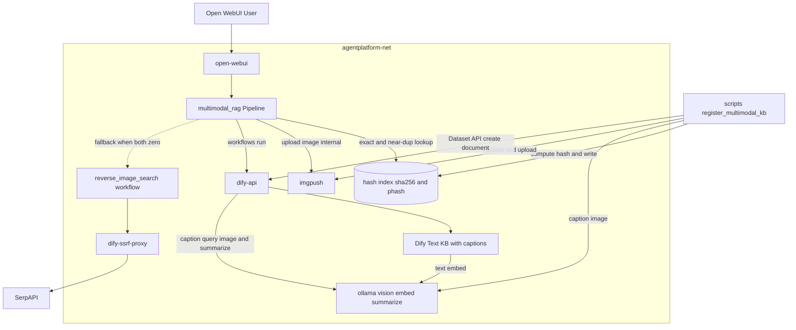
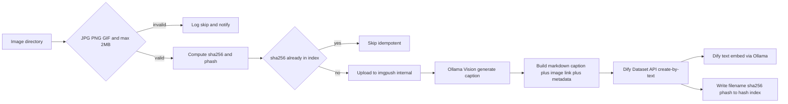
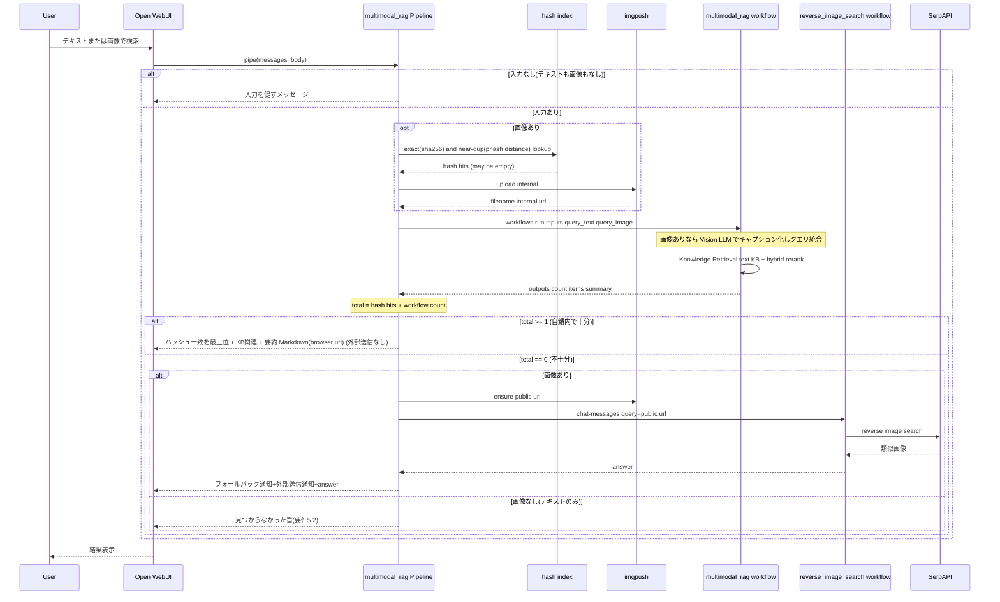
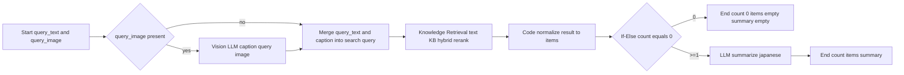

# Design Document

## Overview

本機能は、`dify-integration` が構築したPipeline中継基盤と `reverse-image-search` が追加した imgpush の上に、**Difyテキストナレッジベース（KB）＋画像キャプション（caption）による自鯖内クロスモーダル検索**を新設し、自鯖内で十分な結果が得られない場合に **`reverse-image-search`（Web逆画像検索）へフォールバック**する導線を確立する。

> **設計方針転換の経緯（Phase 0互換性スパイクの結果）**: 当初は Xinference によるローカル・マルチモーダル埋め込み＋vision rerank を前提としたが、Phase 0スパイク（2026-07-03, `research.md`）で (1) Dify v1.11 のマルチモーダル埋め込み枠がクラウドプラグイン（Bedrock/Vertex/Jina/Tongyi）限定で汎用ローカル埋め込みを受理しないこと、(2) Xinference 上で `jina-clip-v2`/`gme-Qwen2-VL`/`Qwen3-VL-Embedding` がいずれも依存関係（TorchCodec/PyTorch/FFmpeg・trust_remote_code）でロード不能なこと、が確定した。プライバシー最優先方針（steering NFR#1）を守るため、クラウド埋め込みは採らず、以下の**2系統のローカル手法を併用**する方式へ転換する:
> 1. **ハッシュ照合レイヤ（視覚的一致）**: 登録画像のコンテンツハッシュ（SHA-256＝完全一致）と知覚ハッシュ（pHash/dHash＝視覚的な準一致）を副インデックスに保持し、画像クエリ時に完全一致・酷似を高精度・O(1)〜線形で検出する。Dify も GPU も不要（Pillow＋imagehash, CPUのみ）。
> 2. **caption 方式（意味的関連）**: 画像の説明文（キャプション）を既存 Ollama の Vision モデルで生成し、通常のテキスト埋め込み（Ollama）で Dify テキストKBに索引。テキスト/画像から内容関連の画像・情報を意味検索する。
>
> これにより Xinference（新規コンテナ）は不要となり、「画像→画像」の**完全一致・視覚酷似はハッシュ照合**で、**内容の意味的関連はキャプション意味検索**で担保する。学習済みマルチモーダル埋め込みによる「異なるが視覚的に似た画像」の厳密類似のみ本Specの対象外（将来Dify対応時に再検討）。

検索フローは、Open WebUI → `multimodal_rag` Pipeline が、画像入力時にまず**ハッシュ照合レイヤで完全一致・酷似を確認**し、並行して Dify `multimodal_rag` ワークフロー（workflowモード, 画像入力時は Vision LLM でクエリ画像をキャプション化 → テキストKB検索）で意味的関連を検索する。ハッシュ一致とキャプション検索の**双方が0件の場合のみ** Pipeline が `reverse_image_search` ワークフローを発火する。自鯖内検索は imgpush の internal/browser URLのみで完結し外部送信を伴わない（ハッシュ計算・埋め込み・要約・キャプション生成はすべてローカル）。フォールバック時のみ public URL 経由で SerpAPI へ画像が送信され、その旨をPipelineが通知する。

**Purpose**: 保存済み画像に対するテキスト/画像クロスモーダル検索を、外部送信なしの自鯖内で先に行い、不足時のみWeb検索へ補完する経路を確立する。

**Users**: 個人開発者（Ollama への Vision/埋め込みモデル用意・Dify テキストKB作成・画像登録・ワークフローインポート）、エンドユーザー（Open WebUIチャットでのテキスト/画像検索と結果閲覧）。

**Impact**: `pipelines/` に共有imgpushクライアントと multimodal_rag ブリッジを、`workflows/` に multimodal_rag ワークフローを、`scripts/` にKB登録スクリプト（キャプション生成付き）を追加する。新規コンテナは追加しない（既存 Ollama を再利用）。`docker/docker-compose.yml` は変更せず、`docker/.env.example` にのみ本機能の環境変数を追加する。既存サービス（open-webui / ollama / searxng / Difyサービス群 / pipelines / imgpush）の定義は変更しない。

### Goals
- ハッシュ照合（SHA-256＝完全一致、pHash/dHash＝視覚的準一致）で「画像→画像」の完全一致・視覚酷似をローカル高精度に検出し、他の関連結果より優先提示する
- Difyテキストナレッジベース＋画像キャプションで text→画像 / 画像→画像（内容関連）/ 画像→テキスト のクロスモーダル意味検索とRerankingを実現する
- ハッシュ計算・キャプション生成・埋め込み・要約をすべて既存 Ollama／CPUローカルで完結させ、自鯖内検索で外部送信を発生させない
- ハッシュ照合とキャプション検索の双方が0件のとき `reverse_image_search` ワークフローへフォールバックし、外部送信通知を前置する
- 画像登録（JPG/PNG/GIF・最大2MB検証＋ハッシュ算出＋キャプション生成）を冪等な運用スクリプトで提供する
- 入力未提供・結果0件・処理失敗の各ケースでユーザーに分かるメッセージを返す
- 検索結果を `reverse-image-search` と統一した出力フォーマット（Markdown画像埋め込み＋関連情報＋要約）で提示する

### Non-Goals
- 学習済みマルチモーダル埋め込みによる「異なるが視覚的に似た画像」の厳密な類似検索（マルチモーダル埋め込みが前提。本Specは完全一致・準一致をハッシュで、内容関連をキャプションで代替。将来Difyがローカル・マルチモーダル埋め込みに対応した時点で再検討）
- Web上の逆画像検索ロジック自体（`reverse-image-search` Specが担当・本Specは発火のみ）
- 画像生成/動画生成結果の自動KB登録（将来検討・境界外）
- Instagram検索（`instagram-search` Specが担当）
- Open WebUIチャットからの画像登録UI（登録は運用スクリプト経由・将来検討）
- imgpush画像（登録画像・検索一時画像）の自動失効・定期削除（運用フォローアップ・境界外）
- Dify以外のベクトルDB/埋め込み基盤への移行、マルチKB横断のルーティング

## Boundary Commitments

### This Spec Owns
- `pipelines/imgpush_client.py`（`ImgpushClient`＋画像バリデーション）: 画像バイト→imgpush→{filename, internal/browser/public URL} 組み立てと JPG/PNG/GIF・2MB検証の契約
- `pipelines/image_hash_index.py`（`ImageHashIndex`）: 画像バイト→SHA-256（完全一致）＋知覚ハッシュ（pHash/dHash, 準一致）算出、副インデックス（JSON/SQLite）の読み書き、画像クエリに対する完全一致・準一致（ハミング距離閾値）検索の契約。登録スクリプトが書き込み、Pipeline が読み込み。Pillow＋imagehash 依存（CPUのみ）
- `pipelines/multimodal_rag_bridge.py`（`multimodal_rag` Pipeline＋`DifyWorkflowBridge`）: テキスト/画像入力の解釈・ハッシュ照合とワークフロー検索の統合・十分性判定によるフォールバック発火・表示用Markdown組み立て・通知/エラー処理の契約
- `workflows/multimodal_rag.yml`（workflowモード）: Start(text+image)→[画像時]Vision LLMキャプション→クエリ統合→Knowledge Retrieval(テキストKB・hybrid/weighted rerank)→正規化Code→0件分岐→LLM要約→End(構造化出力 count/items/summary) の Dify DSL
- `scripts/register_multimodal_kb.py`: ディレクトリ内画像の検証→imgpushアップロード→**ハッシュ算出＋副インデックス登録**→**Ollama Visionでキャプション生成**→Markdown文書化→Dify Dataset API登録（冪等）
- 本機能の環境変数定義と `.env.example` 追加（`IMGPUSH_BROWSER_BASE_URL`・`MULTIMODAL_RAG_CAPTION_MODEL`・`MULTIMODAL_RAG_HASH_INDEX_PATH`・`MULTIMODAL_RAG_PHASH_MAX_DISTANCE`・`DIFY_MULTIMODAL_RAG_APP_API_KEY`・`DIFY_DATASET_API_KEY`・`MULTIMODAL_RAG_DATASET_ID`）。既存 Ollama 接続情報（`dify-integration`/既存 `.env`）を再利用
- pipelines ランタイムへの `Pillow`・`imagehash` 依存追加（`pipelines/requirements.txt` 等、既存の依存宣言方式に従う）
- セットアップ手順（`docs/multimodal-rag-setup.md`）: Ollama Vision/埋め込みモデル用意・Difyへのモデル設定・テキストKB作成・Dataset APIキー発行・画像登録（ハッシュ＋キャプション）・ハッシュ副インデックスの共有パス設定・ワークフローインポート・E2E確認

### Out of Boundary
- `reverse_image_search.yml` および reverse-image-search の imgpush public 公開ロジック・SerpAPI検索ロジックの実装（本Specは workflow を無改変で呼ぶのみ）
- `reverse_image_search_bridge.py` を共有 `imgpush_client.py` へ移行するリファクタ（任意フォローアップ）
- `dify-integration` 構築済みの Pipeline ランタイム・Difyサービス群・Ollama サービス・`agentplatform-net` の変更（`docker-compose.yml` は無改変）
- imgpush 公開到達手段（トンネル/リバースプロキシ）の構築（オペレーター責務、`reverse-image-search` で定義済み）
- 埋め込み画像の自動失効・保持期間管理
- 学習済みマルチモーダル埋め込みによる「異なるが視覚的に似た画像」の厳密類似 — Dify対応待ちの将来検討（完全一致・準一致はハッシュ照合で本Spec対象）

### Allowed Dependencies
- `dify-integration`: Pipeline ランタイム・Dify API（`/v1/chat-messages`・`/v1/workflows/run`・Dataset API `/v1/datasets/...`）・Ollama サービス（Vision＋テキスト埋め込み＋要約）・`agentplatform-net`・`.env` 管理・`dify-ssrf-proxy`
- `reverse-image-search`: imgpush サービス・`reverse_image_search` ワークフロー（フォールバック先, app APIキー `DIFY_REVERSE_IMAGE_SEARCH_APP_API_KEY`）・`IMGPUSH_INTERNAL_URL`/`IMGPUSH_PUBLIC_BASE_URL`
- Ollama（既存）: 画像キャプション用 Vision モデル・テキスト埋め込みモデル・要約用チャットモデル（すべてDifyにプロバイダ登録済みの Ollama を利用）
- Python ライブラリ `Pillow`・`imagehash`（ハッシュ算出, CPUのみ・ネットワーク不要）
- 外部サービス SerpAPI（フォールバック発生時のみ、reverse-image-search経由で間接利用）

### Revalidation Triggers
- `multimodal_rag` Pipeline が公開するモデルID・Valves（環境変数名）・エラー/通知文・出力フォーマットの変更 → `ui-customization` で再確認
- `multimodal_rag.yml` の入出力契約（Start入力 query_text/query_image、End出力 count/items/summary）の変更 → Pipeline と本ワークフローのインポート手順で再確認
- `ImgpushClient` のインターフェース変更 → 登録スクリプトと Pipeline、（移行する場合）reverse-image-search で再確認
- ハッシュ副インデックスのスキーマ・ハッシュアルゴリズム・準一致閾値（`MULTIMODAL_RAG_PHASH_MAX_DISTANCE`）・保存パスの変更 → 登録スクリプトと Pipeline の双方で再確認（インデックス再構築が必要になり得る）
- キャプション生成方式（Ollama Vision モデル・プロンプト）またはテキスト埋め込みモデルの変更 → 登録済みKBの再索引が必要になり得るため、登録スクリプトとワークフローの双方で再確認
- フォールバック契約（`reverse_image_search` app の query=公開URL・応答形式）の変更 → reverse-image-search Spec と本Specの双方で再確認

## Architecture

### Existing Architecture Analysis
- 既存パターン: `web-search`/`reverse-image-search` が確立した「Pipeline中継 + Dify advanced-chat ワークフロー」。本Specは初の **workflowモード**アプリ（構造化出力が必要なため）と、初の **Difyナレッジベース**を導入する。埋め込み・要約・キャプションはすべて既存 Ollama で賄い、新規推論基盤は追加しない。
- 維持する制約: 全サービスは `agentplatform-net` でコンテナ名解決。ホスト公開は `127.0.0.1:${PORT}`。シークレットは `docker/.env`（VCS対象外）。層依存 `docker ← pipelines ← workflows`。LLM/埋め込み推論はローカル（Ollama）。
- 本Specの逸脱点: なし（外部送信はフォールバック時のSerpAPIのみで、これは reverse-image-search が既に通知付きで定義済みの経路）。新規コンテナ追加なし。

### Architecture Pattern & Boundary Map



**Architecture Integration**:
- 選定パターン: 自鯖内検索は「Pipeline中継 + ローカル・ハッシュ照合（完全/準一致）＋ Dify workflowモード（Vision キャプション → テキストKB検索＋hybrid rerank, 意味的関連）」の**二層併走**。フォールバックは **Pipeline主導**で `reverse_image_search` advanced-chat ワークフローを呼ぶ。
- 責務境界: 入力解釈・**ハッシュ照合**・結果統合（ハッシュ一致を優先）・十分性判定・フォールバック発火・表示Markdown組み立て・通知は Pipeline。クエリ画像のキャプション化・KB検索/Reranking/要約はワークフロー。キャプション生成/埋め込み/要約推論は Ollama。ハッシュ算出は CPU ローカル。Web検索本体は reverse-image-search（境界外）。
- 既存パターンの継承: `agentplatform-net` 名前解決、`127.0.0.1:${PORT}` 公開、`.env` 管理、`ImgpushClient`（reverse-image-search のアップロード手法を共有ヘルパー化）、`dify-ssrf-proxy` 経由アウトバウンド（フォールバック時）、Ollama ローカル推論。
- 新規コンポーネントの理由: `image_hash_index.py`（完全/準一致の視覚照合を Dify 非依存でローカル提供）、`imgpush_client.py`（登録スクリプトとPipelineで共有）、`multimodal_rag_bridge.py`（テキスト/画像中継＋二層統合＋フォールバック制御）、`multimodal_rag.yml`（キャプション化＋KB検索オーケストレーション）、`register_multimodal_kb.py`（ハッシュ＋キャプション付き冪等登録）。新規サービスコンテナは無し。
- ハッシュ副インデックスの共有: 登録スクリプト（書き込み）と Pipeline（読み込み）が同一パス（`MULTIMODAL_RAG_HASH_INDEX_PATH`）を参照。pipelines コンテナが読める場所に配置する（既存の pipelines バインドマウント配下、または専用の読み取り可能ボリューム。詳細は File Structure 参照）。
- Steering準拠: 層依存維持、外部送信ゼロ（自鯖内検索）、フォールバック時の外部送信は通知付き。全推論ローカル（Ollama）。

### Technology Stack

| Layer | Choice / Version | Role in Feature | Notes |
|-------|------------------|-----------------|-------|
| 視覚一致（完全/準一致） | SHA-256（hashlib）＋ 知覚ハッシュ（`imagehash` pHash/dHash, Pillow） | 画像→画像の完全一致・視覚酷似をローカル検出し最優先提示 | CPUのみ・GPU/Dify不要。副インデックス（`MULTIMODAL_RAG_HASH_INDEX_PATH`）に保持。準一致閾値は `MULTIMODAL_RAG_PHASH_MAX_DISTANCE` |
| キャプション生成 | Ollama Vision モデル（既存, 例 qwen2.5-vl / gemma3 系） | 登録画像・クエリ画像の説明文（日本語）生成 | 登録時は register スクリプトが直接Ollama呼び出し、検索時はワークフローの Vision LLM ノード |
| テキスト埋め込み | Ollama 埋め込みモデル（既存, 例 bge-m3 / nomic-embed-text 等） | キャプション文書のベクトル化・検索 | Difyにプロバイダ登録済みの Ollama を使用。クラウド送信なし |
| ナレッジベース | Dify **テキストKB**（既存dify-api） | キャプション文書の索引・意味検索・Reranking | 通常のテキストKB。画像はMarkdownリンクで文書に埋め込み表示用に保持 |
| Reranking | Dify Knowledge Retrieval の hybrid search / weighted score（rerankモデル不要） | 関連度順の並べ替え | 追加のrerankモデル・インフラ不要でローカル完結（要件3.1） |
| Workflow Engine | Dify **workflowモード**（既存dify-api） | キャプション化→KB検索→正規化→0件分岐→要約→構造化出力 | 既存はadvanced-chat。本Specは構造化出力のためworkflowモード |
| Pipeline実装 | Python 3.x（Open WebUI Pipelines, requests/pydantic） | 入力解釈・中継・十分性判定・フォールバック・通知・エラー処理 | PEP8・型ヒント必須 |
| 共有ヘルパー | `pipelines/imgpush_client.py` | imgpushアップロード＋3スコープURL組み立て＋画像バリデーション | 登録スクリプトとPipelineで共有 |
| 登録スクリプト | Python（Ollama Vision + Dify Dataset API, requests） | 画像検証→imgpush→キャプション生成→Markdown文書化→KB登録（冪等） | `scripts/` 規約（冪等） |
| LLM（要約） | Ollama接続済みモデル（既存, Vision不要） | 検索結果の日本語要約 | インポート後にモデル設定 |
| 外部API | SerpAPI（フォールバック時のみ・間接） | reverse-image-search 経由のWeb逆画像検索 | 本Specは発火のみ |

## File Structure Plan

### Directory Structure
```
pipelines/
├── imgpush_client.py           # 新規: ImgpushClient + 画像バリデーション（登録/検索で共有）
├── image_hash_index.py         # 新規: ImageHashIndex（SHA-256/pHash算出・副インデックス読書き・完全/準一致検索）
└── multimodal_rag_bridge.py    # 新規: multimodal_rag Pipeline + DifyWorkflowBridge + ハッシュ統合 + フォールバック制御

workflows/
└── multimodal_rag.yml          # 新規: Dify workflowモード DSL（キャプション化→KB検索→分岐→要約→構造化出力）

scripts/
└── register_multimodal_kb.py   # 新規: 画像検証→imgpush→ハッシュ算出/索引→Ollamaキャプション→Markdown→Dataset API登録（冪等）

docs/
└── multimodal-rag-setup.md     # 新規: Ollamaモデル/テキストKB/Dataset APIキー/ハッシュ索引共有パス/登録/インポート/E2E手順

pipelines/tests/
├── test_imgpush_client.py      # 新規: アップロードURL組み立て・バリデーション
├── test_image_hash_index.py    # 新規: ハッシュ算出・完全一致・準一致（ハミング距離閾値）・索引冪等
└── test_multimodal_rag_bridge.py # 新規: 入力分岐・ハッシュ統合・十分性判定・フォールバック・通知・エラー
```

### Modified Files
- `docker/.env.example` — `IMGPUSH_BROWSER_BASE_URL`・`MULTIMODAL_RAG_CAPTION_MODEL`・`MULTIMODAL_RAG_HASH_INDEX_PATH`・`MULTIMODAL_RAG_PHASH_MAX_DISTANCE`・`DIFY_MULTIMODAL_RAG_APP_API_KEY`・`DIFY_DATASET_API_KEY`・`MULTIMODAL_RAG_DATASET_ID` を追加。キャプション用 Vision モデル・テキスト埋め込みモデル・要約モデルはDify管理画面（Ollamaプロバイダ）で設定する旨をコメントで明記。既存の Ollama 接続情報を再利用する旨も明記
- `pipelines/requirements.txt`（または pipelines ランタイムの依存宣言）— `Pillow`・`imagehash` を追加（ハッシュ算出、CPUのみ）

> **`docker/docker-compose.yml` は原則変更しない**（新規コンテナ追加なし。Xinference は不採用）。ただしハッシュ副インデックス（`MULTIMODAL_RAG_HASH_INDEX_PATH`）を **登録スクリプト（書き込み）と pipelines コンテナ（読み込み）で共有**する必要がある。既存の pipelines バインドマウント配下にインデックスを置けば compose 変更は不要。共有できない配置の場合のみ、読み取り可能なボリューム/バインドマウントを1つ追加する（実装時に既存マウント構成を確認して決定）。
> 依存方向: `imgpush_client.py`・`image_hash_index.py` は共有ヘルパー。`multimodal_rag_bridge.py`（pipelines）と `register_multimodal_kb.py`（scripts）が利用。ワークフローはPipelineから呼ばれる（`pipelines → workflows`）。`docker/` はこれらを参照しない。

## System Flows

### 画像登録フロー (1.1, 1.2, 1.3)



**フロー上の決定事項**:
- バリデーション（要件1.1）は `ImgpushClient` の検証関数で形式（JPG/PNG/GIF）とサイズ（≤2MB）を確認。違反は登録せずスキップ＋通知（要件1.2）。
- **ハッシュ算出＋冪等判定**: 検証通過画像の SHA-256（完全一致キー）と pHash/dHash（準一致キー）を算出。SHA-256 が既に副インデックスにあれば登録済みとしてスキップ（冪等・キャプション再生成もアップロードも回避）。
- **キャプション生成**: 未登録画像を Ollama Vision モデルへ渡し、画像内容の日本語説明文を生成。これが意味検索の索引本文となる（テキスト埋め込み対象）。
- **副インデックス書き込み**: KB登録成功後に `{filename, sha256, phash, title}` を副インデックスへ追記。KB登録と副インデックスは一貫性を保つ（登録失敗時は索引も追記しない）。
- KB内画像の表示用URLに依存しないよう、Markdown文書には imgpush filename を保持（表示URLは検索時にbrowser baseから再構築）。

### 検索・フォールバックフロー (2.1-2.5, 3.x, 4.1-4.5, 5.1-5.3)



**フロー上の決定事項**:
- **二層併走**: 画像入力時は Pipeline がまず副インデックスに対し完全一致（SHA-256）と準一致（pHash のハミング距離 ≤ `MULTIMODAL_RAG_PHASH_MAX_DISTANCE`）を照合し、並行してワークフローで意味検索する。テキストのみ入力時はハッシュ照合をスキップしワークフローのみ。
- **結果統合と提示順（要件2.5, 3.1）**: ハッシュ一致（完全一致→準一致の順）を**最上位**に、続いてキャプション意味検索の関連結果を並べる。重複（同一filename）はハッシュ側を優先し除去。
- 十分性判定（要件4.1, 4.2）は `total = ハッシュ一致数 + workflow count`（score_threshold適用後）で行う。`total==0` を「不十分」とする。KB側閾値は Knowledge Retrieval ノードの score_threshold で調整。
- 自鯖内で十分なときは imgpush internal/browser とローカルハッシュのみ使用し**外部送信ゼロ**。キャプション・埋め込み・要約はローカル Ollama。プライバシー通知も不要。
- フォールバックは Pipeline 主導（要件4.5: 発火制御はmultimodal-ragが所有、Web検索は reverse_image_search に委譲）。フォールバック時のみ public URL 経由で外部送信が発生するため、フォールバック通知＋外部送信通知を前置（要件4.3, 4.4）。
- 画像なし（テキストのみ）かつ自鯖内0件は、reverse-image-search が画像必須のためフォールバック不可 → 見つからなかった旨を返す（要件5.2）。
- サムネイル表示URLは Pipeline が `IMGPUSH_BROWSER_BASE_URL` ＋ filename で組み立て、ブラウザ到達性を担保（ハッシュ一致・KB結果とも filename から再構築）。

### ワークフロー内部フロー (2.1-2.3, 3.1, 5.2)



**フロー上の決定事項**:
- 画像入力時は Vision LLM ノード（Ollama）がクエリ画像を日本語キャプション化し、`query_text` と統合した検索クエリを生成する（要件2.2, 2.3）。テキストのみのときはキャプションを介さず `query_text` を直接使用（要件2.1）。これにより「画像→画像（内容関連）/画像→テキスト」を、登録時キャプションとクエリ側キャプションのテキスト意味一致として実現する。
- Knowledge Retrieval ノードは **テキストKB** に対し統合クエリで検索し、hybrid search / weighted score で関連度順に並べ替える（要件3.1、rerankモデル不要）。
- 正規化Codeノードは `result`（content=キャプション本文/metadata/title）から共通形式 `items=[{filename, title, text, source, score}]` を生成し件数を算出（要件3.1のスコア順を保持）。`filename` はキャプション文書のメタデータに保持した imgpush filename から取得。
- 後段（要約/End）はモダリティ非依存。`items` はJSON文字列でEndへ。表示用Markdownの最終組み立てはPipeline（browser URL注入）。

## Requirements Traceability

| Requirement | Summary | Components | Interfaces | Flows |
|-------------|---------|------------|------------|-------|
| 1.1 | 登録時に形式/サイズ検証 | ImgpushClient, RegisterScript | `validate_image()` | 登録フロー |
| 1.2 | 不正画像は登録せず通知 | RegisterScript | 検証失敗→skip/通知 | 登録フロー |
| 1.3 | 検証通過画像をKB登録 | RegisterScript, Text KB | caption生成→Dataset API create-by-text | 登録フロー |
| 2.1 | テキスト→画像検索 | MultimodalRAG Pipeline, Workflow | `run()` → Knowledge Retrieval(query_text) | 検索フロー / 内部フロー |
| 2.2 | 画像→関連画像検索（内容関連） | MultimodalRAG Pipeline, Workflow | imgpush upload → Vision caption → Knowledge Retrieval | 検索フロー / 内部フロー |
| 2.3 | 画像→関連情報取得 | Workflow | Vision caption → Knowledge Retrieval result content | 内部フロー |
| 2.4 | 処理中状態の維持 | MultimodalRAG Pipeline | `pipe()` blocking | 検索フロー |
| 2.5 | 完全一致・視覚酷似を優先取得 | MultimodalRAG Pipeline, ImageHashIndex | `query()` sha256/phash lookup | 登録フロー / 検索フロー |
| 3.1 | Rerankで関連度順（ハッシュ一致を最優先） | MultimodalRAG Pipeline, Workflow | hybrid/weighted score + ハッシュ一致前置 | 検索フロー / 内部フロー |
| 3.2 | Markdownサムネイル表示 | MultimodalRAG Pipeline | browser URL Markdown組み立て | 検索フロー |
| 3.3 | 関連情報併記 | MultimodalRAG Pipeline, Workflow | items(text/source) | 検索/内部フロー |
| 3.4 | 統一出力フォーマット | MultimodalRAG Pipeline | Markdown画像+情報+要約 | 検索フロー |
| 4.1 | 自鯖内を先に試行・十分性判定 | MultimodalRAG Pipeline, Workflow, ImageHashIndex | total = hash hits + `run()` count | 検索フロー |
| 4.2 | 0件/不十分でフォールバック | MultimodalRAG Pipeline | total==0分岐 | 検索フロー |
| 4.3 | 切替をユーザー通知 | MultimodalRAG Pipeline | フォールバック通知前置 | 検索フロー |
| 4.4 | 外部送信通知が到達 | MultimodalRAG Pipeline | 外部送信通知前置 | 検索フロー |
| 4.5 | 発火制御を所有・Web検索は委譲 | MultimodalRAG Pipeline, RIS Workflow | DifyChatBridge.ask(public url) | 検索フロー |
| 5.1 | 入力未提供時に通知 | MultimodalRAG Pipeline | 入力なし分岐 | 検索フロー |
| 5.2 | 双方0件で通知 | MultimodalRAG Pipeline | 0件最終応答 | 検索フロー |
| 5.3 | 処理失敗時にエラー応答 | MultimodalRAG Pipeline, RegisterScript | 例外捕捉→メッセージ | 検索/登録フロー |

## Components and Interfaces

| Component | Domain/Layer | Intent | Req Coverage | Key Dependencies (P0/P1) | Contracts |
|-----------|--------------|--------|--------------|--------------------------|-----------|
| ImgpushClient (`pipelines/imgpush_client.py`) | Application/Adapter | 画像検証＋imgpushアップロード＋3スコープURL組み立て | 1.1, 2.2 | imgpush (P0) | Service |
| ImageHashIndex (`pipelines/image_hash_index.py`) | Application/Adapter | SHA-256/pHash算出・副インデックス読書き・完全/準一致検索 | 2.5, 3.1, 4.1 | Pillow/imagehash (P0), 共有インデックスパス (P0) | Service |
| MultimodalRAG Pipeline (`pipelines/multimodal_rag_bridge.py`) | Application | 入力解釈・ハッシュ照合統合・中継・十分性判定・フォールバック・表示組み立て・通知/エラー | 2.1-2.5, 3.1-3.4, 4.1-4.5, 5.1-5.3 | Workflow run (P0), ImageHashIndex (P0), imgpush (P0), RIS app (P0) | Service |
| MultimodalRAG Workflow (`workflows/multimodal_rag.yml`) | Workflow | クエリ画像キャプション化＋KB検索＋Rerank→正規化→0件分岐→要約→構造化出力 | 2.1-2.3, 3.1, 5.2 | Text KB (P0), Ollama Vision/埋め込み (P0), Ollama要約 (P1) | API |
| Register Script (`scripts/register_multimodal_kb.py`) | Operational | 画像検証→imgpush→ハッシュ索引→キャプション→Markdown→Dataset API登録（冪等） | 1.1, 1.2, 1.3, 2.5, 5.3 | ImgpushClient (P0), ImageHashIndex (P0), Ollama Vision (P0), Dataset API (P0) | Batch |
| Text KB with captions (Dify) | Data | キャプション文書の統合索引・意味検索・Reranking | 1.3, 2.1-2.3, 3.1 | Ollama 埋め込み (P0) | State |
| Setup Documentation (`docs/multimodal-rag-setup.md`) | Documentation | Ollamaモデル/KB/キー/登録/インポート/E2E手順 | 1.1-5.3 | - | - |

### Application

#### ImgpushClient (`pipelines/imgpush_client.py`)

| Field | Detail |
|-------|--------|
| Intent | 画像を検証し imgpush へアップロードして filename と internal/browser/public URL を返す |
| Requirements | 1.1, 2.2 |

**Responsibilities & Constraints**
- `validate_image(image_bytes, mime_type)`: 形式が JPG/PNG/GIF 以外、またはサイズ>2MB のとき `ImageValidationError` を送出（要件1.1）
- `upload(image_bytes, mime_type)`: imgpush `POST /`（multipart `file`）→ `{"filename"}` を取得し、`internal_url`・`browser_url`・`public_url` を組み立てて返す
- 各 base URL は引数/環境変数で受け取りハードコードしない。`public_url` は `public_base_url` 未設定時 `None`（フォールバック時のみ必須）
- imgpush接続/HTTPエラーは `requests.exceptions.RequestException` を送出し呼び出し元に委ねる
- Open WebUIメッセージ形式に依存しない（入力は画像バイト＋MIME）

**Dependencies**
- Outbound: imgpush `POST /` — 画像アップロード (P0)
- External: `hauxir/imgpush` イメージ（reverse-image-search が追加済み）(P0)

**Contracts**: Service [x] / API [ ] / Event [ ] / Batch [ ] / State [ ]

##### Service Interface
```python
from dataclasses import dataclass
from typing import Optional

class ImageValidationError(ValueError):
    """形式/サイズ違反"""

@dataclass
class ImgpushUploadResult:
    filename: str
    internal_url: str            # f"{internal_base}/{filename}"
    browser_url: str             # f"{browser_base}/{filename}"
    public_url: Optional[str]    # f"{public_base}/{filename}" or None

ALLOWED_MIME = {"image/jpeg", "image/png", "image/gif"}
MAX_SIZE_BYTES = 2 * 1024 * 1024

class ImgpushClient:
    def __init__(self, internal_url: str, browser_base_url: str,
                 public_base_url: str, timeout: int) -> None: ...

    def validate_image(self, image_bytes: bytes, mime_type: str) -> None:
        """Raises ImageValidationError if mime not in ALLOWED_MIME or size > MAX_SIZE_BYTES."""

    def upload(self, image_bytes: bytes, mime_type: str) -> ImgpushUploadResult:
        """検証は呼び出し側で済ませる前提。imgpushへアップロードしURL群を返す。
        Raises: requests.exceptions.RequestException"""
```
- Preconditions: `image_bytes` 非空、`mime_type` が画像MIME
- Postconditions: `internal_url`/`browser_url` は常に返る。`public_url` は設定時のみ
- Invariants: imgpush へユーザー識別情報を付与しない

**Implementation Notes**
- Integration: `multimodal_rag_bridge.py` と `register_multimodal_kb.py` が import。reverse-image-search の `ImgpushUploader` ロジックを継承しつつ3スコープURLへ拡張
- Validation: モックで URL組み立て、`ImageValidationError`（gif以外/2MB超）、`RequestException` を確認
- Risks: base URL 末尾スラッシュ正規化（`rstrip('/')`）。imgpush の拡張子付与差異

#### ImageHashIndex (`pipelines/image_hash_index.py`)

| Field | Detail |
|-------|--------|
| Intent | 画像のSHA-256（完全一致）と知覚ハッシュ（準一致）を算出し、副インデックスを読み書きして画像クエリの完全/準一致を返す |
| Requirements | 2.5, 3.1, 4.1 |

**Responsibilities & Constraints**
- `compute(image_bytes)`: SHA-256（`hashlib`）と pHash/dHash（`imagehash`＋Pillow）を算出して返す。Dify/GPU/ネットワーク不要（CPUローカル）
- `add(entry)`: `{filename, sha256, phash, title}` を副インデックス（`index_path`）へ追記。SHA-256 の重複は追記しない（冪等）
- `query(image_bytes, max_distance)`: 完全一致（SHA-256 等価）を最優先、続いて準一致（pHash のハミング距離 ≤ `max_distance`）を距離昇順で返す。ヒットゼロは空リスト
- 副インデックスは登録スクリプト（書き込み）と Pipeline（読み込み）で共有。読み込み時はファイル不在を空インデックスとして扱い例外にしない
- スレッド/プロセス跨ぎの同時書き込みは想定せず（個人利用・逐次登録）。破損防止のため書き込みはアトミック（一時ファイル→rename）

**Dependencies**
- Outbound: ローカルファイルシステム（`MULTIMODAL_RAG_HASH_INDEX_PATH`）(P0)
- External: `Pillow`・`imagehash`（CPUのみ）(P0)

**Contracts**: Service [x] / API [ ] / Event [ ] / Batch [ ] / State [ ]

##### Service Interface
```python
from dataclasses import dataclass

@dataclass
class HashEntry:
    filename: str
    sha256: str
    phash: str
    title: str

@dataclass
class HashMatch:
    entry: HashEntry
    match_type: str   # "exact" | "near"
    distance: int     # exact は 0

class ImageHashIndex:
    def __init__(self, index_path: str, phash_max_distance: int) -> None: ...

    def compute(self, image_bytes: bytes) -> tuple[str, str]:
        """Returns (sha256_hex, phash_hex). Raises: PIL.UnidentifiedImageError for非画像."""

    def add(self, entry: HashEntry) -> bool:
        """未登録(sha256新規)なら追記しTrue、登録済みならFalseでスキップNoop（冪等）。"""

    def query(self, image_bytes: bytes, max_distance: int | None = None) -> list[HashMatch]:
        """完全一致(match_type=exact)を先頭、続けて準一致(near, distance昇順)を返す。"""
```
- Preconditions: `image_bytes` は復号可能な画像。`index_path` は書込/読込可能なパス
- Postconditions: `query` はヒット無しで空リスト。`exact` は `distance==0`
- Invariants: SHA-256 が同一なら同一登録画像として扱う（完全一致）。副インデックスに個人識別情報を保持しない

**Implementation Notes**
- Integration: `register_multimodal_kb.py`（`add`）と `multimodal_rag_bridge.py`（`query`）が import。索引フォーマットは JSON（小規模）または SQLite（件数増時）。初期は JSON、件数増で SQLite 化を検討
- Validation: モックで 完全一致（同一バイト）・準一致（リサイズ/再圧縮画像がハミング距離閾値内でヒット）・非該当（無関係画像がヒットしない）・`add` の冪等（同一SHA二重追記なし）を確認
- Risks: pHash 閾値の調整（緩すぎると誤検出／厳しすぎると取りこぼし）。GIF アニメーションは先頭フレームでハッシュ化。索引ファイルの共有パス到達性（File Structure 参照）

#### MultimodalRAG Pipeline (`pipelines/multimodal_rag_bridge.py`)

| Field | Detail |
|-------|--------|
| Intent | テキスト/画像入力を、ローカル・ハッシュ照合と自鯖内KB検索へ中継・統合し、不十分時にreverse_image_searchへフォールバック、結果を統一フォーマットで返す |
| Requirements | 2.1-2.5, 3.1-3.4, 4.1-4.5, 5.1-5.3 |

**Responsibilities & Constraints**
- `self.id = "multimodal_rag"`。`Valves` に各Dify/imgpush/ハッシュ環境変数を保持
- `messages[-1]` から テキスト（`user_message`）と任意の画像（`image_url` data URI）を抽出。両方なければ入力を促す（要件5.1）
- 画像があれば まず `ImageHashIndex.query()` で完全一致・準一致を照合（要件2.5）。並行して `ImgpushClient.upload()`（internal）→ `query_image` を `workflows/run` の inputs に remote_url 形式で渡す（要件2.2）。クエリ画像のキャプション化はワークフロー内 Vision LLM ノードが担うため、Pipeline はキャプション生成を行わない
- `DifyWorkflowBridge.run(inputs, files, user_id)` で `multimodal_rag` を呼び、`outputs={count, items, summary}` を取得（要件2.1-2.3, 4.1）
- 結果統合: `total = ハッシュ一致数 + count`。ハッシュ一致（完全→準一致）を最上位に、続いてKB意味検索の `items` を並べ、同一filenameの重複はハッシュ側優先で除去（要件2.5, 3.1）
- `total>=1`: 統合結果を `IMGPUSH_BROWSER_BASE_URL` でサムネイルMarkdown化し、関連情報＋要約を統一フォーマットで返す（外部送信なし・通知なし）（要件3.2-3.4）
- `total==0` かつ画像あり: public URL を確保し `DifyChatBridge.ask(public_url)` で `reverse_image_search` を発火。フォールバック通知＋外部送信通知を前置（要件4.2-4.5）
- `total==0` かつ画像なし: 見つからなかった旨を返す（要件5.2）
- `ImageValidationError`/`ValueError`/`RequestException` を捕捉し、例外を伝播せずユーザー向けエラー文字列を返す（要件5.3）。ハッシュ索引の読み込み失敗は空一致として扱い検索を継続（KB検索へフォールバックし機能停止を避ける）

**Dependencies**
- Inbound: Open WebUI — `pipe()` (P0)
- Outbound: ImageHashIndex — 完全/準一致照合 (P0)
- Outbound: Dify `/workflows/run`（multimodal_rag）(P0)
- Outbound: Dify `/chat-messages`（reverse_image_search, フォールバック）(P0)
- Outbound: ImgpushClient (P0)

**Contracts**: Service [x] / API [ ] / Event [ ] / Batch [ ] / State [ ]

##### Service Interface
```python
from pydantic import BaseModel

class Valves(BaseModel):
    DIFY_API_BASE_URL: str
    DIFY_MULTIMODAL_RAG_APP_API_KEY: str          # workflowモードアプリ
    DIFY_REVERSE_IMAGE_SEARCH_APP_API_KEY: str    # フォールバック先(advanced-chat)
    IMGPUSH_INTERNAL_URL: str
    IMGPUSH_BROWSER_BASE_URL: str                 # 既定 http://localhost:${IMGPUSH_PORT}
    IMGPUSH_PUBLIC_BASE_URL: str                  # フォールバック時のみ必須
    MULTIMODAL_RAG_HASH_INDEX_PATH: str           # ハッシュ副インデックスの共有パス
    MULTIMODAL_RAG_PHASH_MAX_DISTANCE: int        # 準一致のハミング距離閾値
    REQUEST_TIMEOUT_SECONDS: int

class DifyWorkflowBridge:
    def run(self, inputs: dict, files: list, user_id: str) -> dict:
        """POST /workflows/run (response_mode=blocking)。data.outputs(dict)を返す。
        Raises: requests.exceptions.RequestException"""

class Pipeline:
    def pipe(self, user_message: str, model_id: str, messages: list, body: dict) -> str:
        """テキスト/画像を ハッシュ照合＋自鯖内KB検索へ統合→必要時フォールバック。常に文字列を返し例外を伝播しない。"""
```
- Preconditions: `messages` がOpen WebUIメッセージ形式
- Postconditions: 戻り値は常に文字列。フォールバック経路でのみ外部送信通知を含む
- Invariants: `total>=1`（ハッシュ一致 or KB充足）では imgpush public/SerpAPI を呼ばない（外部送信ゼロ）。ハッシュ照合はローカルで完結し外部送信しない

**Implementation Notes**
- Integration: 画像抽出は reverse-image-search の `_extract_image`/`_decode_data_uri` と同等。`ImageHashIndex` と `ImgpushClient` を import。`DifyChatBridge` は既存と同型に本ファイル内へ実装。`workflows/run` の files は `[{type:"image", transfer_method:"remote_url", url: internal_url}]`
- Validation: モックで (a) 入力なし→促し、(b) テキストのみ count>=1→自鯖結果（通知なし）、(c) 画像でハッシュ完全一致→当該画像を最上位に提示（外部送信なし）、(d) 画像で total==0→フォールバック＋両通知、(e) テキストのみ total==0→見つからない、(f) 例外→エラー文字列、(g) ハッシュ索引読込失敗→空一致でKB検索継続。`docker compose restart pipelines` 後 `GET /models` に `multimodal_rag` が含まれること
- Risks: `/workflows/run` の画像入力形式・Vision LLM ノードへの画像受け渡し。browser URL のリモートアクセス耐性。ハッシュ索引の共有パス到達性

### Workflow

#### MultimodalRAG Workflow (`workflows/multimodal_rag.yml`)

| Field | Detail |
|-------|--------|
| Intent | クエリ画像をキャプション化しテキストKBを意味検索＋Rerankし、正規化・0件分岐・要約して構造化出力するDify workflowモードアプリ |
| Requirements | 2.1, 2.2, 2.3, 3.1, 5.2 |

**Responsibilities & Constraints**
- Start（inputs: `query_text` string・`query_image` file 任意）→ [画像あり] Vision LLM（Ollama）でクエリ画像キャプション化 → クエリ統合（`query_text` ＋ caption）→ Knowledge Retrieval（テキストKB, hybrid/weighted rerank, top_k/score_threshold）→ Code（`result`→`items` 正規化・件数算出）→ If-Else（count==0）→ LLM要約（≥1件）/ End（0件）
- End 出力: `count`(number)・`items`(string, JSON)・`summary`(string)。表示Markdownの最終組み立てはPipeline（browser URL注入）
- インポート後に Vision LLM ノードのOllamaモデル・Knowledge Retrieval のKB・埋め込み設定・要約LLMノードのOllamaモデルを設定
- リクエストにユーザー識別情報を含めない

**Dependencies**
- Inbound: MultimodalRAG Pipeline — `POST /workflows/run` (P0)
- Outbound: Ollama Vision — クエリ画像キャプション (P0)
- Outbound: Text KB（Ollama 埋め込み）(P0)
- Outbound: Ollama接続済みモデル — 要約 (P1)

**Contracts**: Service [ ] / API [x] / Event [ ] / Batch [ ] / State [ ]

##### API Contract
| Method | Endpoint | Request | Response | Errors |
|--------|----------|---------|----------|--------|
| POST | `/v1/workflows/run`（Pipeline→ワークフロー） | `{inputs:{query_text, query_image?}, files?, response_mode:blocking, user}` | `{data:{outputs:{count, items, summary}}}` | Dify標準エラー（Pipelineが捕捉） |

> `items` は `[{filename, title, text, source, score}]` のJSON文字列。`filename` は キャプション文書に保持した imgpush filename（表示URLはPipelineが browser base から再構築）。

**Implementation Notes**
- Integration: APIキーは `DIFY_MULTIMODAL_RAG_APP_API_KEY`。KB・Vision/要約モデルはDify管理画面（Ollamaプロバイダ）で設定（docs参照）
- Validation: text→image / image→image / image→text の各クエリで正規化と要約、0件時の空出力を確認（要件2.1-2.3, 3.1, 5.2）
- Risks: クエリ画像キャプションの品質が検索再現率を左右。Vision LLM ノードへの画像入力（remote_url）受け渡し。テキストのみ入力時に Vision ノードを空処理でスキップする分岐設計

### Operational

#### Register Script (`scripts/register_multimodal_kb.py`)

| Field | Detail |
|-------|--------|
| Intent | ディレクトリ内画像を検証・ハッシュ索引・アップロード・キャプション生成・Markdown文書化しDify KBへ冪等登録する |
| Requirements | 1.1, 1.2, 1.3, 2.5, 5.3 |

**Responsibilities & Constraints**
- 入力ディレクトリを走査し、各画像を `ImgpushClient.validate_image()` で検証（要件1.1）。違反はスキップ＋ログ通知（要件1.2）
- `ImageHashIndex.compute()` で SHA-256/pHash を算出し、SHA-256 が副インデックスに既存なら登録済みとしてスキップ（冪等）
- 未登録画像を imgpush（internal）へアップロードし、**Ollama Vision モデルで日本語キャプションを生成**
- キャプション＋画像Markdownリンク＋filename/メタデータを含む文書を生成し、Dify Dataset API（`POST /v1/datasets/{MULTIMODAL_RAG_DATASET_ID}/document/create-by-text`）で登録（要件1.3）
- KB登録成功後に `ImageHashIndex.add()` で `{filename, sha256, phash, title}` を副インデックスへ追記（要件2.5）
- Ollama/Dataset API/imgpush エラーは捕捉しメッセージ＋非0終了（要件5.3）。KB登録失敗時は副インデックスへ追記しない（一貫性維持）

**Contracts**: Service [ ] / API [ ] / Event [ ] / Batch [x] / State [ ]

##### Batch / Job Contract
- Trigger: オペレーターが手動実行（`python scripts/register_multimodal_kb.py <dir>`）
- Input / validation: 画像ディレクトリ。形式 JPG/PNG/GIF・≤2MB
- Output / destination: Dify テキストKB（Dataset API）＋ ハッシュ副インデックス（`MULTIMODAL_RAG_HASH_INDEX_PATH`）
- Idempotency & recovery: SHA-256 で登録済みスキップ。途中失敗時は再実行で未登録分のみ処理

**Implementation Notes**
- Integration: `DIFY_DATASET_API_KEY`・`MULTIMODAL_RAG_DATASET_ID`・`MULTIMODAL_RAG_CAPTION_MODEL`・`MULTIMODAL_RAG_HASH_INDEX_PATH`・`MULTIMODAL_RAG_PHASH_MAX_DISTANCE`・Ollama接続情報（既存 `.env` 再利用）を環境変数で受け取る。`indexing_technique`/`process_rule` はDify既定（high_quality）。副インデックスは Pipeline と同一パスを指す
- Validation: モックで 不正画像スキップ・正常画像のハッシュ算出＋キャプション生成＋Dataset API呼び出し＋索引追記・再実行スキップを確認
- Risks: キャプション品質・Ollama Vision の応答時間（バッチ処理のため許容）。Dataset API のテキスト取り込み挙動。索引とKBの一貫性

### Data

#### Text KB with captions (Dify)

| Field | Detail |
|-------|--------|
| Intent | 画像キャプション文書を統合索引し、意味検索とRerankingを提供する |
| Requirements | 1.3, 2.1-2.3, 3.1 |

**Responsibilities & Constraints**
- 通常のDifyテキストKB（`high_quality`）。埋め込みは Ollama 埋め込みモデル（ローカル）
- 1画像＝1ドキュメント。本文はキャプション（画像内容の説明）＋任意メタデータ、Markdownに画像リンク（imgpush internal URL）と filename を保持
- Reranking は Knowledge Retrieval ノードの hybrid search / weighted score（rerankモデル不要）で関連度順に整列（要件3.1）

**Contracts**: Service [ ] / API [ ] / Event [ ] / Batch [ ] / State [x]

##### State Management
- State model: キャプション文書とベクトルをDify KB（既存ベクトルDB）に保持
- Persistence & consistency: 登録は冪等（filename/ハッシュキー）。imgpush 実体とKBドキュメントは1:1対応を維持
- Concurrency strategy: 個人利用・逐次登録前提

**Implementation Notes**
- Integration: KB作成・埋め込みモデル選択はDify管理画面（docs参照）。Dataset API 経由で文書登録
- Validation: 少数キャプション文書を登録し text→image / image(→caption)→image / image→text 検索が関連文書を返すこと
- Risks: 埋め込み/キャプション方式変更時は再索引が必要（Revalidation Triggers 参照）

## Data Models

### KB Document Model（論理）
- **登録単位**: 1画像＝1ドキュメント。本文＝Ollama生成キャプション（画像内容の説明）＋任意のテキストメタデータ（タイトル/説明）。Markdownに画像リンク（imgpush internal URL）を含む。
- **保持属性**: `filename`（imgpush）、`title`、`text`（キャプション＋関連情報）、（Dify生成）ベクトル。
- **不変条件**: 表示URLは保持しない（filename のみ）。表示時に browser base から再構築。
- **整合性**: 登録は冪等（filename/ハッシュキー）。imgpush 実体とKBドキュメントは1:1対応を維持。

### Hash Index Model（副インデックス）
- **単位**: 1画像＝1エントリ `{filename, sha256, phash, title}`。`MULTIMODAL_RAG_HASH_INDEX_PATH` に保持（初期 JSON、件数増で SQLite 化を検討）。
- **キー**: `sha256`（完全一致・冪等キー）、`phash`（準一致・ハミング距離比較）。
- **不変条件**: 個人識別情報を持たない。KB ドキュメントと 1:1（filename で対応）。書き込みはアトミック。
- **統合表示**: `query()` の `HashMatch` を Pipeline が `items` と同一の正規化形（filename/title/text/source/score）へ写像し、完全一致→準一致を最上位に前置。

### Retrieval 出力契約（正規化後 `items`）
```json
[{"filename": "abc.jpg", "title": "...", "text": "...", "source": "...", "score": 0.83}]
```
- score は検索/rerank スコア（降順＝要件3.1の関連度順）。ハッシュ一致は最上位（完全一致→準一致）に前置。`filename` 欠落項目はスキップ。

## Error Handling

### Error Strategy
Pipeline は例外を伝播せず常にユーザー向け文字列を返す。十分性判定（`total = ハッシュ一致 + KB count`）に基づき自鯖内→Webへ分岐。登録スクリプトは検証/接続/キャプション生成/索引エラーを捕捉しログ＋非0終了。

### Error Categories and Responses
- **入力未提供（5.1）**: テキストも画像も無い場合、検索を実行せず入力を促す
- **自鯖内 total==0＋画像なし（5.2）**: フォールバック不可のため見つからなかった旨を返す
- **自鯖内 total==0＋画像あり（4.2-4.5）**: フォールバック通知＋外部送信通知＋reverse_image_search結果（または更なる0件通知）を返す
- **ハッシュ索引の読込失敗（検索時）**: 空一致として扱い、KB検索へ継続（機能停止を避ける・要件5.3の一環）
- **imgpush/Dify接続失敗（5.3）**: `RequestException` を捕捉しエラーメッセージを返す
- **登録時の不正画像（1.2）**: スキップ＋ログ通知。**他画像の登録は継続**
- **登録時のキャプション生成/Dataset API/索引失敗（5.3）**: メッセージ＋非0終了。再実行で未登録分を継続（冪等）

### Monitoring
Pipelines/scripts の標準出力に Dify/imgpush/Ollama 呼び出しのステータス・エラーを記録（個人利用のため外部監視は対象外）。

## Testing Strategy

### Unit Tests
- `ImgpushClient.validate_image()` が gif/jpeg/png を通過、それ以外と2MB超で `ImageValidationError`（要件1.1）
- `ImgpushClient.upload()` がモック応答から internal/browser/public URL を正しく組み立て、public_base未設定で `public_url=None`（要件2.2）
- `ImageHashIndex.query()` が 完全一致（同一バイト）を `exact`/distance0 で最上位に、準一致（リサイズ/再圧縮）を距離昇順で返し、無関係画像を返さない（要件2.5, 3.1）
- `ImageHashIndex.add()` が 同一SHA-256の二重追記をスキップ（冪等）、索引ファイル不在時に空として扱う（要件2.5, 5.3）
- `Pipeline.pipe()` が入力なしで促しを返し検索を呼ばない（要件5.1）
- `Pipeline.pipe()` がテキスト count>=1 で自鯖結果（外部送信/通知なし）を返す（要件2.1, 3.2-3.4, 4.1）
- `Pipeline.pipe()` が画像のハッシュ完全一致で当該画像を最上位提示し外部送信しない（要件2.5, 3.1, 4.1）
- `Pipeline.pipe()` が画像 total==0 でフォールバックし両通知を前置（要件4.2-4.5）
- `Pipeline.pipe()` がテキストのみ total==0 で見つからない旨を返す（要件5.2）
- `Pipeline.pipe()` が例外時にエラー文字列を返し伝播しない・ハッシュ索引読込失敗でKB検索を継続（要件5.3）
- `register_multimodal_kb` が不正画像をスキップし、正常画像のハッシュ算出＋キャプション生成→Dataset API→索引追記を行う・再実行でスキップ（要件1.1, 1.2, 1.3, 2.5）

### Integration Tests
- `docker compose restart pipelines` 後 `GET /models` に `multimodal_rag` が含まれること。pipelines コンテナから ハッシュ副インデックスパスが読めること
- **テキストKB＋Ollama埋め込み疎通**: 少数のキャプション文書を登録し、Difyデバッグで text→画像 / 画像(→caption)→画像 / 画像→テキスト の検索が関連文書を返し、hybrid/weighted で関連度順になること（research.md リスク検証）
- **登録スクリプト→索引→Pipeline照合の一気通貫**: 登録で作成した副インデックスに対し、同一画像で完全一致・軽微加工画像で準一致がヒットすること（要件2.5）
- `multimodal_rag.yml` インポート後、`workflows/run` 呼び出しが `count/items/summary` を返し、画像入力時に Vision キャプションが検索クエリへ反映され、0件時に空出力を返すこと（要件2.1-2.3, 5.2）

### E2E Tests
- Open WebUIで `multimodal_rag` を選択しテキスト検索→自鯖内の関連画像がサムネイル＋要約で表示（外部送信通知なし）（要件2.1, 3.2-3.4）
- **登録済み画像そのものを送信→完全一致が最上位に表示（外部送信なし・Webフォールバックしない）**（要件2.5, 4.1）
- 登録済み画像の軽微加工版（リサイズ等）を送信→準一致として表示（要件2.5）
- 画像を送信→自鯖内の内容関連画像/関連情報が表示（要件2.2, 2.3）
- 自鯖内に無い画像を送信→フォールバック通知＋外部送信通知＋Web結果が表示（要件4.2-4.5）
- テキストも画像も無しで送信→入力を促すメッセージ（要件5.1）
- `dify-api` 停止状態で送信→エラーメッセージ（要件5.3）

### Performance / Load
- Ollama Vision キャプション（登録バッチ・クエリ時）と埋め込み/要約の応答時間、Ollama への同時負荷時の挙動を確認。登録は非同期バッチのため多少の遅延を許容

## Security Considerations
- 自鯖内検索は ローカルハッシュ照合＋imgpush internal/browser のみで完結し**外部送信ゼロ**（steering NFR#1 と整合）。ハッシュ算出・キャプション・埋め込み・要約はローカル。`total>=1` 経路では SerpAPI/public URL を呼ばない不変条件をテストで担保
- **完全一致・準一致がローカルで先に解決するため、登録済み画像に対する検索は外部Webへ落ちにくくなり、プライバシー目的が強化される**（従来 caption のみで取りこぼしていた完全一致がフォールバック＝外部送信に至る事象を抑止）
- フォールバック時のみ public URL 経由で SerpAPI へ画像送信が発生。Pipeline がフォールバック通知＋外部送信通知を前置（要件4.3, 4.4）。同意ゲートは設けない（非ブロッキング）
- `DIFY_MULTIMODAL_RAG_APP_API_KEY`・`DIFY_DATASET_API_KEY`・`DIFY_REVERSE_IMAGE_SEARCH_APP_API_KEY` は `docker/.env`（VCS対象外）で管理。Ollama はローカルのため外部APIキー不要
- ハッシュ副インデックスは filename/ハッシュのみ保持し、個人識別情報を含めない
- imgpush/Ollama/Dify へユーザー識別情報を付与しない
- ハッシュ算出・キャプション・埋め込み・要約・LLM推論はすべてローカルで実行
