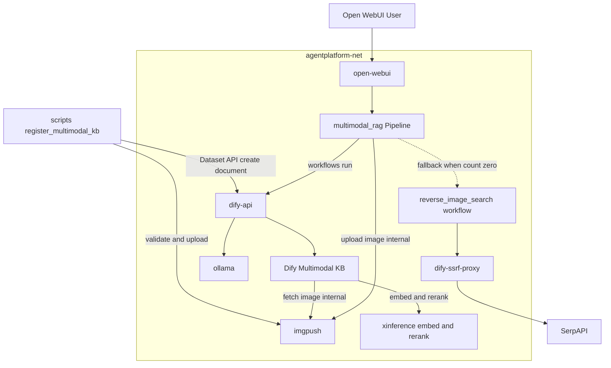
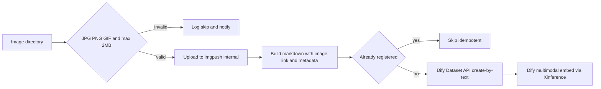
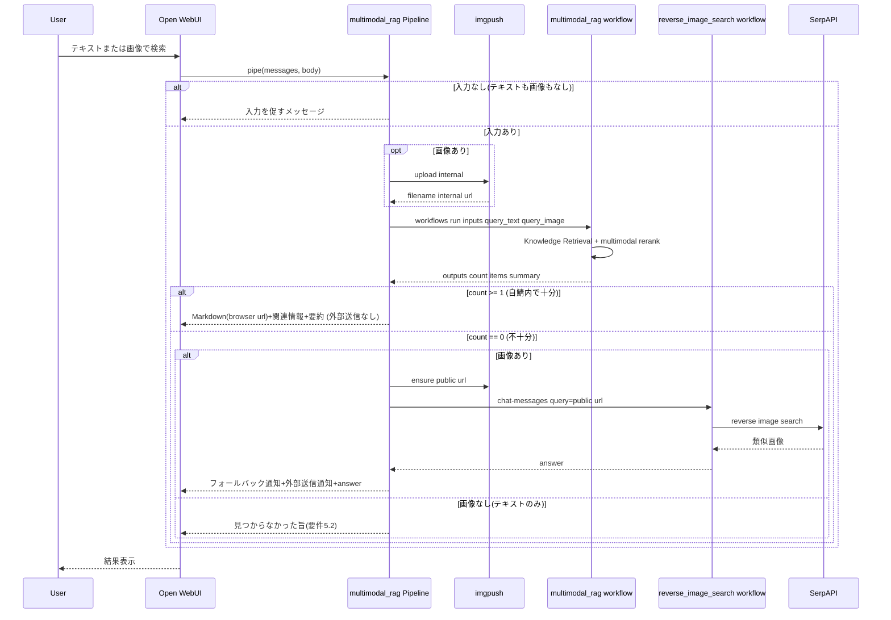
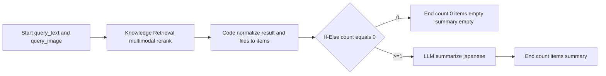

# Design Document

## Overview

本機能は、`dify-integration` が構築したPipeline中継基盤と `reverse-image-search` が追加した imgpush の上に、**Difyマルチモーダルナレッジベース（KB）による自鯖内クロスモーダル検索**を新設し、自鯖内で十分な結果が得られない場合に **`reverse-image-search`（Web逆画像検索）へフォールバック**する導線を確立する。埋め込み・Rerankはプライバシー最優先方針（steering NFR#1）に従い、新規 **Xinference** コンテナでローカル完結させる。

検索フローは、Open WebUI → `multimodal_rag` Pipeline → Dify `multimodal_rag` ワークフロー（workflowモード, Knowledge Retrieval ＋ multimodal rerank）が自鯖内KBを検索し、件数が0件の場合のみ Pipeline が `reverse_image_search` ワークフローを発火する。自鯖内検索は imgpush の internal/browser URLのみで完結し外部送信を伴わない。フォールバック時のみ public URL 経由で SerpAPI へ画像が送信され、その旨をPipelineが通知する。

**Purpose**: 保存済み画像に対するテキスト/画像クロスモーダル検索を、外部送信なしの自鯖内で先に行い、不足時のみWeb検索へ補完する経路を確立する。

**Users**: 個人開発者（Xinferenceモデル設定・KB作成・画像登録・ワークフローインポート）、エンドユーザー（Open WebUIチャットでのテキスト/画像検索と結果閲覧）。

**Impact**: `docker/docker-compose.yml` に Xinference サービスを追加。`pipelines/` に共有imgpushクライアントと multimodal_rag ブリッジを、`workflows/` に multimodal_rag ワークフローを、`scripts/` にKB登録スクリプトを追加する。既存サービス（open-webui / ollama / searxng / Difyサービス群 / pipelines / imgpush）の定義は変更しない。

### Goals
- Difyマルチモーダルナレッジベースで text→image / image→image / image→text のクロスモーダル検索＋マルチモーダルRerankingを実現する
- 埋め込み・RerankをXinferenceでローカル完結させ、自鯖内検索で外部送信を発生させない
- 自鯖内検索が0件のとき `reverse_image_search` ワークフローへフォールバックし、外部送信通知を前置する
- 画像登録（JPG/PNG/GIF・最大2MB検証）を冪等な運用スクリプトで提供する
- 入力未提供・結果0件・処理失敗の各ケースでユーザーに分かるメッセージを返す
- 検索結果を `reverse-image-search` と統一した出力フォーマット（Markdown画像埋め込み＋関連情報＋要約）で提示する

### Non-Goals
- Web上の逆画像検索ロジック自体（`reverse-image-search` Specが担当・本Specは発火のみ）
- 画像生成/動画生成結果の自動KB登録（将来検討・境界外）
- Instagram検索（`instagram-search` Specが担当）
- Open WebUIチャットからの画像登録UI（登録は運用スクリプト経由・将来検討）
- imgpush画像（登録画像・検索一時画像）の自動失効・定期削除（運用フォローアップ・境界外）
- Dify以外のベクトルDB/埋め込み基盤への移行、マルチKB横断のルーティング

## Boundary Commitments

### This Spec Owns
- `docker-compose.yml` への Xinference サービス追加（`agentplatform-net` 接続・GPU割当・モデルキャッシュ永続化ボリューム・`127.0.0.1:${XINFERENCE_PORT}` 公開）
- `pipelines/imgpush_client.py`（`ImgpushClient`＋画像バリデーション）: 画像バイト→imgpush→{filename, internal/browser/public URL} 組み立てと JPG/PNG/GIF・2MB検証の契約
- `pipelines/multimodal_rag_bridge.py`（`multimodal_rag` Pipeline＋`DifyWorkflowBridge`）: テキスト/画像入力の解釈・自鯖内ワークフロー中継・十分性判定によるフォールバック発火・表示用Markdown組み立て・通知/エラー処理の契約
- `workflows/multimodal_rag.yml`（workflowモード）: Start(text+image)→Knowledge Retrieval(multimodal rerank)→正規化Code→0件分岐→LLM要約→End(構造化出力 count/items/summary) の Dify DSL
- `scripts/register_multimodal_kb.py`: ディレクトリ内画像の検証→imgpushアップロード→Markdown文書化→Dify Dataset API登録（冪等）
- 本機能の環境変数定義と `.env.example` 追加（`XINFERENCE_PORT`・`IMGPUSH_BROWSER_BASE_URL`・`DIFY_MULTIMODAL_RAG_APP_API_KEY`・`DIFY_DATASET_API_KEY`・`MULTIMODAL_RAG_DATASET_ID`）
- セットアップ手順（`docs/multimodal-rag-setup.md`）: Xinferenceモデル登録・Difyへのプロバイダ設定・マルチモーダルKB作成（Visionタグ）・Dataset APIキー発行・画像登録・ワークフローインポート・互換性スパイク・E2E確認

### Out of Boundary
- `reverse_image_search.yml` および reverse-image-search の imgpush public 公開ロジック・SerpAPI検索ロジックの実装（本Specは workflow を無改変で呼ぶのみ）
- `reverse_image_search_bridge.py` を共有 `imgpush_client.py` へ移行するリファクタ（任意フォローアップ）
- `dify-integration` 構築済みの Pipeline ランタイム・Difyサービス群・`agentplatform-net` の変更
- imgpush 公開到達手段（トンネル/リバースプロキシ）の構築（オペレーター責務、`reverse-image-search` で定義済み）
- 埋め込み画像の自動失効・保持期間管理

### Allowed Dependencies
- `dify-integration`: Pipeline ランタイム・Dify API（`/v1/chat-messages`・`/v1/workflows/run`・Dataset API `/v1/datasets/...`）・`agentplatform-net`・`.env` 管理・`dify-ssrf-proxy`
- `reverse-image-search`: imgpush サービス・`reverse_image_search` ワークフロー（フォールバック先, app APIキー `DIFY_REVERSE_IMAGE_SEARCH_APP_API_KEY`）・`IMGPUSH_INTERNAL_URL`/`IMGPUSH_PUBLIC_BASE_URL`
- Xinference 公式イメージ（`xprobe/xinference`）とローカルマルチモーダル埋め込み/vision rerank モデル
- 外部サービス SerpAPI（フォールバック発生時のみ、reverse-image-search経由で間接利用）

### Revalidation Triggers
- `multimodal_rag` Pipeline が公開するモデルID・Valves（環境変数名）・エラー/通知文・出力フォーマットの変更 → `ui-customization` で再確認
- `multimodal_rag.yml` の入出力契約（Start入力 query_text/query_image、End出力 count/items/summary）の変更 → Pipeline と本ワークフローのインポート手順で再確認
- `ImgpushClient` のインターフェース変更 → 登録スクリプトと Pipeline、（移行する場合）reverse-image-search で再確認
- Knowledge Retrieval の入力（Query Images）形式・KBスキーマ・Xinferenceモデル契約の変更 → KB再構築と互換性スパイクの再実施
- フォールバック契約（`reverse_image_search` app の query=公開URL・応答形式）の変更 → reverse-image-search Spec と本Specの双方で再確認

## Architecture

### Existing Architecture Analysis
- 既存パターン: `web-search`/`reverse-image-search` が確立した「Pipeline中継 + Dify advanced-chat ワークフロー」。本Specは初の **workflowモード**アプリ（構造化出力が必要なため）と、初の **Difyナレッジベース＋ローカル埋め込み基盤（Xinference）**を導入する。
- 維持する制約: 全サービスは `agentplatform-net` でコンテナ名解決。ホスト公開は `127.0.0.1:${PORT}`。シークレットは `docker/.env`（VCS対象外）。層依存 `docker ← pipelines ← workflows`。LLM/埋め込み推論はローカル（Ollama/Xinference）。
- 本Specの逸脱点: なし（外部送信はフォールバック時のSerpAPIのみで、これは reverse-image-search が既に通知付きで定義済みの経路）。Xinference 追加はローカル推論方針の範囲内。

### Architecture Pattern & Boundary Map



**Architecture Integration**:
- 選定パターン: 自鯖内検索は「Pipeline中継 + Dify workflowモード（KB検索＋rerank）」。フォールバックは **Pipeline主導**で `reverse_image_search` advanced-chat ワークフローを呼ぶ。
- 責務境界: 入力解釈・十分性判定・フォールバック発火・表示Markdown組み立て・通知は Pipeline。KB検索/Reranking/要約はワークフロー。埋め込み/rerank推論は Xinference。Web検索本体は reverse-image-search（境界外）。
- 既存パターンの継承: `agentplatform-net` 名前解決、`127.0.0.1:${PORT}` 公開、`.env` 管理、`ImgpushClient`（reverse-image-search のアップロード手法を共有ヘルパー化）、`dify-ssrf-proxy` 経由アウトバウンド（フォールバック時）。
- 新規コンポーネントの理由: Xinference（ローカルのマルチモーダル埋め込み/rerank供給元）、`imgpush_client.py`（登録スクリプトとPipelineで共有）、`multimodal_rag_bridge.py`（テキスト/画像中継＋フォールバック制御）、`multimodal_rag.yml`（KB検索オーケストレーション）、`register_multimodal_kb.py`（冪等登録）。
- Steering準拠: 層依存維持、外部送信ゼロ（自鯖内検索）、フォールバック時の外部送信は通知付き。

### Technology Stack

| Layer | Choice / Version | Role in Feature | Notes |
|-------|------------------|-----------------|-------|
| 埋め込み/Rerank基盤 | Xinference（`xprobe/xinference`） | マルチモーダル埋め込み＋vision rerank をローカル提供（OpenAI互換） | Difyにプロバイダ登録。**v1.11マルチモーダルKB互換はPhase 0スパイクで検証**（research.md 最大リスク） |
| ナレッジベース | Dify v1.11+ マルチモーダルKB（既存dify-api） | 画像/テキストの統一ベクトル空間・クロスモーダル検索・Reranking | Visionタグ必須。画像はMarkdownリンク（JPG/PNG/GIF・2MB）で登録 |
| Workflow Engine | Dify **workflowモード**（既存dify-api） | KB検索→正規化→0件分岐→要約→構造化出力 | 既存はadvanced-chat。本Specは構造化出力のためworkflowモード |
| Pipeline実装 | Python 3.x（Open WebUI Pipelines, requests/pydantic） | 入力解釈・中継・十分性判定・フォールバック・通知・エラー処理 | PEP8・型ヒント必須 |
| 共有ヘルパー | `pipelines/imgpush_client.py` | imgpushアップロード＋3スコープURL組み立て＋画像バリデーション | 登録スクリプトとPipelineで共有 |
| 登録スクリプト | Python（Dify Dataset API, requests） | 画像検証→imgpush→Markdown文書化→KB登録（冪等） | `scripts/` 規約（冪等） |
| LLM | Ollama接続済みモデル（既存, Vision不要） | 検索結果の日本語要約 | インポート後にモデル設定 |
| 外部API | SerpAPI（フォールバック時のみ・間接） | reverse-image-search 経由のWeb逆画像検索 | 本Specは発火のみ |

## File Structure Plan

### Directory Structure
```
pipelines/
├── imgpush_client.py           # 新規: ImgpushClient + 画像バリデーション（登録/検索で共有）
└── multimodal_rag_bridge.py    # 新規: multimodal_rag Pipeline + DifyWorkflowBridge + フォールバック制御

workflows/
└── multimodal_rag.yml          # 新規: Dify workflowモード DSL（KB検索→正規化→分岐→要約→構造化出力）

scripts/
└── register_multimodal_kb.py   # 新規: 画像検証→imgpush→Markdown→Dataset API登録（冪等）

docs/
└── multimodal-rag-setup.md     # 新規: Xinference/KB/Dataset APIキー/登録/インポート/スパイク/E2E手順

pipelines/tests/
├── test_imgpush_client.py      # 新規: アップロードURL組み立て・バリデーション
└── test_multimodal_rag_bridge.py # 新規: 入力分岐・十分性判定・フォールバック・通知・エラー
```

### Modified Files
- `docker/docker-compose.yml` — Xinference サービスを追加し `agentplatform-net` に接続、GPU割当（`deploy.resources` or `runtime: nvidia`）・モデルキャッシュボリューム（`xinference-data`）・`127.0.0.1:${XINFERENCE_PORT}:9997` を定義。既存サービス定義は変更しない
- `docker/.env.example` — `XINFERENCE_PORT`・`IMGPUSH_BROWSER_BASE_URL`・`DIFY_MULTIMODAL_RAG_APP_API_KEY`・`DIFY_DATASET_API_KEY`・`MULTIMODAL_RAG_DATASET_ID` を追加。埋め込み/rerankモデルやKBはDify管理画面で設定する旨をコメントで明記

> 依存方向: `imgpush_client.py` は外部サービス（imgpush）アダプタ。`multimodal_rag_bridge.py`（pipelines）と `register_multimodal_kb.py`（scripts）が利用。ワークフローはPipelineから呼ばれる（`pipelines → workflows`）。`docker/` はこれらを参照しない。

## System Flows

### 画像登録フロー (1.1, 1.2, 1.3)



**フロー上の決定事項**:
- バリデーション（要件1.1）は `ImgpushClient` の検証関数で形式（JPG/PNG/GIF）とサイズ（≤2MB）を確認。違反は登録せずスキップ＋通知（要件1.2）。
- 冪等性: filename/コンテンツハッシュで登録済みを判定しスキップ。再実行で重複登録しない。
- KB内画像の表示用URLに依存しないよう、Markdown文書には imgpush filename を保持（表示URLは検索時にbrowser baseから再構築）。

### 検索・フォールバックフロー (2.1-2.4, 3.x, 4.1-4.5, 5.1-5.3)



**フロー上の決定事項**:
- 十分性判定（要件4.1, 4.2）は workflow が返す `count`（score_threshold適用後の件数）で行う。`count==0` を「不十分」とする。閾値は Knowledge Retrieval ノードの score_threshold で調整。
- 自鯖内で十分なときは imgpush internal/browser のみ使用し**外部送信ゼロ**。プライバシー通知も不要。
- フォールバックは Pipeline 主導（要件4.5: 発火制御はmultimodal-ragが所有、Web検索は reverse_image_search に委譲）。フォールバック時のみ public URL 経由で外部送信が発生するため、フォールバック通知＋外部送信通知を前置（要件4.3, 4.4）。
- 画像なし（テキストのみ）かつ自鯖内0件は、reverse-image-search が画像必須のためフォールバック不可 → 見つからなかった旨を返す（要件5.2）。
- サムネイル表示URLは Pipeline が `IMGPUSH_BROWSER_BASE_URL` ＋ filename で組み立て、ブラウザ到達性を担保。

### ワークフロー内部フロー (2.1-2.3, 3.1, 5.2)



**フロー上の決定事項**:
- Knowledge Retrieval ノードは `query`＝`query_text`、`query_images`＝`query_image`（マルチモーダルKB＋Visionタグ rerank 選択）。テキストのみ/画像のみ/両方の入力に対応（要件2.1-2.3）。
- 正規化Codeノードは `result`（content/metadata/title）と `files`（画像詳細）から共通形式 `items=[{filename, title, text, source, score}]` を生成し件数を算出（要件3.1のRerank順を保持）。
- 後段（要約/End）はモダリティ非依存。`items` はJSON文字列でEndへ。表示用Markdownの最終組み立てはPipeline（browser URL注入）。

## Requirements Traceability

| Requirement | Summary | Components | Interfaces | Flows |
|-------------|---------|------------|------------|-------|
| 1.1 | 登録時に形式/サイズ検証 | ImgpushClient, RegisterScript | `validate_image()` | 登録フロー |
| 1.2 | 不正画像は登録せず通知 | RegisterScript | 検証失敗→skip/通知 | 登録フロー |
| 1.3 | 検証通過画像をKB登録 | RegisterScript, Multimodal KB | Dataset API create-by-text | 登録フロー |
| 2.1 | テキスト→画像検索 | MultimodalRAG Pipeline, Workflow | `run()` → Knowledge Retrieval(query) | 検索フロー / 内部フロー |
| 2.2 | 画像→類似画像検索 | MultimodalRAG Pipeline, Workflow | imgpush upload → Knowledge Retrieval(query_images) | 検索フロー / 内部フロー |
| 2.3 | 画像→関連情報取得 | Workflow | Knowledge Retrieval result content | 内部フロー |
| 2.4 | 処理中状態の維持 | MultimodalRAG Pipeline | `pipe()` blocking | 検索フロー |
| 3.1 | Rerankで関連度順 | Workflow | multimodal rerank model | 内部フロー |
| 3.2 | Markdownサムネイル表示 | MultimodalRAG Pipeline | browser URL Markdown組み立て | 検索フロー |
| 3.3 | 関連情報併記 | MultimodalRAG Pipeline, Workflow | items(text/source) | 検索/内部フロー |
| 3.4 | 統一出力フォーマット | MultimodalRAG Pipeline | Markdown画像+情報+要約 | 検索フロー |
| 4.1 | 自鯖内を先に試行・十分性判定 | MultimodalRAG Pipeline, Workflow | `run()` → count | 検索フロー |
| 4.2 | 0件/不十分でフォールバック | MultimodalRAG Pipeline | count==0分岐 | 検索フロー |
| 4.3 | 切替をユーザー通知 | MultimodalRAG Pipeline | フォールバック通知前置 | 検索フロー |
| 4.4 | 外部送信通知が到達 | MultimodalRAG Pipeline | 外部送信通知前置 | 検索フロー |
| 4.5 | 発火制御を所有・Web検索は委譲 | MultimodalRAG Pipeline, RIS Workflow | DifyChatBridge.ask(public url) | 検索フロー |
| 5.1 | 入力未提供時に通知 | MultimodalRAG Pipeline | 入力なし分岐 | 検索フロー |
| 5.2 | 双方0件で通知 | MultimodalRAG Pipeline | 0件最終応答 | 検索フロー |
| 5.3 | 処理失敗時にエラー応答 | MultimodalRAG Pipeline, RegisterScript | 例外捕捉→メッセージ | 検索/登録フロー |

## Components and Interfaces

| Component | Domain/Layer | Intent | Req Coverage | Key Dependencies (P0/P1) | Contracts |
|-----------|--------------|--------|--------------|--------------------------|-----------|
| ImgpushClient (`pipelines/imgpush_client.py`) | Application/Adapter | 画像検証＋imgpushアップロード＋3スコープURL組み立て | 1.1, 2.2 | imgpush (P0) | Service |
| MultimodalRAG Pipeline (`pipelines/multimodal_rag_bridge.py`) | Application | 入力解釈・中継・十分性判定・フォールバック・表示組み立て・通知/エラー | 2.1-2.4, 3.2-3.4, 4.1-4.5, 5.1-5.3 | Workflow run (P0), imgpush (P0), RIS app (P0) | Service |
| MultimodalRAG Workflow (`workflows/multimodal_rag.yml`) | Workflow | KB検索＋Rerank→正規化→0件分岐→要約→構造化出力 | 2.1-2.3, 3.1, 5.2 | Multimodal KB (P0), Xinference (P0), Ollama (P1) | API |
| Register Script (`scripts/register_multimodal_kb.py`) | Operational | 画像検証→imgpush→Markdown→Dataset API登録（冪等） | 1.1, 1.2, 1.3, 5.3 | ImgpushClient (P0), Dataset API (P0) | Batch |
| Multimodal KB (Dify) | Data | 画像/テキストの統一ベクトル空間・クロスモーダル検索 | 1.3, 2.1-2.3, 3.1 | Xinference (P0) | State |
| Xinference Service | Infrastructure | ローカルのマルチモーダル埋め込み/vision rerank提供 | 2.1-2.3, 3.1 | agentplatform-net (P0), GPU (P0) | State |
| Setup Documentation (`docs/multimodal-rag-setup.md`) | Documentation | モデル/KB/キー/登録/インポート/スパイク/E2E手順 | 1.1-5.3 | - | - |

### Application

#### ImgpushClient (`pipelines/imgpush_client.py`)

| Field | Detail |
|-------|--------|
| Intent | 画像を検証し imgpush へアップロードして filename と internal/browser/public URL を返す |
| Requirements | 1.1, 2.2 |

**Responsibilities & Constraints**
- `validate_image(image_bytes, mime_type)`: 形式が JPG/PNG/GIF 以外、またはサイズ>2MB のとき `ImageValidationError` を送出（要件1.1）
- `upload(image_bytes, mime_type)`: imgpush `POST /`（multipart `file`）→ `{"filename"}` を取得し、`internal_url`・`browser_url`・`public_url` を組み立てて返す
- 各 base URL は引数/環境変数で受け取りハードコードしない。`public_url` は `public_base_url` 未設定時 `None`（フォールバック時のみ必須）
- imgpush接続/HTTPエラーは `requests.exceptions.RequestException` を送出し呼び出し元に委ねる
- Open WebUIメッセージ形式に依存しない（入力は画像バイト＋MIME）

**Dependencies**
- Outbound: imgpush `POST /` — 画像アップロード (P0)
- External: `hauxir/imgpush` イメージ（reverse-image-search が追加済み）(P0)

**Contracts**: Service [x] / API [ ] / Event [ ] / Batch [ ] / State [ ]

##### Service Interface
```python
from dataclasses import dataclass
from typing import Optional

class ImageValidationError(ValueError):
    """形式/サイズ違反"""

@dataclass
class ImgpushUploadResult:
    filename: str
    internal_url: str            # f"{internal_base}/{filename}"
    browser_url: str             # f"{browser_base}/{filename}"
    public_url: Optional[str]    # f"{public_base}/{filename}" or None

ALLOWED_MIME = {"image/jpeg", "image/png", "image/gif"}
MAX_SIZE_BYTES = 2 * 1024 * 1024

class ImgpushClient:
    def __init__(self, internal_url: str, browser_base_url: str,
                 public_base_url: str, timeout: int) -> None: ...

    def validate_image(self, image_bytes: bytes, mime_type: str) -> None:
        """Raises ImageValidationError if mime not in ALLOWED_MIME or size > MAX_SIZE_BYTES."""

    def upload(self, image_bytes: bytes, mime_type: str) -> ImgpushUploadResult:
        """検証は呼び出し側で済ませる前提。imgpushへアップロードしURL群を返す。
        Raises: requests.exceptions.RequestException"""
```
- Preconditions: `image_bytes` 非空、`mime_type` が画像MIME
- Postconditions: `internal_url`/`browser_url` は常に返る。`public_url` は設定時のみ
- Invariants: imgpush へユーザー識別情報を付与しない

**Implementation Notes**
- Integration: `multimodal_rag_bridge.py` と `register_multimodal_kb.py` が import。reverse-image-search の `ImgpushUploader` ロジックを継承しつつ3スコープURLへ拡張
- Validation: モックで URL組み立て、`ImageValidationError`（gif以外/2MB超）、`RequestException` を確認
- Risks: base URL 末尾スラッシュ正規化（`rstrip('/')`）。imgpush の拡張子付与差異

#### MultimodalRAG Pipeline (`pipelines/multimodal_rag_bridge.py`)

| Field | Detail |
|-------|--------|
| Intent | テキスト/画像入力を自鯖内KB検索へ中継し、不十分時にreverse_image_searchへフォールバック、結果を統一フォーマットで返す |
| Requirements | 2.1-2.4, 3.2-3.4, 4.1-4.5, 5.1-5.3 |

**Responsibilities & Constraints**
- `self.id = "multimodal_rag"`。`Valves` に各Dify/imgpush環境変数を保持
- `messages[-1]` から テキスト（`user_message`）と任意の画像（`image_url` data URI）を抽出。両方なければ入力を促す（要件5.1）
- 画像があれば `ImgpushClient.upload()`（internal）→ `query_image` を `workflows/run` の inputs に remote_url 形式で渡す（要件2.2）
- `DifyWorkflowBridge.run(inputs, user_id)` で `multimodal_rag` を呼び、`outputs={count, items, summary}` を取得（要件2.1-2.3, 4.1）
- `count>=1`: `items` を `IMGPUSH_BROWSER_BASE_URL` でサムネイルMarkdown化し、関連情報＋要約を統一フォーマットで返す（外部送信なし・通知なし）（要件3.2-3.4）
- `count==0` かつ画像あり: public URL を確保し `DifyChatBridge.ask(public_url)` で `reverse_image_search` を発火。フォールバック通知＋外部送信通知を前置（要件4.2-4.5）
- `count==0` かつ画像なし: 見つからなかった旨を返す（要件5.2）
- `ImageValidationError`/`ValueError`/`RequestException` を捕捉し、例外を伝播せずユーザー向けエラー文字列を返す（要件5.3）

**Dependencies**
- Inbound: Open WebUI — `pipe()` (P0)
- Outbound: Dify `/workflows/run`（multimodal_rag）(P0)
- Outbound: Dify `/chat-messages`（reverse_image_search, フォールバック）(P0)
- Outbound: ImgpushClient (P0)

**Contracts**: Service [x] / API [ ] / Event [ ] / Batch [ ] / State [ ]

##### Service Interface
```python
from pydantic import BaseModel

class Valves(BaseModel):
    DIFY_API_BASE_URL: str
    DIFY_MULTIMODAL_RAG_APP_API_KEY: str          # workflowモードアプリ
    DIFY_REVERSE_IMAGE_SEARCH_APP_API_KEY: str    # フォールバック先(advanced-chat)
    IMGPUSH_INTERNAL_URL: str
    IMGPUSH_BROWSER_BASE_URL: str                 # 既定 http://localhost:${IMGPUSH_PORT}
    IMGPUSH_PUBLIC_BASE_URL: str                  # フォールバック時のみ必須
    REQUEST_TIMEOUT_SECONDS: int

class DifyWorkflowBridge:
    def run(self, inputs: dict, files: list, user_id: str) -> dict:
        """POST /workflows/run (response_mode=blocking)。data.outputs(dict)を返す。
        Raises: requests.exceptions.RequestException"""

class Pipeline:
    def pipe(self, user_message: str, model_id: str, messages: list, body: dict) -> str:
        """テキスト/画像を自鯖内検索→必要時フォールバック。常に文字列を返し例外を伝播しない。"""
```
- Preconditions: `messages` がOpen WebUIメッセージ形式
- Postconditions: 戻り値は常に文字列。フォールバック経路でのみ外部送信通知を含む
- Invariants: `count>=1`（自鯖内充足）では imgpush public/SerpAPI を呼ばない（外部送信ゼロ）

**Implementation Notes**
- Integration: 画像抽出は reverse-image-search の `_extract_image`/`_decode_data_uri` と同等。`DifyChatBridge` は既存と同型に本ファイル内へ実装。`workflows/run` の files は `[{type:"image", transfer_method:"remote_url", url: internal_url}]`
- Validation: モックで (a) 入力なし→促し、(b) テキストのみ count>=1→自鯖結果（通知なし）、(c) 画像 count==0→フォールバック＋両通知、(d) テキストのみ count==0→見つからない、(e) 例外→エラー文字列。`docker compose restart pipelines` 後 `GET /models` に `multimodal_rag` が含まれること
- Risks: `/workflows/run` の画像入力形式・Query Images への接続（Phase 0スパイクと連動）。browser URL のリモートアクセス耐性

### Workflow

#### MultimodalRAG Workflow (`workflows/multimodal_rag.yml`)

| Field | Detail |
|-------|--------|
| Intent | マルチモーダルKBをクロスモーダル検索＋Rerankし、正規化・0件分岐・要約して構造化出力するDify workflowモードアプリ |
| Requirements | 2.1, 2.2, 2.3, 3.1, 5.2 |

**Responsibilities & Constraints**
- Start（inputs: `query_text` string・`query_image` file 任意）→ Knowledge Retrieval（`query`=query_text, `query_images`=query_image, マルチモーダルKB, multimodal rerank, top_k/score_threshold）→ Code（`result`/`files`→`items` 正規化・件数算出）→ If-Else（count==0）→ LLM要約（≥1件）/ End（0件）
- End 出力: `count`(number)・`items`(string, JSON)・`summary`(string)。表示Markdownの最終組み立てはPipeline（browser URL注入）
- インポート後に Knowledge Retrieval のKB（Visionタグ）・multimodal rerank モデル・LLMノードのOllamaモデルを設定
- リクエストにユーザー識別情報を含めない

**Dependencies**
- Inbound: MultimodalRAG Pipeline — `POST /workflows/run` (P0)
- Outbound: Multimodal KB（Xinference埋め込み/rerank）(P0)
- Outbound: Ollama接続済みモデル — 要約 (P1)

**Contracts**: Service [ ] / API [x] / Event [ ] / Batch [ ] / State [ ]

##### API Contract
| Method | Endpoint | Request | Response | Errors |
|--------|----------|---------|----------|--------|
| POST | `/v1/workflows/run`（Pipeline→ワークフロー） | `{inputs:{query_text, query_image?}, files?, response_mode:blocking, user}` | `{data:{outputs:{count, items, summary}}}` | Dify標準エラー（Pipelineが捕捉） |

> `items` は `[{filename, title, text, source, score}]` のJSON文字列。`filename` は imgpush filename（表示URLはPipelineが browser base から再構築）。

**Implementation Notes**
- Integration: APIキーは `DIFY_MULTIMODAL_RAG_APP_API_KEY`。KB・モデルはDify管理画面で設定（docs参照）
- Validation: Phase 0スパイク後、text→image / image→image / image→text の各クエリで正規化と要約、0件時の空出力を確認（要件2.1-2.3, 3.1, 5.2）
- Risks: Xinference埋め込み/rerankのマルチモーダルKB互換（最大リスク）。Query Images 入力の受け渡し

### Operational

#### Register Script (`scripts/register_multimodal_kb.py`)

| Field | Detail |
|-------|--------|
| Intent | ディレクトリ内画像を検証・アップロード・Markdown文書化しDify KBへ冪等登録する |
| Requirements | 1.1, 1.2, 1.3, 5.3 |

**Responsibilities & Constraints**
- 入力ディレクトリを走査し、各画像を `ImgpushClient.validate_image()` で検証（要件1.1）。違反はスキップ＋ログ通知（要件1.2）
- 検証通過画像を imgpush（internal）へアップロードし、Markdown（`` ＋ filename/メタデータ）を生成
- Dify Dataset API（`POST /v1/datasets/{MULTIMODAL_RAG_DATASET_ID}/document/create-by-text`）で登録（要件1.3）
- filename/コンテンツハッシュで登録済みを判定しスキップ（冪等）。Dataset API/imgpush エラーは捕捉しメッセージ＋非0終了（要件5.3）

**Contracts**: Service [ ] / API [ ] / Event [ ] / Batch [x] / State [ ]

##### Batch / Job Contract
- Trigger: オペレーターが手動実行（`python scripts/register_multimodal_kb.py <dir>`）
- Input / validation: 画像ディレクトリ。形式 JPG/PNG/GIF・≤2MB
- Output / destination: Dify マルチモーダルKB（Dataset API）
- Idempotency & recovery: 登録済みスキップ。途中失敗時は再実行で未登録分のみ処理

**Implementation Notes**
- Integration: `DIFY_DATASET_API_KEY`・`MULTIMODAL_RAG_DATASET_ID` を環境変数で受け取る。`indexing_technique`/`process_rule` はDify既定（high_quality）
- Validation: モックで 不正画像スキップ・正常画像のDataset API呼び出し・再実行スキップを確認
- Risks: Dataset API のマルチモーダル取り込み挙動（画像Markdownリンクの自動抽出がDataset API経由でも有効か）をスパイクで確認

### Infrastructure

#### Xinference Service

| Field | Detail |
|-------|--------|
| Intent | マルチモーダル埋め込みとvision rerankをローカル提供する |
| Requirements | 2.1-2.3, 3.1 |

**Responsibilities & Constraints**
- `xprobe/xinference` を `agentplatform-net` に接続、GPU割当、モデルキャッシュを永続ボリューム（`xinference-data`）に保存
- ホスト公開 `127.0.0.1:${XINFERENCE_PORT}:9997`。Difyからは `http://xinference:9997` で参照
- マルチモーダル埋め込み（例: jina-clip-v2 系）と vision rerank（例: jina-reranker-m0 系）をロードし、Difyにプロバイダ登録

**Contracts**: Service [ ] / API [ ] / Event [ ] / Batch [ ] / State [x]

##### State Management
- State model: モデルキャッシュをローカルFSに保持。推論はステートレス
- Persistence & consistency: `docker compose down` 後もモデルキャッシュ保持
- Concurrency strategy: GPU VRAM 共有（Ollama/将来のComfyUIと競合しうる）。軽量モデル選定・オンデマンドロード

**Implementation Notes**
- Integration: `docker/.env.example` に `XINFERENCE_PORT`。GPU設定は既存GPUサービス（ollama）に倣う
- Validation: `GET http://127.0.0.1:${XINFERENCE_PORT}/` 応答、モデルロード、Difyからのプロバイダ疎通
- Risks: VRAM競合・モデル選定。Dify v1.11マルチモーダルKB互換（Phase 0スパイク）

## Data Models

### KB Document Model（論理）
- **登録単位**: 1画像＝1ドキュメント（または1画像チャンク）。Markdown本文に画像リンク（imgpush internal URL）＋任意のテキストメタデータ（タイトル/説明）を含む。
- **保持属性**: `filename`（imgpush）、`title`、`text`（関連情報）、（Dify生成）ベクトル。
- **不変条件**: 表示URLは保持しない（filename のみ）。表示時に browser base から再構築。
- **整合性**: 登録は冪等（filename/ハッシュキー）。imgpush 実体とKBドキュメントは1:1対応を維持。

### Retrieval 出力契約（正規化後 `items`）
```json
[{"filename": "abc.jpg", "title": "...", "text": "...", "source": "...", "score": 0.83}]
```
- score は rerank スコア（降順＝要件3.1の関連度順）。`filename` 欠落項目はスキップ。

## Error Handling

### Error Strategy
Pipeline は例外を伝播せず常にユーザー向け文字列を返す。十分性判定（count）に基づき自鯖内→Webへ分岐。登録スクリプトは検証/接続エラーを捕捉しログ＋非0終了。

### Error Categories and Responses
- **入力未提供（5.1）**: テキストも画像も無い場合、検索を実行せず入力を促す
- **自鯖内0件＋画像なし（5.2）**: フォールバック不可のため見つからなかった旨を返す
- **自鯖内0件＋画像あり（4.2-4.5）**: フォールバック通知＋外部送信通知＋reverse_image_search結果（または更なる0件通知）を返す
- **imgpush/Dify接続失敗（5.3）**: `RequestException` を捕捉しエラーメッセージを返す
- **登録時の不正画像（1.2）**: スキップ＋ログ通知。**他画像の登録は継続**
- **登録時のDataset API失敗（5.3）**: メッセージ＋非0終了。再実行で未登録分を継続（冪等）

### Monitoring
Pipelines/scripts の標準出力に Dify/imgpush 呼び出しのステータス・エラーを記録（個人利用のため外部監視は対象外）。

## Testing Strategy

### Unit Tests
- `ImgpushClient.validate_image()` が gif/jpeg/png を通過、それ以外と2MB超で `ImageValidationError`（要件1.1）
- `ImgpushClient.upload()` がモック応答から internal/browser/public URL を正しく組み立て、public_base未設定で `public_url=None`（要件2.2）
- `Pipeline.pipe()` が入力なしで促しを返し検索を呼ばない（要件5.1）
- `Pipeline.pipe()` がテキスト count>=1 で自鯖結果（外部送信/通知なし）を返す（要件2.1, 3.2-3.4, 4.1）
- `Pipeline.pipe()` が画像 count==0 でフォールバックし両通知を前置（要件4.2-4.5）
- `Pipeline.pipe()` がテキストのみ count==0 で見つからない旨を返す（要件5.2）
- `Pipeline.pipe()` が例外時にエラー文字列を返し伝播しない（要件5.3）
- `register_multimodal_kb` が不正画像をスキップし正常画像のみ Dataset API を呼ぶ・再実行でスキップ（要件1.1, 1.2, 1.3）

### Integration Tests
- `docker compose up` 後 Xinference が `agentplatform-net` で起動し、Difyからプロバイダ疎通すること
- `docker compose restart pipelines` 後 `GET /models` に `multimodal_rag` が含まれること
- **Phase 0 互換性スパイク**: マルチモーダルKB（Xinference埋め込み＋vision rerank, Visionタグ）に少数画像を登録し、Difyデバッグで text→image / image→image / image→text とRerankが機能すること（research.md 最大リスク検証）
- `multimodal_rag.yml` インポート後、`workflows/run` 呼び出しが `count/items/summary` を返し、0件時に空出力を返すこと（要件2.1-2.3, 5.2）

### E2E Tests
- Open WebUIで `multimodal_rag` を選択しテキスト検索→自鯖内の関連画像がサムネイル＋要約で表示（外部送信通知なし）（要件2.1, 3.2-3.4）
- 画像を送信→自鯖内の類似画像/関連情報が表示（要件2.2, 2.3）
- 自鯖内に無い画像を送信→フォールバック通知＋外部送信通知＋Web結果が表示（要件4.2-4.5）
- テキストも画像も無しで送信→入力を促すメッセージ（要件5.1）
- `dify-api` 停止状態で送信→エラーメッセージ（要件5.3）

### Performance / Load
- Xinference 埋め込み/rerank の応答時間（個人GPUで実用域か）と、Ollama/ComfyUI との VRAM 同時利用時の挙動を確認

## Security Considerations
- 自鯖内検索は imgpush internal/browser のみで完結し**外部送信ゼロ**（steering NFR#1 と整合）。`count>=1` 経路では SerpAPI/public URL を呼ばない不変条件をテストで担保
- フォールバック時のみ public URL 経由で SerpAPI へ画像送信が発生。Pipeline がフォールバック通知＋外部送信通知を前置（要件4.3, 4.4）。同意ゲートは設けない（非ブロッキング）
- `DIFY_MULTIMODAL_RAG_APP_API_KEY`・`DIFY_DATASET_API_KEY`・`DIFY_REVERSE_IMAGE_SEARCH_APP_API_KEY` は `docker/.env`（VCS対象外）で管理。Xinferenceは外部APIキー不要（ローカル）
- imgpush/Xinference/Dify へユーザー識別情報を付与しない
- 埋め込み・rerank・LLM推論はすべてローカル（Xinference/Ollama）で実行
