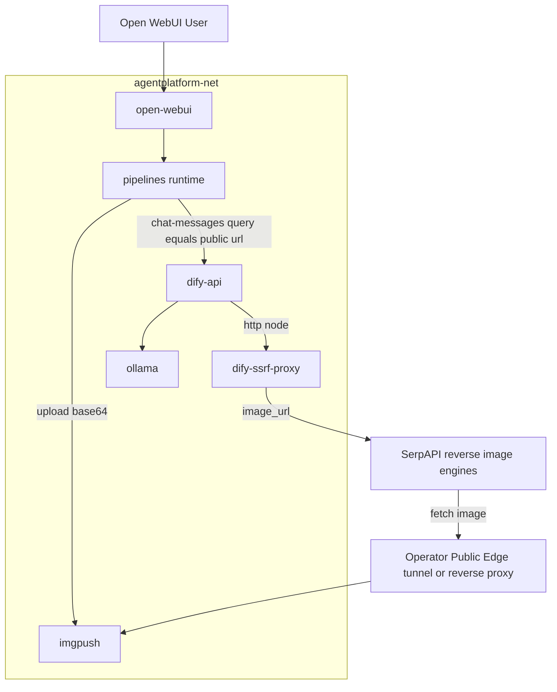
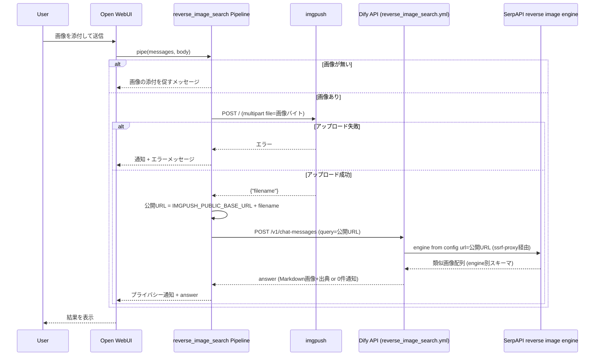
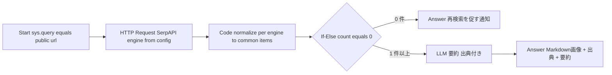

# Design Document

## Overview

本機能は、`dify-integration` Specが構築したPipeline中継基盤の上に、Open WebUIにアップロードされた画像を起点とする逆画像検索フローを追加する。Pipelineがアップロード画像（base64）を新規サービス imgpush へ変換して公開URLを取得し、その公開URLをクエリとしてDifyワークフロー（`reverse_image_search.yml`）へ中継する。ワークフローはSerpAPIで類似画像を検索し、サムネイル（Markdown画像埋め込み）と出典サイトをローカルLLMで要約してチャットへ返す。SerpAPIの検索エンジンは設定（Dify環境変数 `REVERSE_IMAGE_ENGINE`）で `google_lens`・`yandex_images`（Yandex Reverse Image）・`bing_reverse_image`（Bing Reverse Image）を切替可能とし、コード編集なしでアクティブエンジンを選択できる。画像が外部へ送信される旨は、Pipelineが情報通知（非ブロッキング）として応答に前置する。

**Purpose**: Open WebUIのチャットUIから、アップロード画像と類似する画像をWeb上から検索し、サムネイル＋出典サイト一覧として取得できる経路を確立する。

**Users**: 個人開発者（環境構築・imgpush公開設定・DifyインポートとSecret/モデル設定）、エンドユーザー（Open WebUIチャットでの画像アップロードと結果閲覧）。

**Impact**: `docker/docker-compose.yml` に imgpush サービスを追加し、`pipelines/` に画像アップロードヘルパーと逆画像検索ブリッジを、`workflows/` に逆画像検索ワークフローを追加する。既存サービス（open-webui / ollama / searxng / Difyサービス群 / pipelines）の定義は変更しない。

### Goals
- アップロード画像（base64）を imgpush 経由で公開URL化し、SerpAPIで逆画像検索する経路を確立する
- SerpAPIの検索エンジンを設定（`REVERSE_IMAGE_ENGINE`）で `google_lens`/`yandex_images`/`bing_reverse_image` から切替可能にする（コード編集不要）
- 類似画像をサムネイル（Markdown）＋出典サイトのLLM要約付きでチャットに返す
- 画像の外部送信に関する情報通知（非ブロッキング）を提供する
- 画像未提供・結果0件・処理失敗の各ケースでユーザーに分かるメッセージを返す

### Non-Goals
- imgpush の公開到達手段（トンネル/リバースプロキシ）の構築（オペレーター責務・境界外）
- 複数エンジンの同時実行・フォールバック連鎖・結果統合（本Specは一度に1つのアクティブエンジンのみ。フォールバックは将来検討）
- ユーザーがチャット内でリクエスト単位にエンジンを選択するUI（設定（環境変数）レベルの切替のみ）
- ストレージ内画像検索とそのフォールバック制御（`multimodal-rag` Specが担当）
- Instagram検索（`instagram-search` Specが担当）
- TinEye等のSerpAPI非対応バックエンドへの切替（将来検討）
- imgpush に蓄積された画像の自動失効・定期削除（運用フォローアップ）

## Boundary Commitments

### This Spec Owns
- `docker-compose.yml` への imgpush サービス追加（`agentplatform-net` 接続・画像永続化ボリューム・ホストポート公開）
- `pipelines/image_uploader.py`（`ImgpushUploader`）: base64画像バイト → imgpush アップロード → 公開URL組み立ての契約
- `pipelines/reverse_image_search_bridge.py`（`reverse_image_search` Pipeline）: 画像抽出・アップロード・公開URLのワークフロー中継・プライバシー通知前置・エラー/画像未提供応答の契約
- `workflows/reverse_image_search.yml`: SerpAPI呼び出し（`REVERSE_IMAGE_ENGINE` でエンジン選択）→エンジン別応答の共通形式への正規化→0件分岐→LLM要約/Answer のDify advanced-chat DSL
- imgpush 接続用環境変数（`IMGPUSH_INTERNAL_URL`・`IMGPUSH_PUBLIC_BASE_URL`・`IMGPUSH_PORT`）と Dify アプリキー（`DIFY_REVERSE_IMAGE_SEARCH_APP_API_KEY`）の定義と `.env.example` への追加
- セットアップ手順（imgpush公開設定の案内・ワークフローインポート・SERPAPI_KEY/モデル設定・モデル登録・E2E確認）

### Out of Boundary
- imgpush を公開到達可能にするトンネル/リバースプロキシ/DNS/TLSの構築（`IMGPUSH_PUBLIC_BASE_URL` の値はオペレーターが用意）
- `multimodal-rag` のストレージ内検索ロジックおよび逆画像検索結果に基づくフォールバック発火・制御
- `dify-integration` が構築済みの Pipeline 中継基盤・Difyサービス群・`agentplatform-net` の変更
- imgpush 画像の保持期間管理・定期削除（運用フォローアップ）

### Allowed Dependencies
- `dify-integration` が提供する Pipeline ランタイム（`pipelines` コンテナ）・Dify Chat API（`POST /v1/chat-messages`）・`agentplatform-net`・`.env` 管理パターン
- `dify-integration` が確立した advanced-chat ワークフローのインポート/APIキー発行運用、`dify-ssrf-proxy` 経由のアウトバウンドHTTP
- imgpush 公式イメージ（`hauxir/imgpush`）
- 外部サービス SerpAPI（`google_lens` / `yandex_images` / `bing_reverse_image` の逆画像検索エンジン群）

### Revalidation Triggers
- `reverse_image_search` Pipeline が公開するモデルID・Valves（環境変数名）・エラー応答形式・プライバシー通知文の変更 → `ui-customization` 等の横断調整Specで再確認
- `ImgpushUploader` のインターフェース（入力: 画像バイト/MIME、出力: 公開URL）の変更 → 将来共有する `multimodal-rag` で再確認
- `reverse_image_search.yml` の入力契約（クエリ＝公開画像URL）・出力フォーマット（Markdown画像＋出典）・正規化後の共通アイテム形式・対応エンジン集合（`REVERSE_IMAGE_ENGINE` の許容値）の変更 → ワークフローをインポートするオペレーター手順、および下流の `multimodal-rag`（結果フォーマット参照）で再確認
- imgpush の公開到達方式（`IMGPUSH_PUBLIC_BASE_URL` の前提）の変更 → セットアップ手順とネットワーク方針（steering）で再確認

## Architecture

### Existing Architecture Analysis
- 既存パターン: `dify-integration` で確立した「Open WebUI → Pipeline → Dify Workflow → 各バックエンド」構成。web-search Specが「Pipeline（クエリ中継）+ advanced-chat ワークフロー（HTTP→Code→If-Else→LLM/Answer）」の同型実装を確立済み。
- 維持する制約: 全サービスは `agentplatform-net` 上でコンテナ名解決。ホスト公開は `127.0.0.1:${PORT}`。シークレットは `docker/.env`（VCS対象外）。`structure.md` の `docker ← pipelines ← workflows` 層依存。
- 本Specの逸脱点: imgpush は SerpAPI から**インバウンド到達**される必要があり、ホスト127.0.0.1バインドの内部公開に加え、オペレーター提供の公開URL（`IMGPUSH_PUBLIC_BASE_URL`）を前提とする。これは steering のアウトバウンド限定方針に対する明示的な例外であり、公開到達手段の構築は境界外とする。

### Architecture Pattern & Boundary Map



**Architecture Integration**:
- 選定パターン: web-search と同型の「Pipeline中継 + advanced-chat ワークフロー」。逆画像検索固有の差分は (1) Pipelineが画像をimgpushへ変換し公開URLをクエリ化する点、(2) ワークフローのHTTP先がSerpAPIである点、(3) Pipelineがプライバシー通知を前置する点。
- 責務境界: Open WebUIメッセージ形式の解釈・画像変換・通知はPipeline、外部検索オーケストレーションと結果整形はワークフロー、公開到達手段はオペレーター（境界外）。
- 既存パターンの継承: `agentplatform-net` 名前解決、`127.0.0.1:${PORT}` 公開、`.env` シークレット管理、`DifyChatBridge.ask()` によるテキストクエリ中継、`dify-ssrf-proxy` 経由のアウトバウンド。
- 新規コンポーネントの理由: imgpush（SerpAPIが要求する公開画像URLの供給元）、`image_uploader.py`（base64→公開URL変換、下流`multimodal-rag`との共有を見据えた独立ヘルパー）、`reverse_image_search_bridge.py`（画像起点の中継）、`reverse_image_search.yml`（SerpAPIオーケストレーション）。
- Steering準拠: 層依存 `docker ← pipelines ← workflows` を維持。ネットワーク方針の例外（imgpushインバウンド公開）はドキュメントとオペレーター設定に局所化し research.md に根拠を記録。

### Technology Stack

| Layer | Choice / Version | Role in Feature | Notes |
|-------|------------------|-----------------|-------|
| 一時画像ホスト | imgpush（`hauxir/imgpush:latest`） | base64画像を受け取り `GET /<filename>` で配信、SerpAPI向け公開URLの実体 | `POST /`(multipart `file`)→`{"filename"}`。公開到達はオペレーター提供 |
| Pipeline実装 | Python 3.x（Open WebUI Pipelines, requests/pydantic） | 画像抽出・imgpushアップロード・公開URL中継・通知前置・エラー処理 | PEP8・型ヒント必須（tech.md準拠） |
| Workflow Engine | Dify CE v1.14.2（既存） advanced-chat | SerpAPI呼び出し→結果解析→LLM要約 | 既存`dify-api`を利用、新規サービス追加なし |
| 外部API | SerpAPI（`google_lens` / `yandex_images` / `bing_reverse_image`、`REVERSE_IMAGE_ENGINE` で選択） | 公開画像URLから類似画像を取得（エンジン別応答を正規化） | キーはDify Secret環境変数 `SERPAPI_KEY`、エンジンはDify環境変数 `REVERSE_IMAGE_ENGINE`（既定 `google_lens`） |
| LLM | Ollama接続済みモデル（既存、Vision不要） | 類似画像・出典の日本語要約 | インポート後にモデル設定（web-search同様） |
| Egress制御 | `dify-ssrf-proxy`（既存squid） | HTTPノードのアウトバウンドをSerpAPIへ中継 | serpapi.comへのHTTPS到達を実装時に検証 |

## File Structure Plan

### Directory Structure
```
pipelines/
├── image_uploader.py                 # 新規: ImgpushUploader（画像バイト→imgpush→公開URL組み立て）
└── reverse_image_search_bridge.py    # 新規: reverse_image_search Pipeline（画像抽出・アップロード・中継・通知・エラー処理）

workflows/
└── reverse_image_search.yml          # 新規: Dify advanced-chat DSL（SerpAPI→解析→0件分岐→LLM要約/Answer）

docs/
└── reverse-image-search-setup.md     # 新規: imgpush公開設定・ワークフローインポート・SERPAPI_KEY/REVERSE_IMAGE_ENGINE/モデル設定・E2E確認手順
```

### Modified Files
- `docker/docker-compose.yml` — imgpush サービスを追加し `agentplatform-net` に接続、画像永続化ボリューム（`imgpush-data`）と `127.0.0.1:${IMGPUSH_PORT}:5000` を定義。既存サービス定義は変更しない
- `docker/.env.example` — `IMGPUSH_PORT`・`IMGPUSH_INTERNAL_URL`・`IMGPUSH_PUBLIC_BASE_URL`・`DIFY_REVERSE_IMAGE_SEARCH_APP_API_KEY` を追加。`SERPAPI_KEY` はDify管理画面で設定する旨をコメントで明記（値は置かない）

> 依存方向: `image_uploader.py` は外部サービス（imgpush）アダプタ、`reverse_image_search_bridge.py` がそれを利用。ワークフローはPipelineから呼ばれる（`pipelines → workflows`）。`docker/` はこれらを参照しない。

## System Flows

### 逆画像検索の中継・処理フロー (1.1-1.3, 3.1, 4.1, 4.3)



**フロー上の決定事項**:
- Pipelineは `response_mode: blocking`（既存`DifyChatBridge.ask`）で同期待機し、Open WebUI標準の処理中インジケーターで要件1.3を満たす。
- プライバシー通知（要件3）は、画像を検知し外部処理へ進む全経路（成功/0件/エラー）でPipelineが応答先頭に前置する。同意操作は求めない（非ブロッキング）。
- `IMGPUSH_PUBLIC_BASE_URL` 未設定時はimgpushアップロード前にPipelineが明示エラーを返す。

### ワークフロー内部フロー (1.2, 2.1-2.3, 4.2, 4.3)



**フロー上の決定事項**:
- HTTPノードはSerpAPIのクエリパラメータを `params` で構成し、`engine={{#env.REVERSE_IMAGE_ENGINE#}}`・`api_key={{#env.SERPAPI_KEY#}}` を設定。画像URLパラメータ名がエンジンで異なる（`google_lens`/`yandex_images`=`url`、`bing_reverse_image`=`image_url`）ため、`url={{#sys.query#}}` と `image_url={{#sys.query#}}` の両方を同値で送る（SerpAPIは対象エンジンが解釈しない余剰パラメータを無視する想定。実装時に各エンジンで疎通検証）。`params` 利用によりURL符号化を担保する。
- 正規化Codeノードは `REVERSE_IMAGE_ENGINE` に応じてエンジン別の応答配列（`google_lens`=`visual_matches`、`bing_reverse_image`=`image_results`/`inline_images`、`yandex_images`=類似画像配列）から、共通形式 `{title, link, source, thumbnail}` のアイテム列へ正規化し、上位N件（既定5件程度）の `` 形式Markdownと件数を算出する。`thumbnail` 欠落の項目はスキップ。SerpAPIの `error` フィールド検出時は件数0相当として扱う。
- 正規化以降（If-Else／LLM／Answer）はエンジン非依存。LLMノードは正規化済みアイテムを日本語で要約し、各項目に出典リンク（`[出典: source](link)`）を付与。
- エンジン追加時の変更点は本ワークフローのHTTPノード（パラメータ）と正規化Codeノード（分岐）に限定され、Pipeline・imgpush・下流ノードには波及しない。

## Requirements Traceability

| Requirement | Summary | Components | Interfaces | Flows |
|-------------|---------|------------|------------|-------|
| 1.1 | アップロード画像を公開URLへ変換 | ImgpushUploader, ReverseImageSearch Pipeline | `ImgpushUploader.upload()` → `POST /`(imgpush) | 中継・処理フロー |
| 1.2 | 公開URLで外部逆画像検索し類似画像/出典取得 | ReverseImageSearch Pipeline, ReverseImageSearch Workflow | `DifyChatBridge.ask(query=url)` → SerpAPI HTTPノード | 中継・処理フロー / ワークフロー内部フロー |
| 1.3 | 処理中であることが分かる状態 | ReverseImageSearch Pipeline | `pipe()` blocking応答 | 中継・処理フロー |
| 2.1 | 類似画像をMarkdownサムネイルで表示 | ReverseImageSearch Workflow | Codeノード→Answer（Markdown） | ワークフロー内部フロー |
| 2.2 | 各画像の出典サイト情報を併せて提示 | ReverseImageSearch Workflow | Codeノード抽出 + LLM/Answer | ワークフロー内部フロー |
| 2.3 | ローカルLLM要約を付与 | ReverseImageSearch Workflow | LLMノード | ワークフロー内部フロー |
| 3.1 | 外部送信の旨を通知 | ReverseImageSearch Pipeline | 通知前置（固定文字列） | 中継・処理フロー |
| 3.2 | 通知は非ブロッキング（同意不要） | ReverseImageSearch Pipeline | 通知前置（実行を妨げない） | 中継・処理フロー |
| 4.1 | 画像未提供時に添付を促す | ReverseImageSearch Pipeline | `pipe()` 画像未検出分岐 | 中継・処理フロー |
| 4.2 | 結果0件時に通知 | ReverseImageSearch Workflow | If-Else → 0件Answer | ワークフロー内部フロー |
| 4.3 | 処理失敗（上限到達含む）時にエラー応答 | ReverseImageSearch Pipeline, ReverseImageSearch Workflow | 例外捕捉→エラー文字列 / Code内error検出 | 中継・処理フロー / ワークフロー内部フロー |

## Components and Interfaces

| Component | Domain/Layer | Intent | Req Coverage | Key Dependencies (P0/P1) | Contracts |
|-----------|--------------|--------|--------------|--------------------------|-----------|
| ImgpushUploader (`pipelines/image_uploader.py`) | Application/Adapter | 画像バイトをimgpushへアップロードし公開URLを返す | 1.1 | imgpush (P0) | Service |
| ReverseImageSearch Pipeline (`pipelines/reverse_image_search_bridge.py`) | Application | 画像抽出・アップロード・公開URL中継・通知前置・エラー/未提供処理 | 1.1, 1.2, 1.3, 3.1, 3.2, 4.1, 4.3 | ImgpushUploader (P0), Dify Chat API (P0) | Service |
| ReverseImageSearch Workflow (`workflows/reverse_image_search.yml`) | Workflow | SerpAPI検索（エンジン設定切替）→エンジン別応答の正規化→0件分岐→LLM要約/Answer | 1.2, 2.1, 2.2, 2.3, 4.2, 4.3 | SerpAPI (P0), Ollamaモデル (P1), dify-ssrf-proxy (P1) | API |
| imgpush Service | Infrastructure | base64画像の受領と公開配信 | 1.1 | agentplatform-net (P0) | State |
| Setup Documentation (`docs/reverse-image-search-setup.md`) | Documentation | 公開設定・インポート・Secret/エンジン/モデル設定・E2E確認手順 | 1.1-1.3, 2.1-2.3, 3.1, 4.1-4.3 | - | - |

### Application

#### ImgpushUploader (`pipelines/image_uploader.py`)

| Field | Detail |
|-------|--------|
| Intent | base64由来の画像バイトをimgpushへアップロードし、SerpAPIが到達可能な公開URLを返す |
| Requirements | 1.1 |

**Responsibilities & Constraints**
- imgpush の `POST /`（multipart, フィールド名 `file`）を呼び出し、応答 `{"filename": ...}` と `IMGPUSH_PUBLIC_BASE_URL` から公開URL `f"{base}/{filename}"` を組み立てて返す
- 接続先（内部アップロードURL）と公開ベースURLは引数/環境変数で受け取り、ハードコードしない
- `IMGPUSH_PUBLIC_BASE_URL` が空の場合は `ValueError` を送出し、呼び出し元がユーザー向けメッセージへ変換する
- imgpush接続エラー・タイムアウト・非2xxは `requests.exceptions.RequestException` を送出し、呼び出し元に委ねる（例外をメッセージに変換しない）
- 下流 `multimodal-rag` での再利用を見据え、Open WebUIメッセージ形式には依存しない（入力は画像バイトとMIMEのみ）

**Dependencies**
- Outbound: imgpush `POST /` — 画像アップロード (P0)
- External: `hauxir/imgpush` イメージ (P0)

**Contracts**: Service [x] / API [ ] / Event [ ] / Batch [ ] / State [ ]

##### Service Interface
```python
class ImgpushUploader:
    def __init__(self, internal_url: str, public_base_url: str, timeout: int) -> None:
        ...

    def upload(self, image_bytes: bytes, mime_type: str) -> str:
        """画像バイトをimgpushへアップロードし、公開URL（文字列）を返す。

        Returns: f"{public_base_url}/{filename}"
        Raises:
            ValueError: public_base_url が未設定の場合
            requests.exceptions.RequestException: imgpush接続/HTTPエラー時
        """
```
- Preconditions: `image_bytes` が非空、`mime_type` が画像MIME、`public_base_url` が非空
- Postconditions: 戻り値はSerpAPIが取得可能な公開HTTP(S) URL
- Invariants: ユーザー識別情報をimgpushへ付与しない

**Implementation Notes**
- Integration: `reverse_image_search_bridge.py` から `from image_uploader import ImgpushUploader` で利用。pipelinesランタイムでのモジュール解決を起動時に検証
- Validation: モックしたimgpush応答に対し公開URLを正しく組み立てること、`public_base_url` 空で `ValueError`、接続エラーで `RequestException` を送出すること
- Risks: 公開URL末尾スラッシュの正規化（`base.rstrip('/') + '/' + filename`）。imgpushの `NAME_STRATEGY`/拡張子差異への耐性

#### ReverseImageSearch Pipeline (`pipelines/reverse_image_search_bridge.py`)

| Field | Detail |
|-------|--------|
| Intent | Open WebUIの画像付きメッセージを起点に、imgpush変換→公開URLのワークフロー中継→通知前置→応答を行う |
| Requirements | 1.1, 1.2, 1.3, 3.1, 3.2, 4.1, 4.3 |

**Responsibilities & Constraints**
- `self.id = "reverse_image_search"`。`Valves` に `DIFY_API_BASE_URL`・`DIFY_REVERSE_IMAGE_SEARCH_APP_API_KEY`・`IMGPUSH_INTERNAL_URL`・`IMGPUSH_PUBLIC_BASE_URL`・`REQUEST_TIMEOUT_SECONDS` を環境変数から受け取る
- `messages[-1].content` から最初の画像（`image_url` data URI）を抽出。画像が無い場合は添付を促すメッセージを返す（要件4.1）
- `ImgpushUploader.upload()` で公開URLを取得し、`DifyChatBridge.ask(query=公開URL, user_id)` でワークフローへ中継（要件1.1, 1.2）
- 画像検知後の全経路で、固定のプライバシー通知文を応答先頭に前置（要件3.1, 3.2、同意操作なし）
- `ValueError`（公開URL未設定/画像デコード不正）・`requests.exceptions.RequestException`（imgpush/Dify接続失敗）を捕捉し、例外を再raiseせずユーザー向けエラーメッセージ文字列を返す（要件4.3）
- SearXNG同様、imgpush/SerpAPIへユーザー識別情報を付与しない

**Dependencies**
- Inbound: Open WebUI — `pipe()` 呼び出し (P0)
- Outbound: ImgpushUploader — 画像アップロード (P0)
- Outbound: Dify Chat API (`POST /v1/chat-messages`) — ワークフロー呼び出し (P0)

**Contracts**: Service [x] / API [ ] / Event [ ] / Batch [ ] / State [ ]

##### Service Interface
```python
class Valves(BaseModel):
    DIFY_API_BASE_URL: str
    DIFY_REVERSE_IMAGE_SEARCH_APP_API_KEY: str
    IMGPUSH_INTERNAL_URL: str       # 例: http://imgpush:5000
    IMGPUSH_PUBLIC_BASE_URL: str    # オペレーター提供の公開ベースURL
    REQUEST_TIMEOUT_SECONDS: int

class Pipeline:
    def pipe(self, user_message: str, model_id: str, messages: list, body: dict) -> str:
        """画像付きメッセージを逆画像検索フローへ中継し、通知+結果またはエラー文字列を返す。
        例外を呼び出し元に伝播しない。"""
```
- Preconditions: `messages` がOpen WebUIメッセージ形式
- Postconditions: 戻り値は常に文字列。画像検知時はプライバシー通知を先頭に含む
- Invariants: 画像未検出時はimgpush/Difyを呼び出さない（要件4.1）

**Implementation Notes**
- Integration: 画像抽出ロジックは `dify_bridge.py` の `_extract_content`/`_decode_data_uri` と同等（`content` がリストで `type=="image_url"` の data URI をデコード）。`DifyChatBridge` は web/image search と同型に当ファイル内に実装
- Validation: モックで (a) 画像→imgpush→`ask` 呼び出しと通知前置、(b) 画像なし→添付促し、(c) imgpush/Dify例外→通知+エラー文字列、を確認。`docker compose restart pipelines` 後 `GET /models` に `reverse_image_search` が含まれること
- Risks: プライバシー通知文の固定化（多言語化は `ui-customization` の横断調整余地）。`IMGPUSH_PUBLIC_BASE_URL` 空時の早期エラー

### Workflow

#### ReverseImageSearch Workflow (`workflows/reverse_image_search.yml`)

| Field | Detail |
|-------|--------|
| Intent | 公開画像URLをSerpAPI（`REVERSE_IMAGE_ENGINE` で選択したエンジン）で検索し、エンジン別応答を正規化して類似画像サムネイル＋出典をLLM要約して返すDify advanced-chat ワークフロー |
| Requirements | 1.2, 2.1, 2.2, 2.3, 4.2, 4.3 |

**Responsibilities & Constraints**
- Start→HTTP Request（SerpAPI `engine={{#env.REVERSE_IMAGE_ENGINE#}}`, `url`/`image_url` 両方に `{{#sys.query#}}`, `api_key={{#env.SERPAPI_KEY#}}`）→Code（エンジン別応答を共通形式へ正規化・上位N件抽出・Markdown生成・件数算出・`error` 検出）→If-Else（0件分岐）→LLM（要約・出典付与）/Answer（0件通知）→Answer（Markdown画像＋出典＋要約）
- `REVERSE_IMAGE_ENGINE`（既定 `google_lens`、許容値 `google_lens`/`yandex_images`/`bing_reverse_image`）はDify環境変数として参照し、コード編集なしでアクティブエンジンを切替可能にする
- 正規化Codeノードがエンジン差分（応答配列キー・画像URLパラメータ名）を吸収し、共通形式 `{title, link, source, thumbnail}` を後段へ渡す。後段ノードはエンジン非依存
- SerpAPIへのリクエストにユーザー識別情報を含めない
- `SERPAPI_KEY` はDify Secret環境変数として参照（DSL・`docker/.env` に値を置かない）
- インポート後にLLMノードのモデルをOllama接続済みモデルへ設定（web-search同様）

**Dependencies**
- Inbound: ReverseImageSearch Pipeline — `POST /v1/chat-messages`(query=公開URL) (P0)
- Outbound: SerpAPI（選択エンジン）— `dify-ssrf-proxy` 経由 (P0)
- Outbound: Ollama接続済みモデル — 要約 (P1)

**Contracts**: Service [ ] / API [x] / Event [ ] / Batch [ ] / State [ ]

##### API Contract
| Method | Endpoint | Request | Response（正規化前） | Errors |
|--------|----------|---------|----------|--------|
| GET | `https://serpapi.com/search`（HTTPノード, ssrf-proxy経由） | `engine=<選択エンジン>&url=<公開URL>&image_url=<公開URL>&api_key=<secret>` | `google_lens`→`{visual_matches:[...]}` / `bing_reverse_image`→`{image_results/inline_images:[...]}` / `yandex_images`→`{類似画像配列:[...]}`（各 `title/link/source/thumbnail` 相当を含む） | 非2xx / `{error}`（上限到達等）→ Codeで件数0相当扱い |
| POST | `/v1/chat-messages`（Dify標準, Pipeline→ワークフロー） | `{query: 公開URL, response_mode: blocking, user}` | `{answer}`（Markdown画像+出典+要約 / 0件通知） | Dify標準エラー（Pipelineが捕捉） |

> エンジン別の生応答は正規化Codeノードで共通形式 `{title, link, source, thumbnail}` に変換され、以降のノードに渡る。具体的なキー対応は実装時に各エンジンの実応答で確定する。

**Implementation Notes**
- Integration: 本ワークフローのAPIキーは `DIFY_REVERSE_IMAGE_SEARCH_APP_API_KEY` としてPipelinesランタイムに設定。`SERPAPI_KEY`（Secret）と `REVERSE_IMAGE_ENGINE`（非Secret、既定 `google_lens`）はDify管理画面で環境変数として設定
- Validation: 既定 `google_lens` に加え、`yandex_images`・`bing_reverse_image` の各設定で、SerpAPIモック/実応答に対するデバッグ実行が共通形式に正規化され、1件以上時にMarkdown画像＋出典＋要約、0件時に再検索通知が返ること（要件1.2, 2.1-2.3, 4.2）
- Risks: 余剰パラメータ（`url`/`image_url` 同時送信）を各エンジンが無視するかの検証、`dify-ssrf-proxy` 経由でのserpapi.com（HTTPS）到達、URLパラメータ符号化、エンジン別応答スキーマの差異・変化。実装時に各エンジンの実応答で検証（research.md リスク参照）

### Infrastructure

#### imgpush Service

| Field | Detail |
|-------|--------|
| Intent | アップロード画像を保持し `GET /<filename>` で配信、SerpAPI向け公開URLの実体を提供する |
| Requirements | 1.1 |

**Responsibilities & Constraints**
- `hauxir/imgpush` イメージを `agentplatform-net` に接続し、画像を永続ボリューム（`imgpush-data` → `/images`）に保存
- ホスト公開は既存パターンに合わせ `127.0.0.1:${IMGPUSH_PORT}:5000`。オペレーターはこのコンテナを公開到達可能にする（トンネル/リバースプロキシ、境界外）
- `MAX_SIZE_MB`・`NUDE_FILTER_MAX_THRESHOLD` 等は既定運用とし、必要に応じ手順書で調整を案内

**Dependencies**
- Inbound: ReverseImageSearch Pipeline — 画像アップロード (P0)
- Inbound: SerpAPI（オペレーター公開エッジ経由）— 画像フェッチ (P0)

**Contracts**: Service [ ] / API [ ] / Event [ ] / Batch [ ] / State [x]

##### State Management
- State model: アップロード画像はローカルFS（`imgpush-data` ボリューム）に保存。自動失効しない
- Persistence & consistency: `docker compose down` 後も画像は保持される
- Concurrency strategy: imgpush既定（IP単位のレート制限 `MAX_UPLOADS_PER_*`）

**Implementation Notes**
- Integration: `docker/.env.example` に `IMGPUSH_PORT`・`IMGPUSH_INTERNAL_URL`・`IMGPUSH_PUBLIC_BASE_URL` を追加
- Validation: `docker compose up` 後 `GET http://127.0.0.1:${IMGPUSH_PORT}/liveness` が200。サンプル画像のPOST→GETで取得できること
- Risks: 公開到達性はオペレーター設定依存。画像蓄積（定期削除は運用フォローアップ・境界外）

## Error Handling

### Error Strategy
ユーザー向けに分かるメッセージを常に返し、Pipelineは例外を伝播しない。Pipelineが画像変換・中継の失敗を捕捉し（要件4.3）、ワークフローは検索結果0件・SerpAPIエラーをCodeノードで判定して分岐する（要件4.2, 4.3）。

### Error Categories and Responses
- **画像未提供（要件4.1）**: 画像を検知できない場合、imgpush/Difyを呼ばず「画像を添付してください」旨のガイダンスを返す
- **imgpush変換失敗（要件4.3）**: `IMGPUSH_PUBLIC_BASE_URL` 未設定（`ValueError`）/接続・HTTPエラー（`RequestException`）時、プライバシー通知＋「逆画像検索の実行に失敗しました」等を返す
- **Dify/ワークフロー失敗（要件4.3）**: `chat-messages` の接続失敗・タイムアウト・非2xxをPipelineが捕捉しエラー文字列を返す
- **検索結果0件（要件4.2）**: ワークフローのIf-Elseで0件分岐し、再検索を促すAnswerを返す
- **SerpAPI利用上限到達等（要件4.3）**: SerpAPI応答の `error` をCodeノードで検出し件数0相当またはエラーメッセージとして扱う

### Monitoring
Pipelinesコンテナの標準出力にimgpush/Dify呼び出しのステータス・エラーを記録（個人利用のため外部監視は対象外）。

## Testing Strategy

### Unit Tests
- `ImgpushUploader.upload()` がモックimgpush応答 `{"filename": "abc.jpg"}` と `public_base_url` から `https://<base>/abc.jpg` を組み立てること（要件1.1）
- `ImgpushUploader.upload()` が `public_base_url` 空で `ValueError`、imgpush接続エラーで `RequestException` を送出すること（要件1.1, 4.3）
- `Pipeline.pipe()` が画像なしメッセージで添付促しを返し、imgpush/Difyを呼ばないこと（要件4.1）
- `Pipeline.pipe()` が画像ありで `ImgpushUploader.upload` と `DifyChatBridge.ask` を呼び、応答先頭にプライバシー通知を含むこと（要件1.1, 1.2, 3.1, 3.2）
- `Pipeline.pipe()` がimgpush/Dify例外時に例外を伝播せず、通知＋エラーメッセージ文字列を返すこと（要件4.3）

### Integration Tests
- `docker compose up` 後 imgpush が `agentplatform-net` で起動し `/liveness` が200、サンプル画像のPOST→GETが成功すること（要件1.1）
- `docker compose restart pipelines` 後 `GET http://127.0.0.1:${PIPELINES_PORT}/models` に `reverse_image_search` が含まれること
- `reverse_image_search.yml` をインポート・SERPAPI_KEY設定後、`REVERSE_IMAGE_ENGINE` を `google_lens`/`yandex_images`/`bing_reverse_image` の各値に設定した状態で、SerpAPIモック/実応答に対するDifyデバッグ実行が共通形式へ正規化され、1件以上時にMarkdown画像＋出典＋要約、0件時に再検索通知が返ること（要件1.2, 2.1-2.3, 4.2）
- 正規化Codeノードが、各エンジンの代表的な応答スキーマ（`visual_matches`/`image_results`/Yandex類似画像配列）を共通形式 `{title, link, source, thumbnail}` へ変換し、`thumbnail` 欠落項目をスキップすること

### E2E Tests
- Open WebUIで `reverse_image_search` モデルを選択し画像を送信すると、プライバシー通知＋類似画像サムネイル＋出典＋要約が表示されること（要件1.1-1.3, 2.1-2.3, 3.1）
- 類似画像が見つからない画像を送信すると再検索を促す通知が表示されること（要件4.2）
- 画像を添付せず送信すると添付を促すメッセージが表示されること（要件4.1）
- `dify-api` 停止状態またはimgpush到達不可状態で送信するとエラーメッセージが表示されること（要件4.3）

## Security Considerations
- `SERPAPI_KEY` はDify Secret環境変数として管理し、DSL・`docker/.env` に平文で置かない（research.md 設計判断参照）。`REVERSE_IMAGE_ENGINE` は機密でない設定値のためDify環境変数（非Secret）として管理。`DIFY_REVERSE_IMAGE_SEARCH_APP_API_KEY` は `docker/.env`（VCS対象外）で管理
- 画像の外部送信（imgpush公開 + SerpAPIフェッチ）はプライバシー上センシティブなため、Pipelineが情報通知を前置（要件3）。同意ゲートは設けない（非ブロッキング）
- imgpush の公開到達はオペレーター責務。インバウンド公開はsteeringのアウトバウンド限定方針の明示的例外であり、公開範囲・保持期間の管理（定期削除）を手順書で注意喚起する
- imgpush/SerpAPIへユーザー識別情報を付与しない
