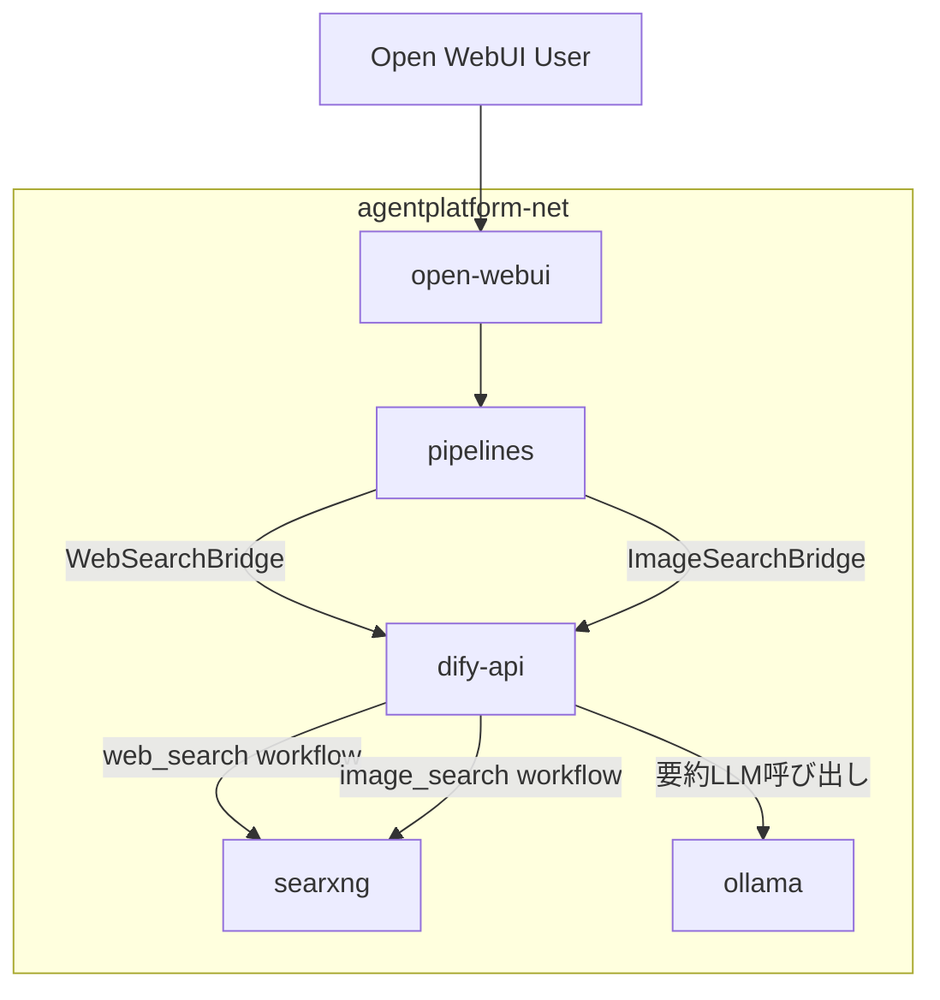
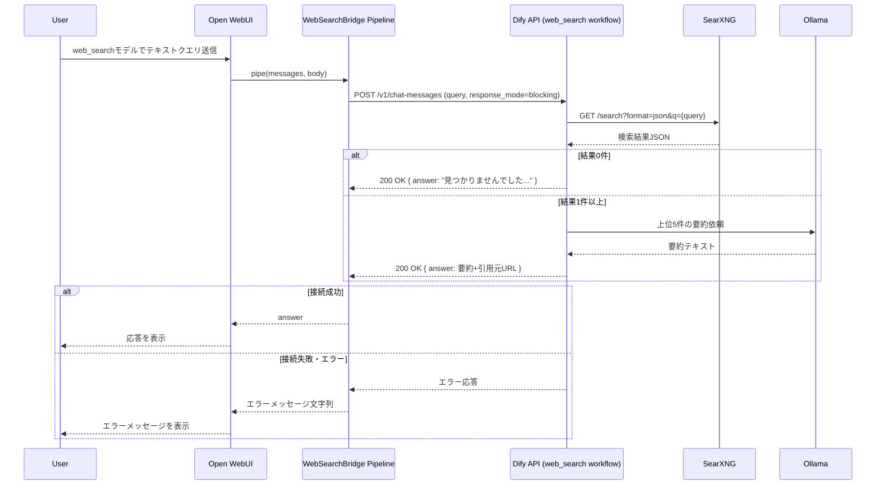
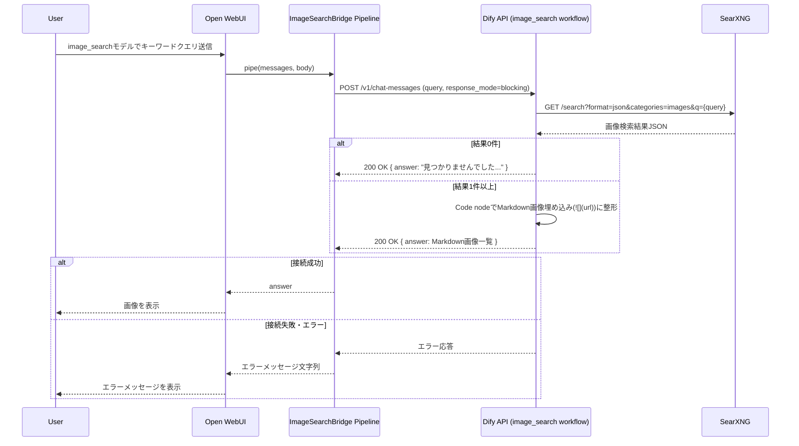

# Design Document

## Overview

本機能は、`infrastructure`が提供するSearXNG（JSON検索有効化済み）と`dify-integration`が提供するDify-Open WebUI中継基盤（`pipelines/dify_bridge.py`パターン）の上に、ワード検索（要約・引用元URL付き応答）とキーワード画像検索（Markdown画像埋め込み）の2つの検索体験をOpen WebUIのチャットから利用可能にする。

**Purpose**: ユーザーがOpen WebUIのモデル選択でワード検索／画像検索を選び、テキストクエリを送ることでSearXNG経由の最新Web情報・画像を取得できるようにする。

**Users**: 個人開発者（Open WebUIのチャットでワード検索・画像検索モデルを利用するエンドユーザー、ワークフローインポート・APIキー設定を行うOperator）。

**Impact**: `pipelines/`に新規Pipelineファイルを追加し、`workflows/`に2つのDify DSLワークフローを追加する。`docker/searxng/settings.yml`に検索エンジン有効化設定を追加し、`docker/.env.example`に新規APIキー変数を追加する。既存の`docker-compose.yml`・`pipelines/dify_bridge.py`・`workflows/echo_workflow.yml`は変更しない。

### Goals
- テキストクエリに対し、SearXNGの複数エンジン検索結果上位5件をLLMが要約し、引用元URL付きでチャットに返す
- キーワードクエリに対し、SearXNGの画像検索結果をMarkdown形式でチャットに表示する
- いずれも検索結果0件時はユーザーに通知し再検索を促す
- いずれも検索処理失敗時に例外を伝播させず、ユーザー向けエラーメッセージを返す
- 検索処理はユーザーを特定する情報を付与せず匿名で実行する

### Non-Goals
- 逆画像検索・Instagram検索・Reddit投稿検索（他Spec/対象外）
- `pipelines/dify_bridge.py`・`workflows/echo_workflow.yml`・Difyサービス群・SearXNGコンテナ定義自体の変更
- ワード検索/画像検索の振り分けをワークフロー内の意図分類で行う方式（モデル選択による明示的な切り替えを採用）
- 出力フォーマットの横断的な最終調整（`ui-customization`が担当）

## Boundary Commitments

### This Spec Owns
- `workflows/web_search.yml`: SearXNGワード検索→上位5件要約→引用元URL付き応答、0件時の通知分岐
- `workflows/image_search.yml`: SearXNG画像検索→Markdown画像埋め込み整形、0件時の通知分岐
- `pipelines/web_search_bridge.py`・`pipelines/image_search_bridge.py`: 上記ワークフローをOpen WebUIの選択可能モデルとして公開するPipeline、および両者が共有するリレーヘルパー`pipelines/_dify_search_bridge.py`
- `docker/searxng/settings.yml`へのワード検索・画像検索向けエンジン有効化設定の追加
- `docker/.env.example`への`DIFY_WEB_SEARCH_APP_API_KEY`・`DIFY_IMAGE_SEARCH_APP_API_KEY`の追加
- `docs/web-search-setup.md`: ワークフローインポート・APIキー発行・Pipelines登録・SearXNGエンジン確認手順

### Out of Boundary
- `pipelines/dify_bridge.py`本体および`workflows/echo_workflow.yml`（`dify-integration`所有、変更しない）
- `docker-compose.yml`のサービス定義・ネットワーク・ボリューム構成（`infrastructure`/`dify-integration`所有）
- 逆画像検索（`reverse-image-search`）・Instagram検索（`instagram-search`）・Reddit投稿検索（対象外、requirements.md参照）
- SearXNGコンテナ自体のアップグレード・ポート設定変更

### Allowed Dependencies
- SearXNG JSON検索API（`SEARXNG_BASE_URL=http://searxng:8080`、`infrastructure`提供）
- Dify Chat API（`POST /v1/chat-messages`、`dify-integration`提供のDify Service Stack）
- Open WebUI Pipelinesランタイム（`dify-integration`提供）
- Dify Code node実行環境（dify-sandbox、`dify-integration`提供）
- Difyのモデルプロバイダーとして接続済みのOllama（`dify-integration`提供）

### Revalidation Triggers
- `pipelines/dify_bridge.py`が確立したPipeline公開パターン（`self.id`/`self.name`/`Valves`/エラー応答契約）が変更された場合 → `web_search_bridge.py`/`image_search_bridge.py`/`_dify_search_bridge.py`の再確認が必要
- `docker/searxng/settings.yml`の構造（`use_default_settings`方針、`engines:`セクションの扱い）が`infrastructure`側で変更された場合 → 本Specのエンジン有効化設定の再確認が必要
- `chat-messages` APIのエラー応答形式が変更された場合 → `_dify_search_bridge.py`のエラーハンドリングの再確認が必要
- 画像Markdown埋め込み等の出力フォーマット規約が`ui-customization`で変更された場合 → `workflows/image_search.yml`の整形ロジックの再確認が必要

## Architecture

### Architecture Pattern & Boundary Map



**Architecture Integration**:
- 選定パターン: `dify-integration`が確立した「Pipeline 1ファイル = Open WebUIの選択可能モデル1つ = Dify App 1つ」のパターンを継続する
- 責務境界: SearXNGクエリ・結果整形・要約はDifyワークフロー（`workflows/`）に閉じ、Open WebUIとの中継・エラーメッセージ生成はPipeline（`pipelines/`）に閉じる
- 既存パターンの継承: `Valves`による環境変数読み込み、接続エラー時に例外を伝播させずエラーメッセージ文字列を返す契約（`dify_bridge.py`と同様）
- 新規コンポーネントの理由:
  - `web_search_bridge.py`/`image_search_bridge.py`: ワード検索・画像検索をユーザーが明示的に選択できるよう、それぞれ別のOpen WebUIモデルとして公開するため
  - `_dify_search_bridge.py`: 2つのPipelineで共通する「テキストクエリ→`/v1/chat-messages`→応答またはエラーメッセージ」処理を共有するため
- Steering準拠: `tech.md`の「Open WebUI → Pipeline → Dify Workflow → SearXNG/Ollama」構成、`structure.md`の`docker ← pipelines ← workflows`依存方向を維持

### Technology Stack

| Layer | Choice / Version | Role in Feature | Notes |
|-------|------------------|------------------|-------|
| Workflow | Dify advanced-chat DSL（`dify-integration`既定のDifyバージョン） | SearXNG呼び出し・0件判定・要約/Markdown整形 | HTTP Request / Code / LLM / If-Else / Answerノードを使用 |
| Pipeline | Open WebUI Pipelines（Python, `requests`/`pydantic`） | Dify Appへの中継・エラーメッセージ応答 | `dify_bridge.py`と同じ実行基盤を共有 |
| メタ検索 | SearXNG（既存、`docker/searxng/settings.yml`にエンジン設定追加） | ワード/画像検索結果のJSON提供 | `format=json`、`categories=images` |
| LLM | Ollama（Dify接続済みモデル） | 上位5件の要約・引用元URL付き応答生成 | ワード検索のみ使用。画像検索はCode nodeでMarkdown整形のみ |

## File Structure Plan

### Directory Structure
```
pipelines/
├── _dify_search_bridge.py      # 新規: WebSearchBridge/ImageSearchBridgeが共有するDify中継ヘルパー
├── web_search_bridge.py        # 新規: web_searchワークフロー用Pipeline（モデルID: web_search）
└── image_search_bridge.py      # 新規: image_searchワークフロー用Pipeline（モデルID: image_search）

workflows/
├── web_search.yml               # 新規: ワード検索ワークフロー（要約・引用元URL付き応答、0件分岐）
└── image_search.yml             # 新規: 画像検索ワークフロー（Markdown画像埋め込み、0件分岐）

docker/
├── searxng/
│   └── settings.yml             # 変更: ワード/画像検索向けエンジン有効化設定（engines:セクション追加）
└── .env.example                 # 変更: DIFY_WEB_SEARCH_APP_API_KEY・DIFY_IMAGE_SEARCH_APP_API_KEYを追加

docs/
└── web-search-setup.md          # 新規: ワークフローインポート・APIキー発行・Pipelines登録・エンジン確認手順
```

### Modified Files
- `docker/searxng/settings.yml` — `engines:`セクションを追加し、ワード検索（Google/Bing/DuckDuckGo/Brave）・画像検索（Google Images/Bing Images/DuckDuckGo Images/Yandex Images）に必要なエンジンを有効化する
- `docker/.env.example` — `DIFY_WEB_SEARCH_APP_API_KEY`・`DIFY_IMAGE_SEARCH_APP_API_KEY`（各ワークフローのDify App APIキー、初期値は空欄）を追加する

## System Flows

### ワード検索フロー (1.1-1.5)



### 画像検索フロー (2.1-2.5)



**フロー上の決定事項**:
- HTTP/接続エラーはワークフロー内で分岐させず、`chat-messages`のエラー応答としてPipeline側に伝播させ、`dify_bridge.py`と同様の例外処理パターンでエラーメッセージ文字列に変換する（research.md参照）
- 「0件」判定のみをワークフロー内のIf-Else分岐とし、SearXNG応答のCode nodeでの解析結果（件数）を条件に使用する
- ワード検索・画像検索のいずれもSearXNGへのリクエストにユーザー識別情報を含めない（`user`パラメータはDify側の会話スコープ分離にのみ使用し、SearXNGへは転送しない）

## Requirements Traceability

| Requirement | Summary | Components | Interfaces | Flows |
|-------------|---------|------------|------------|-------|
| 1.1 | テキストクエリで複数エンジンのメタ検索結果を取得する | Web Search Workflow | HTTP Request node → SearXNG `/search?format=json` | ワード検索フロー |
| 1.2 | 上位5件を要約し引用元URL付きで応答する | Web Search Workflow, WebSearchBridge Pipeline | Code node（上位5件抽出）→ LLM node（要約） → `pipe()`戻り値 | ワード検索フロー |
| 1.3 | 0件時にユーザー通知・再検索を促す | Web Search Workflow | If-Else node（0件分岐）→ Answer node | ワード検索フロー |
| 1.4 | 検索処理エラー時に例外を伝播させずエラーメッセージを返す | WebSearchBridge Pipeline, _dify_search_bridge | `pipe()`の例外処理 | ワード検索フロー |
| 1.5 | 検索処理を匿名で実行する | Web Search Workflow, SearXNG Engine Configuration | HTTP Request node（ユーザー識別情報なし） | ワード検索フロー |
| 2.1 | キーワードで画像検索結果を取得する | Image Search Workflow | HTTP Request node → SearXNG `/search?format=json&categories=images` | 画像検索フロー |
| 2.2 | 画像をMarkdown形式で表示する | Image Search Workflow, ImageSearchBridge Pipeline | Code node（Markdown整形） → `pipe()`戻り値 | 画像検索フロー |
| 2.3 | 0件時にユーザー通知・再検索を促す | Image Search Workflow | If-Else node（0件分岐）→ Answer node | 画像検索フロー |
| 2.4 | 検索処理エラー時に例外を伝播させずエラーメッセージを返す | ImageSearchBridge Pipeline, _dify_search_bridge | `pipe()`の例外処理 | 画像検索フロー |
| 2.5 | 検索処理を匿名で実行する | Image Search Workflow, SearXNG Engine Configuration | HTTP Request node（ユーザー識別情報なし） | 画像検索フロー |

## Components and Interfaces

| Component | Domain/Layer | Intent | Req Coverage | Key Dependencies (P0/P1) | Contracts |
|-----------|--------------|--------|---------------|--------------------------|-----------|
| Web Search Workflow | Workflow | SearXNGワード検索→上位5件要約→引用元URL付き応答、0件分岐 | 1.1, 1.2, 1.3, 1.5 | SearXNG (P0), Ollama (P0), Dify Code node (P1) | API |
| Image Search Workflow | Workflow | SearXNG画像検索→Markdown画像埋め込み整形、0件分岐 | 2.1, 2.2, 2.3, 2.5 | SearXNG (P0), Dify Code node (P1) | API |
| WebSearchBridge Pipeline | Application | Open WebUI↔Web Search Workflow中継、エラー応答 | 1.2, 1.4 | Dify Chat API (P0), _dify_search_bridge (P0) | Service |
| ImageSearchBridge Pipeline | Application | Open WebUI↔Image Search Workflow中継、エラー応答 | 2.2, 2.4 | Dify Chat API (P0), _dify_search_bridge (P0) | Service |
| _dify_search_bridge (shared helper) | Application | `/v1/chat-messages`への中継・例外処理ロジックの共有実装 | 1.4, 2.4 | Dify Chat API (P0) | Service |
| SearXNG Engine Configuration | Infrastructure | ワード/画像検索向けエンジン有効化設定 | 1.1, 1.5, 2.1, 2.5 | - | State |
| Setup Documentation | Documentation | ワークフローインポート・APIキー発行・Pipelines登録・エンジン確認手順 | 1.1-1.5, 2.1-2.5 | - | - |

### Workflow

#### Web Search Workflow (`workflows/web_search.yml`)

| Field | Detail |
|-------|--------|
| Intent | テキストクエリをSearXNGへ転送し、上位5件を要約・引用元URL付きで応答する。0件時は通知メッセージを返す |
| Requirements | 1.1, 1.2, 1.3, 1.5 |

**Responsibilities & Constraints**
- Start nodeで`sys.query`を受け取り、HTTP Request nodeで`GET {SEARXNG_BASE_URL}/search?format=json&q={query}`を呼び出す（Requirement 1.1, 1.5: ユーザー識別情報は付与しない）
- Code node（Python3、dify-sandbox）でレスポンスJSONの`results`配列から上位5件（`title`/`url`/`content`）を抽出し、件数と整形済みテキストを変数として出力する
- If-Else nodeで件数0を判定し、0件の場合は固定の通知メッセージ（Answer node）を返す（Requirement 1.3）
- 1件以上の場合、LLM node（Dify接続済みOllamaモデル）が抽出結果を要約し、各要約に引用元URLを付与したテキストをAnswer nodeで返す（Requirement 1.2）

**Dependencies**
- Outbound: SearXNG（`GET /search?format=json`） — ワード検索結果取得 (P0)
- Outbound: Ollama（Dify Model Provider経由） — 上位5件の要約 (P0)
- Internal: Dify Code node（dify-sandbox） — JSON解析・上位5件抽出 (P1)

**Contracts**: Service [ ] / API [x] / Event [ ] / Batch [ ] / State [ ]

##### API Contract
| Method | Endpoint | Request | Response | Errors |
|--------|----------|---------|----------|--------|
| POST | /v1/chat-messages（Dify標準、`web_search` App） | `{query, response_mode: blocking, user}` | `{answer}`（要約+引用元URL、または0件時の通知文） | Dify標準のワークフロー実行エラー応答 |

**Implementation Notes**
- Integration: SearXNGへのリクエストURLは`docker/.env.example`の`SEARXNG_BASE_URL`をDify環境変数として登録し参照する
- Validation: SearXNGのモック/実応答に対し、上位5件抽出・要約・0件分岐の各経路をDifyのデバッグ実行で確認する（Requirement 1.1-1.3, 1.5）
- Risks: 検索エンジン側のレスポンス構造変化により`results`配列のキー（`title`/`url`/`content`）が変わる可能性。Code nodeでキー欠落時のデフォルト値処理を行う

#### Image Search Workflow (`workflows/image_search.yml`)

| Field | Detail |
|-------|--------|
| Intent | キーワードクエリをSearXNGの画像検索へ転送し、結果をMarkdown画像埋め込みで応答する。0件時は通知メッセージを返す |
| Requirements | 2.1, 2.2, 2.3, 2.5 |

**Responsibilities & Constraints**
- Start nodeで`sys.query`を受け取り、HTTP Request nodeで`GET {SEARXNG_BASE_URL}/search?format=json&categories=images&q={query}`を呼び出す（Requirement 2.1, 2.5: ユーザー識別情報は付与しない）
- Code node（Python3、dify-sandbox）でレスポンスJSONの`results`配列から各画像の`img_src`（またはURL相当のキー）を抽出し、``形式のMarkdown文字列と件数を出力する（Requirement 2.2）
- If-Else nodeで件数0を判定し、0件の場合は固定の通知メッセージ（Answer node）を返す（Requirement 2.3）
- 1件以上の場合、Code nodeが整形したMarkdown文字列をAnswer nodeでそのまま返す

**Dependencies**
- Outbound: SearXNG（`GET /search?format=json&categories=images`） — 画像検索結果取得 (P0)
- Internal: Dify Code node（dify-sandbox） — JSON解析・Markdown整形 (P1)

**Contracts**: Service [ ] / API [x] / Event [ ] / Batch [ ] / State [ ]

##### API Contract
| Method | Endpoint | Request | Response | Errors |
|--------|----------|---------|----------|--------|
| POST | /v1/chat-messages（Dify標準、`image_search` App） | `{query, response_mode: blocking, user}` | `{answer}`（Markdown画像一覧、または0件時の通知文） | Dify標準のワークフロー実行エラー応答 |

**Implementation Notes**
- Integration: SearXNGへのリクエストURLは`docker/.env.example`の`SEARXNG_BASE_URL`をDify環境変数として登録し参照する
- Validation: SearXNGのモック/実応答に対し、Markdown整形・0件分岐の各経路をDifyのデバッグ実行で確認する（Requirement 2.1-2.3, 2.5）
- Risks: SearXNGの画像検索結果に`img_src`が含まれないエンジンが混在する場合、Code nodeで該当結果をスキップするフォールバックが必要

### Application

#### WebSearchBridge / ImageSearchBridge Pipeline (`pipelines/web_search_bridge.py`, `pipelines/image_search_bridge.py`)

| Field | Detail |
|-------|--------|
| Intent | Open WebUIから受信したテキストクエリをそれぞれ対応するDify App（`web_search`/`image_search`）へ中継し、応答またはエラーメッセージを返す |
| Requirements | 1.2, 1.4, 2.2, 2.4 |

**Responsibilities & Constraints**
- それぞれ`self.id`（`web_search`/`image_search`）・`self.name`・`Valves`（`DIFY_API_BASE_URL`共通、`DIFY_WEB_SEARCH_APP_API_KEY`/`DIFY_IMAGE_SEARCH_APP_API_KEY`、`REQUEST_TIMEOUT_SECONDS`）を持つOpen WebUI Pipelineとして実装する
- `pipe()`は共有ヘルパー`_dify_search_bridge.DifyChatBridge.ask()`を呼び出し、テキストクエリのみを`/v1/chat-messages`へ送信する（画像アップロードは扱わない）
- `DifyChatBridge.ask()`が例外を発生させた場合、各Pipelineは機能固有のエラーメッセージ文字列（例: 「⚠️ Web検索の実行に失敗しました」「⚠️ 画像検索の実行に失敗しました」）を返す（Requirement 1.4, 2.4）

**Dependencies**
- Outbound: Dify Chat API（`POST /v1/chat-messages`、`web_search`/`image_search` App） — 検索・要約結果の取得 (P0)
- Internal: `pipelines/_dify_search_bridge.py` — リレー処理の共有実装 (P0)

**Contracts**: Service [x] / API [ ] / Event [ ] / Batch [ ] / State [ ]

##### Service Interface
```python
# pipelines/_dify_search_bridge.py
class DifyChatBridge:
    def __init__(self, base_url: str, api_key: str, timeout: int) -> None: ...

    def ask(self, query: str, user_id: str) -> str:
        """`/v1/chat-messages`にテキストクエリを送信し、`answer`を返す。
        接続エラー・タイムアウト・非2xx応答時はrequests.exceptions.RequestExceptionを発生させる。"""

# pipelines/web_search_bridge.py, pipelines/image_search_bridge.py
class Pipeline:
    class Valves(BaseModel):
        DIFY_API_BASE_URL: str
        DIFY_WEB_SEARCH_APP_API_KEY: str   # image_search_bridge.pyではDIFY_IMAGE_SEARCH_APP_API_KEY
        REQUEST_TIMEOUT_SECONDS: int

    def pipe(self, user_message: str, model_id: str, messages: list, body: dict) -> str:
        """DifyChatBridge.ask()を呼び出し、応答テキストまたは
        ユーザー向けエラーメッセージ文字列を返す。例外を呼び出し元に伝播しない。"""
```
- Preconditions: `messages`の最後の要素がOpen WebUIのチャットメッセージ形式（`content`が文字列）であること
- Postconditions: 戻り値は常に文字列（Dify応答テキスト、または機能固有のエラーメッセージ）であり、Open WebUIのチャット画面にそのまま表示可能であること
- Invariants: `DifyChatBridge.ask()`が発生させた例外は`pipe()`内で必ず捕捉され、呼び出し元に伝播しない

**Implementation Notes**
- Integration: ユーザー識別子は`dify_bridge.py`の`_resolve_user_id`と同様のロジック（`body["user"]["id"]`等）を`_dify_search_bridge.py`内で共有する
- Validation: Open WebUIのモデル選択リストに`web_search`/`image_search`が表示され、それぞれのDify Appからの応答・エラーメッセージが正しく返ることを確認する
- Risks: `chat-messages`のエラー応答（非2xx、タイムアウト）が`dify_bridge.py`と同形式であることを実装時に確認する（research.md参照）

### Infrastructure

#### SearXNG Engine Configuration (`docker/searxng/settings.yml`)

| Field | Detail |
|-------|--------|
| Intent | ワード検索（Google/Bing/DuckDuckGo/Brave）・画像検索（Google Images/Bing Images/DuckDuckGo Images/Yandex Images）に必要なエンジンを有効化する |
| Requirements | 1.1, 1.5, 2.1, 2.5 |

**Responsibilities & Constraints**
- `use_default_settings: true`を維持したまま、`engines:`セクションに対象エンジンの`disabled: false`設定を追加する
- 既存の`search.formats`（html/json）・`server.limiter: false`の設定は変更しない
- 認証情報やAPIキーを必要とするエンジンは追加しない（Requirement 1.5, 2.5の匿名性維持）

**Dependencies**
- External: 各検索エンジン（Google/Bing/DuckDuckGo/Brave/Yandex等）への匿名アウトバウンド (P1)

**Contracts**: Service [ ] / API [ ] / Event [ ] / Batch [ ] / State [x]

##### State Management
- State model: SearXNGの`settings.yml`がエンジン有効/無効状態を保持する（Gitで管理、`docker/searxng/settings.yml`は`.gitignore`対象だが`settings.yml.example`を更新する）
- Persistence & consistency: `docker compose restart searxng`で設定が反映される

**Implementation Notes**
- Integration: `docker/searxng/settings.yml.example`を更新し、利用者が`settings.yml`へコピーする際に対象エンジンが有効化された状態になるようにする
- Validation: `curl "http://localhost:${SEARXNG_PORT}/search?format=json&q=test"`および`&categories=images`で対象エンジンの結果が含まれることを確認する
- Risks: Yandex ImagesがDocker環境からアクセス不能な場合、`docs/web-search-setup.md`に既知の制約として記録する

### Documentation

#### Setup Documentation (`docs/web-search-setup.md`)

| Field | Detail |
|-------|--------|
| Intent | `workflows/web_search.yml`・`workflows/image_search.yml`のインポート・APIキー発行・`docker/.env`設定・Pipelines登録・SearXNGエンジン確認手順を提供する |
| Requirements | 1.1-1.5, 2.1-2.5 |

**Responsibilities & Constraints**
- Dify管理画面での各ワークフローのインポート・公開・APIキー発行手順、発行したキーを`docker/.env`の`DIFY_WEB_SEARCH_APP_API_KEY`/`DIFY_IMAGE_SEARCH_APP_API_KEY`へ設定する手順を記載する
- Open WebUI管理画面でのPipelines登録（`web_search`/`image_search`モデルが選択可能になること）の確認手順を記載する
- SearXNGエンジン有効化設定の反映確認手順（`curl`によるJSON応答確認）を記載する

**Implementation Notes**
- Integration: `docs/dify-integration-setup.md`の構成（手順番号・`.env`変数名の明記）を踏襲する
- Validation: 本ドキュメントの手順に従い、Open WebUIのチャットでワード検索・画像検索・0件・エラーの各応答パターンを確認できること

## Error Handling

### Error Strategy
検索処理に関するエラーは、Dify APIからの応答エラー（ワークフロー実行失敗・タイムアウト）として`pipe()`に到達し、`dify_bridge.py`と同様に例外を再raiseせずユーザー向けの固定エラーメッセージ文字列に変換する。

### Error Categories and Responses
- **SearXNG接続/応答エラー（ワークフロー内）**: HTTP Request nodeの失敗によりワークフロー実行が失敗し、Dify APIがエラー応答を返す → Pipeline側で機能固有のエラーメッセージに変換（Requirement 1.4, 2.4）
- **検索結果0件（正常応答）**: ワークフロー内のIf-Else分岐で固定の通知文を返す（Requirement 1.3, 2.3）
- **Dify API接続エラー・タイムアウト**: `DifyChatBridge.ask()`が`requests.exceptions.RequestException`を発生させ、Pipelineがエラーメッセージ文字列を返す（`dify_bridge.py`の`_connection_error_message`と同パターン）

## Testing Strategy

### Unit Tests
- `_dify_search_bridge.DifyChatBridge.ask()`が正常応答時に`answer`を返すことを確認する
- `_dify_search_bridge.DifyChatBridge.ask()`が接続エラー・タイムアウト時に`requests.exceptions.RequestException`を発生させることを確認する
- `web_search_bridge.Pipeline.pipe()`/`image_search_bridge.Pipeline.pipe()`が`DifyChatBridge.ask()`の例外を捕捉し、機能固有のエラーメッセージ文字列を返すことを確認する

### Integration Tests
- `workflows/web_search.yml`をDifyのデバッグ実行で動かし、SearXNG応答（モックまたは実環境）に対して上位5件要約+引用元URL付き応答が返ることを確認する（Requirement 1.1, 1.2）
- `workflows/web_search.yml`に0件のSearXNG応答を与え、通知メッセージが返ることを確認する（Requirement 1.3）
- `workflows/image_search.yml`をDifyのデバッグ実行で動かし、SearXNG画像検索応答に対してMarkdown画像一覧が返ることを確認する（Requirement 2.1, 2.2）
- `workflows/image_search.yml`に0件のSearXNG応答を与え、通知メッセージが返ることを確認する（Requirement 2.3）

### E2E Tests
- Open WebUIで`web_search`モデルを選択し、テキストクエリ送信→要約+引用元URL付き応答が表示されることを確認する（Requirement 1.1, 1.2, 1.5）
- Open WebUIで`image_search`モデルを選択し、キーワードクエリ送信→画像がチャット内に表示されることを確認する（Requirement 2.1, 2.2, 2.5）
- 各モデルで0件になるクエリを送信し、再検索を促す通知が表示されることを確認する（Requirement 1.3, 2.3）
- `dify-api`コンテナ停止状態で各モデルにクエリを送信し、エラーメッセージが表示されることを確認する（Requirement 1.4, 2.4）
